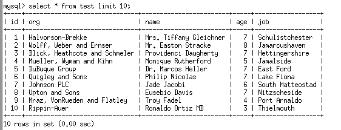

# AS Lab 2 - Database

#### Artem Abramov SNE19

# Prepare database 

## 1. Install a DBMS that can perform column level encryption and database level encryption (f.e MySQL).

I installed the DB with docker. For this I used the MySQL image from docker hub. 
```
docker run --name mysql-db -p 3306:3306 -p 33060:33060 -e MYSQL_ROOT_PASSWORD=artem -d mysql
```

To interact with the database I used the mysql client installed in the same container:
```
docker exec -it mysql-db bash
root@ad813693c8cc:/# mysql -uroot -p
```

## 2. Create database and populate it with data (about 5 columns and 50 000 rows in a table)

```
mysql> create DATABASE test;
```

Generated test data using http://filldb.info/ a sample  is shown below:



Copied the test data into the container
```
docker cp ~/Downloads/test-02-02-2020-20-56-beta.sql mysql-db:mnt
```

Inserted data into database called `test` (inside the container):
```
# cd /mnt
# mysql -u root -p
mysql> use test
mysql> source /mnt/test-02-02-2020-20-56-beta.sql
```


# Database connection

## 3. Create password based credentials that will be used by your application to access the created database.

The credential file allows storing our sensitive username and password to allow automated access to MySQL.

Spin up  `mysql-cli` container:

```
docker run --name mysql-cli -it  mysql /bin/bash
```

On it create the credentials file with identifier  `main`. (The info about `mysql-db` container was taken from `docker inspect`):

```
 mysql_config_editor set --login-path=main --host=172.17.0.2 --user=root --password
```

Connect to db:

```
mysql --login-path=main
```

Remember to `use test` after login to select the db.

## 4. Make sure the DBMS is available on some network interface and capture the  traffic on that interface during the connection (you can use  corresponding CLI to open the connection, perform some SELECT queries  and then close the connection).

I captured traffic with wireshark listening to docker0.

I performed the following from `mysql-cli` container:

```
root@b7c99e16d613:/# mysql --login-path=main
mysql> use test
mysql> select * from test limit 10;
mysql> \q
```


## 5. Analyze the captured data:

#### Can you see the plain data and credentials? How can the attacker bypass TLS layer with your present configuration? (hint: analyze TLS handshake)

The data and credentials are not present as plaintext. 

- On connection start server advertises MySQL protocol==10 and version==8.0.19. 
- Next follows a login request from the client (user), it contains a name field, however that is legacy of MySQL protocol and in this capture the field is not filled. 
- The next message is also from the client, it is a Client Hello which starts the TLS handshake. Client  (as seen in the handshake layer)  supports up to TLSv1.2. Part of the  header is shown below:

```
Transport Layer Security
    TLSv1.2 Record Layer: Handshake Protocol: Client Hello
        Content Type: Handshake (22)
        Version: TLS 1.0 (0x0301)
        Length: 175
        Handshake Protocol: Client Hello
            Handshake Type: Client Hello (1)
            Length: 171
            Version: TLS 1.2 (0x0303)
            Random: e4747df403a07859d34cbe45cb4bd8a859a46840377630f0…
            Session ID Length: 0
            Cipher Suites Length: 60
            Cipher Suites (30 suites)
                Cipher Suite: TLS_ECDHE_ECDSA_WITH_AES_128_GCM_SHA256 (0xc02b)
                Cipher Suite: TLS_ECDHE_ECDSA_WITH_AES_256_GCM_SHA384 (0xc02c)
                Cipher Suite: TLS_ECDHE_RSA_WITH_AES_128_GCM_SHA256 (0xc02f)
                Cipher Suite: TLS_ECDHE_RSA_WITH_AES_256_GCM_SHA384 (0xc030)
                Cipher Suite: TLS_ECDHE_ECDSA_WITH_AES_128_CBC_SHA256 (0xc023)
                Cipher Suite: TLS_ECDHE_RSA_WITH_AES_128_CBC_SHA256 (0xc027)
                Cipher Suite: TLS_ECDHE_ECDSA_WITH_AES_256_CBC_SHA384 (0xc024)
                Cipher Suite: TLS_ECDHE_RSA_WITH_AES_256_CBC_SHA384 (0xc028)
                Cipher Suite: TLS_DHE_RSA_WITH_AES_128_GCM_SHA256 (0x009e)
                Cipher Suite: TLS_DHE_DSS_WITH_AES_128_GCM_SHA256 (0x00a2)
                Cipher Suite: TLS_DHE_RSA_WITH_AES_128_CBC_SHA256 (0x0067)
                Cipher Suite: TLS_DHE_DSS_WITH_AES_128_CBC_SHA256 (0x0040)
                Cipher Suite: TLS_DHE_DSS_WITH_AES_256_GCM_SHA384 (0x00a3)
                Cipher Suite: TLS_DHE_RSA_WITH_AES_256_CBC_SHA256 (0x006b)
                Cipher Suite: TLS_DHE_DSS_WITH_AES_256_CBC_SHA256 (0x006a)
                Cipher Suite: TLS_ECDHE_RSA_WITH_AES_128_CBC_SHA (0xc013)
                Cipher Suite: TLS_ECDHE_ECDSA_WITH_AES_128_CBC_SHA (0xc009)
                Cipher Suite: TLS_ECDHE_RSA_WITH_AES_256_CBC_SHA (0xc014)
                Cipher Suite: TLS_ECDHE_ECDSA_WITH_AES_256_CBC_SHA (0xc00a)
                Cipher Suite: TLS_DHE_DSS_WITH_AES_128_CBC_SHA (0x0032)
                Cipher Suite: TLS_DHE_RSA_WITH_AES_128_CBC_SHA (0x0033)
                Cipher Suite: TLS_DHE_RSA_WITH_AES_256_CBC_SHA (0x0039)
                Cipher Suite: TLS_RSA_WITH_AES_128_GCM_SHA256 (0x009c)
                Cipher Suite: TLS_RSA_WITH_AES_256_GCM_SHA384 (0x009d)
                Cipher Suite: TLS_RSA_WITH_AES_128_CBC_SHA256 (0x003c)
                Cipher Suite: TLS_RSA_WITH_AES_256_CBC_SHA256 (0x003d)
                Cipher Suite: TLS_RSA_WITH_AES_128_CBC_SHA (0x002f)
                Cipher Suite: TLS_RSA_WITH_AES_256_CBC_SHA (0x0035)
                Cipher Suite: TLS_DHE_RSA_WITH_AES_256_GCM_SHA384 (0x009f)
                Cipher Suite: TLS_EMPTY_RENEGOTIATION_INFO_SCSV (0x00ff)
```

- In response the server chooses to use TLSv1.2 and replies with Server Hello, Certificate, Server Key Exchange, Certificate Request and Server Hello Done records.

source: https://dev.mysql.com/doc/refman/8.0/en/encrypted-connection-protocols-ciphers.html

The server allows connections without authentication:

```
mysql> SHOW GLOBAL VARIABLES LIKE 'require_secure_transport';
+--------------------------+-------+
| Variable_name            | Value |
+--------------------------+-------+
| require_secure_transport | OFF   |
+--------------------------+-------+
1 row in set (0.00 sec)
```

require_secure_transport = Whether client connections to the server are required to use some form of secure transport. When this variable is enabled, the server permits only TCP/IP connections that use SSL.

The server also accepts TLSv1.0 for communication:

```
mysql> SHOW GLOBAL VARIABLES LIKE 'tls_version';
+---------------+-----------------------+
| Variable_name | Value                 |
+---------------+-----------------------+
| tls_version   | TLSv1,TLSv1.1,TLSv1.2 |
+---------------+-----------------------+
1 row in set (0.01 sec)
```

The security hazard associated with accepting non-TLS conneciton is clear and simple. 

There is also an issue with accepting TLSv1.0 connections. The TLS handshake happens in plaintext, a man in the middle can rewrite the client hello to claim that client only supports the insecure TLSv1.0, under current configuration MySQL server will accept this insecure connection as secure and valid. Example TLSv1.0 vulnerabilities: POOL, BEAST, etc.

#### What can be done to mitigate that?

Force authentication and forbid using TLSv1.0 on the server. This values can be set dynamically **no server restart required**  on MySQL server version>=8.0.16 and can be made persistent across reboot via the commands below:

```
mysql> SET PERSIST require_secure_transport = ON;
mysql> SET PERSIST tls_version="TLSv1.1,TLSv1.2";
```

Checking the connection from client:

```
root@b7c99e16d613:~# mysql --login-path=main --tls_version=TLSv1.0
ERROR 2026 (HY000): SSL connection error: TLS version is invalid
```


## 6) Capture the connection traffic with TLS disabled and extract the content of user and password fields.

For this I disabled the require_secure_transport option in the MySQL db and then connected without SSL:

```
root@b7c99e16d613:~# mysql --login-path=main --ssl-mode=DISABLED
```

