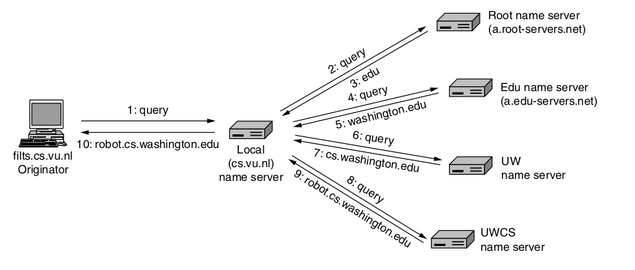
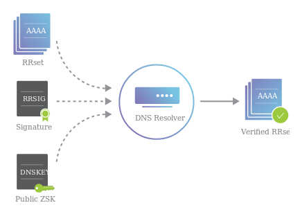
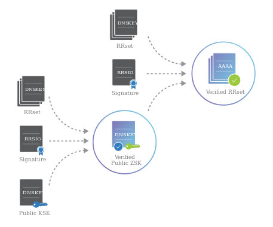
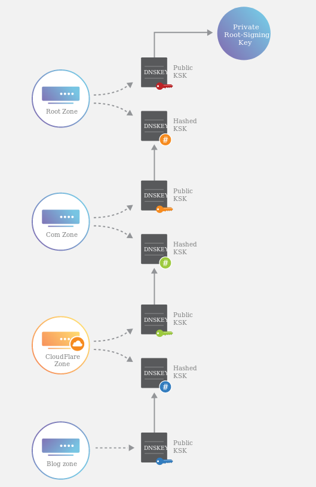
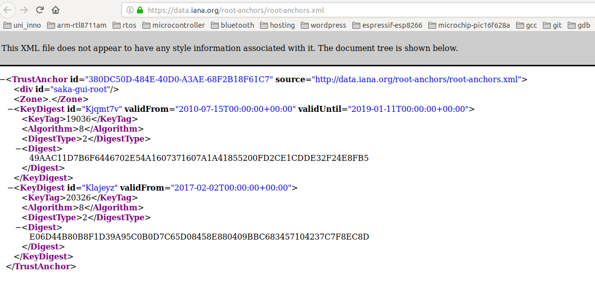
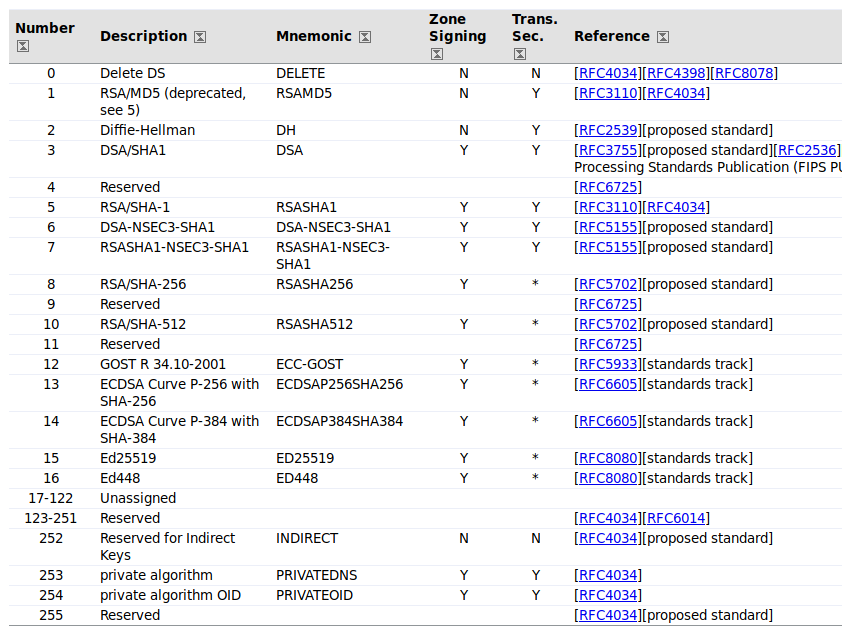
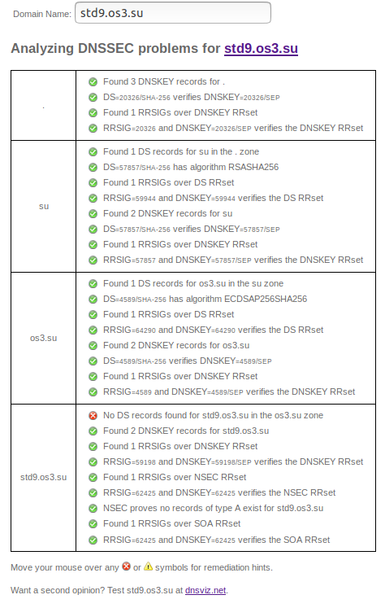

# FIA Lab 4 - DNSSEC
#### Artem Abramov SNE19

##  Task 1 - DNS Insecurity

### a. In what context was the DNS cache poisoning attack discovered? (Who, when, why)

The idea of forging a reply packet can be attributed to Daniel J. Bernstein and a reference to it is found in the `bind` DNS server's mailing list, source: http://cr.yp.to/djbdns/forgery-cost.txt
He released more information about this type of attack in 2002, source: http://cr.yp.to/djbdns/forgery.html. 

However many thought that while this method could be used to spoof a single DNS responce it was not critically dangerous because it's just one record, and many properties require multiple hostnames to operate, and the chances of poisoning all the records for a zone were too small. Dan Kaminsky discovered (around July 2008)  that instead of poisoning the final answer (i.e. the A record with the IP address) its possible to up one level and spoof the authority records instead, which means that the attacker can present himself as owning the entire zone to the user's machine, source: http://unixwiz.net/techtips/iguide-kaminsky-dns-vuln.html

### b. How does this attack work and how to prevent it?

Suppose that Alice is trying to access Bob's website and Mallory is the attacker.
Mallory can trick the DNS server at Alice ISP into sending out a query to look up Bob website address. Because DNS uses UDP, the DNS server has no way to check who supplied the answer (except for checking the source IP). Mallory exploits this by forging a packet with the expected reply and sending it to the DNS server as the proposed answer.
If the packet arrives before the legitimate reply and it matches some checks (source IP and DNS sequence number) the server will accept it as the legitimate reply. The server will store this response in its cache and will discard the legitimate response, because there is already an entry in the cache for this address.

If Alice ISP already has an entry for Bobs server, then Mallory can wait until the cache times out (or use other tricks).

The difficulties for Mallory are:
1.	His reply must reach the DNS server before the legitimate reply
2.	His reply must have the correct Sequence number. When the DNS resolver sends out a query it includes a sequence number to match the answer to the question. Because the sequence number is only 2 bytes, its possible to brute force it (or cleverly exploit the particular algorithm that generates the sequence number). 

This attack described above can be used to spoof one record. To take over the whole zone a similar process can be used, as before Mallory will send a stream of forged packets to the DNS server, however instead of providing an answer to for example the A record, the forged packets indicate delegation to another nameserver via Authority records. This record contains the NS and the glue record, now the NS may point to Bobs website, however the glue record will point to Mallory's DNS server. If the forged query sequence numbers match Alice's DNS will believe that Mallory's nameserver is authoritative for Bob's zone. 

The attack can be mitigated in a number of ways:
1.	Generate the sequence number from a random number generator. Some old servers just incremented the sequence number by one for each query.
2.	Randomize the source port, so that the fake reply has to match the tuple (Sequence Number, Source Port). This raises the total number of combinations to 4227727360 which is more difficult to brute force.  `djbdns` DNS server was perhaps the first to implement source port randomization.
3.	Use DNSSEC to authenticate the reply.

sources:
1.	 http://unixwiz.net/techtips/iguide-kaminsky-dns-vuln.html
2.	 Computer Networks - A. Tanenbaum - 5th edition

### c. What is DNS spoofing and what tools can be used to integrate this attack?

Quoting Andrew Tanenbaum `Computer Networks - 5th edition`:
```
Tricking a DNS server into installing a false IP address is called DNS spoofing. A cache that holds an intentionally false IP address like this is called a poisoned cache.
```

The question asks about tools that can be used to `integrate this attack`. The language is not clear, however I understand the question as asking about tools that can be used to carry out the attack (i.e. what tools would Mallory use to trick Alice).

1.	map - used to locate the target
2.	Ettercap - a very popular and easy DNS spoofing tool that comes pre-installed with Kali Linux. It essentially carries out the whole process, from  initiating a query to flooding target's DNS resolver with forged packets.
2.	Apache - web server with a fake page where user will land.

sources:
1. 	https://www.blackarch.org/spoof.html
2. 	https://www.kalilinux.in/2019/07/ettercap-dns-spoofing-in-kali-linux.html
3. 	https://medium.com/bugbountywriteup/how-i-pranked-my-friend-using-dns-spoofing-6a65ff01da1


### d. What does a validating resolver do? What is the difference between island-of-trust versus full-chain-of-trust?

The job of a validating resolver is to resolve the DNS query for the user and validate the authenticity of  DNS reply that are received in the process. 

How a DNS resolver works is shown on the diagram below:



A validating resolver tries to build a full-chain-of-trust to verify the authenticity of the reply that he will pass to the user.  The resolver uses RRSIG to verify the RRSET, and DNSKEY (ZKS) to verify the RRSIG, this is shown on the diagram below:




Then its necessary to validate the ZKS with KSK as shown below:




The final step is recursively validating the key with the parent zone using its DS record as shown below:




The public key for the root certificate comes pre-installed with the OS, so the resolver can verify that as well. The full chain of validation is called the full-chain-of-trust. 

source: https://www.cloudflare.com/dns/dnssec/how-dnssec-works/


A zone owner can establish and island-of-trust (a.k.a trust-anchor) for a particular zone, say `catphotos.pro` to improve security of the zone and its child zones. Lets say I wand to enable DNSSEC for my zone `catphotos.pro`. I have generated the keys and signed `catphotos.pro` zone, but unfortunately the administrator of  `pro` has not signed his zone yet. This means that he can not certify my DNSKEY records. Establishing an island-of-trust allows the slave nameservers and other nameservers to verify zone data and sub-zones under the `catphotos.pro` zone, assuming that the sub-zones have their DNSKEY records certified by DS and RRSIG records in `catphotos.pro`. This way `catphotos.pro` becomes a trust-anchor and any sub-zones can be verified up to this anchor. This improves security for child zones, because even though we can not verify the `catphotos.pro` (because its parent zone is not signed), the child zones can create long chains and to forge a DNS reply the attacker would have to override replies from each nameserver in the chain leading up to `catphotos.pro`, which requires more resources the longer the chain and is less likely. 


sources: 
1.	http://www.ipamworldwide.com/ipam/bind-trusted-keys.html
2.	Cricket Liu, Paul Albitz - DNS and BIND, 5th Edition-O’Reilly (2006)


### e. What other means to protect DNS transactions are there?

There have been many proposals on securing DNS:

1. DNSCurve (with DNSCrypt) - proposed by Daniel J. Bernstein promises confidentiality (data was not read), integrity (data was not modified) and authenticity (data came from this exact source) between recursive DNS servers and authoritative name servers.
2.  DNSCrypt (with DNSCrypt)  -  based on DNSCurve, provides confidentiality and integrity between stub resolvers (the client) and recursive DNS servers.
3.  DNS over TLS - similar to SNDCrypt works by encrypting the link between a stub resolver and a recursive server.
4.  DNS over HTTPS - similar in spirit to DNS over TLS but is more verbose due to the HTTP underlying protocol. Has a questionable feature - DNS traffic is hidden inside other HTTPS traffic.
5.  DNS over IPSec - too expensive computationally.

sources: 
1. https://www.opendns.com/about/innovations/dnscrypt/
2. https://tools.ietf.org/html/rfc7858
3. https://tools.ietf.org/html/rfc8484
4. https://dnscurve.org/


## Task 2 - Validating Resolver

### Enable DNSSEC to your BIND or Unbound and verify the root key used a trusted source

The current unbound config is shown below:
```
server:
  verbosity: 8
  do-daemonize: no
  num-threads: 1
  interface: 0.0.0.0
  port: 53
  access-control: 0.0.0.0/0 allow
  username: "unbound"
  logfile: "/var/log/unbound.log"
python:
remote-control:
  control-enable: yes
  control-interface: "/var/tmp/unbound-control.pipe"
```

The steps are as follows:
1. Go to ICANN website to find KSK for root server (public part)
2. Use unbound-anchor to download the root public KSK
3. Verify that the key download by unbound-anchor matches the one displayed on the website
4. Write out the verified public KSK as the DNSKEY record
5. Check what how the digest for DS is calculated from IANA website
6. Calculate the digest from the DNSKEY record and compose the DS record
7. Install the DNSKEY and DS records as root.key

Go to ICANN website to find the KSK for root server shown there:
https://www.icann.org/dns-resolvers-updating-latest-trust-anchor

Using unbound-anchor to download the KSK (public part) for root is shown below:
```
$ sudo unbound-anchor
$ cat trusted-key.key
; autotrust trust anchor file
;;id: . 1
;;last_queried: 1568936946 ;;Fri Sep 20 02:49:06 2019
;;last_success: 1568936946 ;;Fri Sep 20 02:49:06 2019
;;next_probe_time: 1568977737 ;;Fri Sep 20 14:08:57 2019
;;query_failed: 0
;;query_interval: 43200
;;retry_time: 8640
.	86400	IN	DNSKEY	257 3 8 AwEAAaz/tAm8yTn4Mfeh5eyI96WSVexTBAvkMgJzkKTOiW1vkIbzxeF3+/4RgWOq7HrxRixHlFlExOLAJr5emLvN7SWXgnLh4+B5xQlNVz8Og8kvArMtNROxVQuCaSnIDdD5LKyWbRd2n9WGe2R8PzgCmr3EgVLrjyBxWezF0jLHwVN8efS3rCj/EWgvIWgb9tarpVUDK/b58Da+sqqls3eNbuv7pr+eoZG+SrDK6nWeL3c6H5Apxz7LjVc1uTIdsIXxuOLYA4/ilBmSVIzuDWfdRUfhHdY6+cn8HFRm+2hM8AnXGXws9555KrUB5qihylGa8subX2Nn6UwNR1AkUTV74bU= ;{id = 20326 (ksk), size = 2048b} ;;state=2 [  VALID  ] ;;count=0 ;;lastchange=1568936946 ;;Fri Sep 20 02:49:06 2019
```

The actual key is shown below:
```
AwEAAaz/tAm8yTn4Mfeh5eyI96WSVexTBAvkMgJzkKTOiW1vkIbzxeF3+/4RgWOq7HrxRixHlFlExOLAJr5emLvN7SWXgnLh4+B5xQlNVz8Og8kvArMtNROxVQuCaSnIDdD5LKyWbRd2n9WGe2R8PzgCmr3EgVLrjyBxWezF0jLHwVN8efS3rCj/EWgvIWgb9tarpVUDK/b58Da+sqqls3eNbuv7pr+eoZG+SrDK6nWeL3c6H5Apxz7LjVc1uTIdsIXxuOLYA4/ilBmSVIzuDWfdRUfhHdY6+cn8HFRm+2hM8AnXGXws9555KrUB5qihylGa8subX2Nn6UwNR1AkUTV74bU=
```

And it matches bit-by-bit with that is shown on the ICANN website, so the key that was transfered with unbound-anchor is verified over a secure HTTPS channel with ICANN website.

The procedure for caluclating the digest that makes up the DS record from DNSKEY record
is described in RFC 4509 (https://tools.ietf.org/html/rfc4509)

To verify the digest I also used the information from IANA website as shown below:
 

The target digest is the key with key tag is 20326. The other key is the digest for the old root KSK.

My final root.key file looked as shown below:
```
.	86400	IN	DNSKEY	257 3 8 AwEAAaz/tAm8yTn4Mfeh5eyI96WSVexTBAvkMgJzkKTOiW1vkIbzxeF3+/4RgWOq7HrxRixHlFlExOLAJr5emLvN7SWXgnLh4+B5xQlNVz8Og8kvArMtNROxVQuCaSnIDdD5LKyWbRd2n9WGe2R8PzgCmr3EgVLrjyBxWezF0jLHwVN8efS3rCj/EWgvIWgb9tarpVUDK/b58Da+sqqls3eNbuv7pr+eoZG+SrDK6nWeL3c6H5Apxz7LjVc1uTIdsIXxuOLYA4/ilBmSVIzuDWfdRUfhHdY6+cn8HFRm+2hM8AnXGXws9555KrUB5qihylGa8subX2Nn6UwNR1AkUTV74bU=
```


And my final unbound config is below:

```
server:
  verbosity: 8
  do-daemonize: no
  num-threads: 1
  interface: 0.0.0.0
  port: 53
  access-control: 0.0.0.0/0 allow
  username: "unbound"
  logfile: "/var/log/unbound.log"
  trust-anchor-file: root.key
python:
remote-control:
  control-enable: yes
  control-interface: "/var/tmp/unbound-control.pipe"
```


source:

1. https://stackoverflow.com/questions/36499494/how-do-i-verify-a-root-dns-trust-anchor
2. https://www.nlnetlabs.nl/documentation/unbound/howto-anchor/
3. https://github.com/iana-org/get-trust-anchor
4. https://www.iana.org/dnssec/files


### Use dig or drill to verify the validity of DNS records for isc.org and os3.su
### How does dig (Hint: it’s about a flag) or drill show whether DNSSEC full-chain-of-trust validation was succesful or not?

Configuration for unbound is below:

```
server:
  verbosity: 8
  do-daemonize: no
  num-threads: 1
  interface: 0.0.0.0
  port: 53
  access-control: 0.0.0.0/0 allow
  username: "unbound"
  logfile: "/var/log/unbound.log"
  trust-anchor-file: root.key
python:
remote-control:
  control-enable: yes
  control-interface: "/var/tmp/unbound-control.pipe"
```


Verifying `isc.org` (the result must have `ad` flag set for `Authenticated Data`):
```
$ dig isc.org SOA +dnssec @127.0.0.1

; <<>> DiG 9.14.4 <<>> isc.org SOA +dnssec @127.0.0.1
;; global options: +cmd
;; Got answer:
;; ->>HEADER<<- opcode: QUERY, status: NOERROR, id: 10108
;; flags: qr rd ra ad; QUERY: 1, ANSWER: 3, AUTHORITY: 0, ADDITIONAL: 1

;; OPT PSEUDOSECTION:
; EDNS: version: 0, flags: do; udp: 4096
;; QUESTION SECTION:
;isc.org.			IN	SOA

;; ANSWER SECTION:
isc.org.		7199	IN	SOA	ns-int.isc.org. hostmaster.isc.org. 2019063357 7200 3600 24796800 3600
isc.org.		7199	IN	RRSIG	SOA 5 2 7200 20191019151739 20190919141739 28347 isc.org. 3qOCZUHLyopGeo0HeStxSgJW3nM4Xt20PxQOfZKRGHFTta7kBfT0k8Cl GHJz89wQ/CyswACSnHWvoewZu79KxM2QfZAYRAR8nVCaGR6e1iBFUSrx Fnhz0Sh1aaL/A2I1CeAhaCyKsDcgbcXEDFiRvwoY1JHWHJiV+0QSNIT8 EqY=
isc.org.		7199	IN	RRSIG	SOA 13 2 7200 20191019151739 20190919141739 27566 isc.org. QYr8vThnkhgVI3/mhJP8g1IJARYSIWOS2TueGMvU+BENq5bhMSm5uyvt 1vKhJdqkc1lqc0ptVCbuWnxmRoEvfg==

;; Query time: 889 msec
;; SERVER: 127.0.0.1#53(127.0.0.1)
;; WHEN: Fri Sep 20 03:50:40 MSK 2019
;; MSG SIZE  rcvd: 360

```

Verifying the `os3.su`  (the result must have `ad` flag set):
```
artem@ unbound$ dig os3.su. SOA +dnssec @127.0.0.1

; <<>> DiG 9.11.3-1ubuntu1.8-Ubuntu <<>> os3.su. SOA +dnssec @127.0.0.1
;; global options: +cmd
;; Got answer:
;; ->>HEADER<<- opcode: QUERY, status: NOERROR, id: 18939
;; flags: qr rd ra ad; QUERY: 1, ANSWER: 2, AUTHORITY: 0, ADDITIONAL: 1

;; OPT PSEUDOSECTION:
; EDNS: version: 0, flags: do; udp: 4096
;; QUESTION SECTION:
;os3.su.				IN	SOA

;; ANSWER SECTION:
os3.su.			1800	IN	SOA	os3.su. p\.braun.innopolis.ru. 1568635206 3600 900 1209600 1800
os3.su.			1800	IN	RRSIG	SOA 13 2 1800 20191014120006 20190916120006 58232 os3.su. pIzsG01tOwEY9U/BmPir371Ok6yZWzlGxHfS57FR85U7eh0BMqOBW3ou 2Vn34Wznq7EnXUjoukgWUeC57zSmPg==

;; Query time: 813 msec
;; SERVER: 127.0.0.1#53(127.0.0.1)
;; WHEN: Wed Sep 18 02:17:37 MSK 2019
;; MSG SIZE  rcvd: 193
```

Both queries show the `AD` flag, which means DNSSEC was used.

### Where does BIND or Unbound store the DNSSEC root key?

In `/usr/local/etc/unbound/root.key`

### How do managed keys differ from trusted keys ? Which RFC describes the mechanisms for managed keys?

trusted-keys are some manually maintained DNSSEC keys for a particular zone. Trusted-keys are copies of DNSKEY RRs for a zone. That record is used to form the topmost link in the trust chain.

managed-keys are some automatically maintained DNSSEC keys for a particular zone (for example the root zone). If the keys are maintained automatically then in case of key rollover for the zone the keys will be updated automatically. The managed-keys like trusted-keys, define DNSSEC security roots.

The RFC that describes the process for automatically updating the zone keys is RFC5011 - Automated Updates of DNS Security (DNSSEC) Trust Anchors.

sources:

1. https://tools.ietf.org/html/rfc5011
2. https://kb.isc.org/docs/aa-01547


### Modify the DNSSEC root key and test your validating resolver

The key before modification is below:
```
.	86400	IN	DNSKEY	257 3 8 AwEAAaz/tAm8yTn4Mfeh5eyI96WSVexTBAvkMgJzkKTOiW1vkIbzxeF3+/4RgWOq7HrxRixHlFlExOLAJr5emLvN7SWXgnLh4+B5xQlNVz8Og8kvArMtNROxVQuCaSnIDdD5LKyWbRd2n9WGe2R8PzgCmr3EgVLrjyBxWezF0jLHwVN8efS3rCj/EWgvIWgb9tarpVUDK/b58Da+sqqls3eNbuv7pr+eoZG+SrDK6nWeL3c6H5Apxz7LjVc1uTIdsIXxuOLYA4/ilBmSVIzuDWfdRUfhHdY6+cn8HFRm+2hM8AnXGXws9555KrUB5qihylGa8subX2Nn6UwNR1AkUTV74bU=
```


The modified key is shown below:
```
.	86400  IN	DNSKEY	257 	3 8 FFFFFFFFFFFFFFFFFFFFFFFFFFFFFFFFFFFFFFFFFKTOiW1vkIbzxeF3+/4RgWOq7HrxRixHlFlExOLAJr5emLvN7SWXgnLh4+B5xQlNVz8Og8kvArMtNROxVQuCaSnIDdD5LKyWbRd2n9WGe2R8PzgCmr3EgVLrjyBxWezF0jLHwVN8efS3rCj/EWgvIWgb9tarpVUDK/b58Da+sqqls3eNbuv7pr+eoZG+SrDK6nWeL3c6H5Apxz7LjVc1uTIdsIXxuOLYA4/ilBmSVIzuDWfdRUfhHdY6+cn8HFRm+2hM8AnXGXws9555KrUB5qihylGa8subX2Nn6UwNR1AkUTV74bU=
```


### How did you server react?

The server started normally, however it could not validate any sites.

Querying the `isc.org` domain is below:
```
$ dig isc.org SOA +dnssec @127.0.0.1
; <<>> DiG 9.14.4 <<>> isc.org SOA +dnssec @127.0.0.1
;; global options: +cmd
;; Got answer:
;; ->>HEADER<<- opcode: QUERY, status: SERVFAIL, id: 34399
;; flags: qr rd ra; QUERY: 1, ANSWER: 0, AUTHORITY: 0, ADDITIONAL: 1

;; OPT PSEUDOSECTION:
; EDNS: version: 0, flags: do; udp: 4096
;; QUESTION SECTION:
;isc.org.			IN	SOA

;; Query time: 2643 msec
;; SERVER: 127.0.0.1#53(127.0.0.1)
;; WHEN: Fri Sep 20 04:04:27 MSK 2019
;; MSG SIZE  rcvd: 36
```


And querying the `os3.su` domain is below:
```
$ dig os3.su SOA +dnssec @127.0.0.1    
; <<>> DiG 9.14.4 <<>> os3.su SOA +dnssec @127.0.0.1
;; global options: +cmd
;; Got answer:
;; ->>HEADER<<- opcode: QUERY, status: SERVFAIL, id: 17289
;; flags: qr rd ra; QUERY: 1, ANSWER: 0, AUTHORITY: 0, ADDITIONAL: 1

;; OPT PSEUDOSECTION:
; EDNS: version: 0, flags: do; udp: 4096
;; QUESTION SECTION:
;os3.su.				IN	SOA

;; Query time: 433 msec
;; SERVER: 127.0.0.1#53(127.0.0.1)
;; WHEN: Fri Sep 20 04:05:05 MSK 2019
;; MSG SIZE  rcvd: 35
```


# Task 3 - Secure Zone

## Island of trust


### Look up which cryptographic algorithms are available for use in DNSSEC. Which one do you prefer, and why?

source: https://www.iana.org/assignments/dns-sec-alg-numbers/dns-sec-alg-numbers.xhtml

The KEY, SIG, DNSKEY, RRSIG, DS, and CERT RRs use an 8-bit number used to identify the security algorithm being used. Below is a screenshot of the table on IANA website.



The algorithm I decided to use is `ECDSAP256SHA256` which is `ECDSA Curve P-256 with SHA-256`. This algorithm for curve `P-256` has an approximate strength as RSA with a 3072-bit key. However the ECDSA key is much shorter which in turn means that the signatures are shorter. This is valuable because DNSSEC stores and transmits both keys and signatures a lot. Furthermore signing with ECDSA can be up to 20 times faster in some implementations than signing with RSA. The disadvantage is that validating an ECDSA signature can be up to 5 times slower than validating RSA signatures.

source: 

1. https://tools.ietf.org/html/rfc6090
2. https://tools.ietf.org/html/rfc6605

### What is the difference between Key-Signing Key (KSK) and Zone-Signing Key (ZSK)?

Each zone in DNSSEC has a zone signing key pair (SK): the private part of the key signs each RRset in the zone, and the public part is used verifies the signature. To enable DNSSEC, the zone operator creates digital signatures for each RRset using a private ZSK and stores them on its name server as RRSIG records.

DNSSEC name servers also have a key signing key (KSK). KSK is used to verify the DNSKEY record in the same way that ZSK is used to verify RRset in the zone. KSK signs the open ZSK (which is stored in the DNSKEY record), creating an RRSIG for DNSKEY.

The hash of KSK is stored in a DS record on the nameserver of the parent zone. 


### Why are those separated and why do those use different algorithms, key sizes and lifetimes?

The keys are kept separate to handle key rollover when it needs to happen.

Keys use different sizes and algorithms for:

1. security - if a technique is found to compromise the encryption, this method is less likely to apply to another distinct encrypting algorithm. In this case the other key would be safe and a key rollover can occur which would substitute the compromised key with a different one
2. optimization - ZSK is used more often than KSK, it can afford to have a weaker but faster encryption algorithm.

Lifetimes are different for the same reason - if ZSK uses SHA1 then theoretically it is possible to compromise it (source: https://shattered.io/), so it must either use a more complex encryption or have a regular scheduled key rollover.

However using different algorithms complicates the setup significantly and according to the RFC 6840 (https://tools.ietf.org/html/rfc6840#section-5.11) the zone must be signed with each algorithm. This is also discussed in RFC 4035.

source: https://security.stackexchange.com/questions/80493/dnssec-does-the-algorithm-of-the-zsk-need-to-match-the-algorithm-of-the-ksk


### Use BIND9 tools (dnssec − keygen & dnssec − signzone) or NSD tools ( ldns − keygen & ldns − signzone) to secure your zone. Show the configuration files involved and validate your setup with https://dnssec-debugger.verisignlabs.com/ and http://dnsviz.net/

First step is to check my zone file:

```
$ ldns-read-zone std9.os3.su.zone 
std9.os3.su.	3600	IN	SOA	ns0.std9.os3.su. admin.std9.os3.su. 2019091900 10800 3600 604800 38400
std9.os3.su.	3600	IN	NS	ns0.std9.os3.su.
ns0.std9.os3.su.	3600	IN	A	188.130.155.42
lab.std9.os3.su.	3600	IN	A	188.130.155.42
mail.std9.os3.su.	3600	IN	A	188.130.155.42
ansible.std9.os3.su.	3600	IN	A	185.22.153.49
ansible.std9.os3.su.	3600	IN	AAAA	2a00:b700::6:220
tst.std9.os3.su.	3600	IN	A	68.183.92.166
tst.std9.os3.su.	3600	IN	AAAA	2400:6180:100:d0::8c4:9001
www.std9.os3.su.	3600	IN	CNAME	notes.std9.os3.su.
notes.std9.os3.su.	3600	IN	CNAME	temach.github.io.
std9.os3.su.	3600	IN	MX	10 mail.std9.os3.su.
std9.os3.su.	3600	IN	MX	20 ansible.std9.os3.su.
```


Then increase zone serial number and check the result:

```
# ldns-read-zone -S YYYYMMDDxx std9.os3.su.zone > std9.os3.su.zone.tmp
# mv std9.os3.su.zone.tmp std9.os3.su.zone
# cat std9.os3.su.zone
std9.os3.su.	3600	IN	SOA	ns0.std9.os3.su. admin.std9.os3.su. 2019091901 10800 3600 604800 38400
std9.os3.su.	3600	IN	MX	20 ansible.std9.os3.su.
std9.os3.su.	3600	IN	MX	10 mail.std9.os3.su.
notes.std9.os3.su.	3600	IN	CNAME	temach.github.io.
www.std9.os3.su.	3600	IN	CNAME	notes.std9.os3.su.
tst.std9.os3.su.	3600	IN	AAAA	2400:6180:100:d0::8c4:9001
tst.std9.os3.su.	3600	IN	A	68.183.92.166
ansible.std9.os3.su.	3600	IN	AAAA	2a00:b700::6:220
ansible.std9.os3.su.	3600	IN	A	185.22.153.49
mail.std9.os3.su.	3600	IN	A	188.130.155.42
lab.std9.os3.su.	3600	IN	A	188.130.155.42
ns0.std9.os3.su.	3600	IN	A	188.130.155.42
std9.os3.su.	3600	IN	NS	ns0.std9.os3.su.
```


View possible key algorithms:

```
# ldns-keygen -a list
Possible algorithms:
RSAMD5
RSASHA1
RSASHA1-NSEC3-SHA1
RSASHA256
RSASHA512
ECC-GOST
ECDSAP256SHA256
ECDSAP384SHA384
DSA
DSA-NSEC3-SHA1
hmac-md5.sig-alg.reg.int
hmac-sha1
hmac-sha256
hmac-sha224
hmac-sha384
hmac-sha512
```


Create ZSK:

```
# ldns-keygen -a ECDSAP256SHA256 std9.os3.su
Kstd9.os3.su.+013+62425
# ll
total 48
drwxr-xr-x 2 root root  4096 Sep 19 22:45 ./
drwxr-xr-x 4 root root  4096 Sep  6 03:26 ../
-rw-r--r-- 1 root root   521 Sep  7 23:14 130.188.in-addr.arpa.zone
-rw-r--r-- 1 root root   546 Sep 11 10:53 artem.std8.os3.su.zone
-rw-r--r-- 1 root root   147 Sep  6 03:37 example.com.zone
-rw-r--r-- 1 root root   154 Sep 19 22:45 Kstd9.os3.su.+013+62425.key
-rw------- 1 root root   114 Sep 19 22:45 Kstd9.os3.su.+013+62425.private
-rw-r--r-- 1 root root   863 Sep 19 22:15 nsd.conf
-rw-r--r-- 1 root root 10592 Sep  6 03:34 nsd.conf.sample
-rw-r--r-- 1 root root   652 Sep 19 21:24 std9.os3.su.zone
```

Newly created files:
```
-rw-r--r-- 1 root root   154 Sep 19 22:45 Kstd9.os3.su.+013+62425.key
-rw------- 1 root root   114 Sep 19 22:45 Kstd9.os3.su.+013+62425.private
```

And their contents (just catenate all the three new files together):
```
# cat Kstd9.os3.su.+013+62425.*

std9.os3.su.	IN	DNSKEY	256 3 13 tMVV1aZA+72bTZUh53xB12Xl/dsxcGR5W/aIeZ3+rzSceq3WT88CitEzzcaC8dwcJ2jtZlFXmDRGnf55f6RgVw== ;{id = 62425 (zsk), size = 256b}

Private-key-format: v1.2
Algorithm: 13 (ECDSAP256SHA256)
PrivateKey: su5DNU496PZ/ReZoIXrFMw68AfiKE6TygaJbovzufeA=
```


Create KSK:
```
# ldns-keygen -a ECDSAP256SHA256 -k std9.os3.su.
Kstd9.os3.su.+013+59198
# ll
total 60
drwxr-xr-x 2 root root  4096 Sep 19 22:46 ./
drwxr-xr-x 4 root root  4096 Sep  6 03:26 ../
-rw-r--r-- 1 root root   521 Sep  7 23:14 130.188.in-addr.arpa.zone
-rw-r--r-- 1 root root   546 Sep 11 10:53 artem.std8.os3.su.zone
-rw-r--r-- 1 root root   147 Sep  6 03:37 example.com.zone
-rw-r--r-- 1 root root    95 Sep 19 22:46 Kstd9.os3.su.+013+59198.ds
-rw-r--r-- 1 root root   154 Sep 19 22:46 Kstd9.os3.su.+013+59198.key
-rw------- 1 root root   114 Sep 19 22:46 Kstd9.os3.su.+013+59198.private
-rw-r--r-- 1 root root   154 Sep 19 22:45 Kstd9.os3.su.+013+62425.key
-rw------- 1 root root   114 Sep 19 22:45 Kstd9.os3.su.+013+62425.private
-rw-r--r-- 1 root root   863 Sep 19 22:15 nsd.conf
-rw-r--r-- 1 root root 10592 Sep  6 03:34 nsd.conf.sample
-rw-r--r-- 1 root root   652 Sep 19 21:24 std9.os3.su.zone
```

Newly created files (for KSK a `Kstd9.os3.su.+013+59198.ds` file was also created):
```
-rw-r--r-- 1 root root    95 Sep 19 22:46 Kstd9.os3.su.+013+59198.ds
-rw-r--r-- 1 root root   154 Sep 19 22:46 Kstd9.os3.su.+013+59198.key
-rw------- 1 root root   114 Sep 19 22:46 Kstd9.os3.su.+013+59198.private
```
And their contents (just catenate all the three new files together):
```
# cat Kstd9.os3.su.+013+59198.*

std9.os3.su.	IN	DS	59198 13 2 3a9589a84e5c2926093b0616dd96dcbabcc8502ce5d4af721f639a475fde0202

std9.os3.su.	IN	DNSKEY	257 3 13 ZP8yUKKmSdi8H03m2Pzynh8nTyis1LV72Bmf+ZBbdS0/bBoVIVIBEJ3uYPGMoOlu7kbybMNfLRW1kKRvb6Gv5g== ;{id = 59198 (ksk), size = 256b}

Private-key-format: v1.2
Algorithm: 13 (ECDSAP256SHA256)
PrivateKey: O3NqTtyNpF5h+rj/rqIVF99SeZQv8txqiNckXaKtKNA=
```


Then sign the zone. I use an expiry date that is 1 month and 2 days into the future, by default the expiry date is 3 weeks into the future:

```
# ldns-signzone -e $(date -d "1 month 2 days" "+%Y%m%d") std9.os3.su.zone Kstd9.os3.su.+013+59198 Kstd9.os3.su.+013+62425
# ll
total 68
drwxr-xr-x 2 root root  4096 Sep 19 22:49 ./
drwxr-xr-x 4 root root  4096 Sep  6 03:26 ../
-rw-r--r-- 1 root root   521 Sep  7 23:14 130.188.in-addr.arpa.zone
-rw-r--r-- 1 root root   546 Sep 11 10:53 artem.std8.os3.su.zone
-rw-r--r-- 1 root root   147 Sep  6 03:37 example.com.zone
-rw-r--r-- 1 root root    95 Sep 19 22:46 Kstd9.os3.su.+013+59198.ds
-rw-r--r-- 1 root root   154 Sep 19 22:46 Kstd9.os3.su.+013+59198.key
-rw------- 1 root root   114 Sep 19 22:46 Kstd9.os3.su.+013+59198.private
-rw-r--r-- 1 root root   154 Sep 19 22:45 Kstd9.os3.su.+013+62425.key
-rw------- 1 root root   114 Sep 19 22:45 Kstd9.os3.su.+013+62425.private
-rw-r--r-- 1 root root   863 Sep 19 22:15 nsd.conf
-rw-r--r-- 1 root root 10592 Sep  6 03:34 nsd.conf.sample
-rw-r--r-- 1 root root   652 Sep 19 21:24 std9.os3.su.zone
-rw-r--r-- 1 root root  5367 Sep 19 22:49 std9.os3.su.zone.signed
```


Newly create file:

```
-rw-r--r-- 1 root root  5367 Sep 19 22:49 std9.os3.su.zone.signed
```

Contents of signed zone:
```
# cat std9.os3.su.zone.signed
std9.os3.su.	3600	IN	SOA	ns0.std9.os3.su. admin.std9.os3.su. 2019091901 10800 3600 604800 38400
std9.os3.su.	3600	IN	RRSIG	SOA 13 3 3600 20191021000000 20190919194914 62425 std9.os3.su. G1il5T/cdEKjXU/8ChGYNAWAr1dcyZsECTHUtTYJ9dfLaOJBDisMNs6oht4SzPnvI50iRR071yfCUIP7aIOfbw==
std9.os3.su.	3600	IN	NS	ns0.std9.os3.su.
std9.os3.su.	3600	IN	RRSIG	NS 13 3 3600 20191021000000 20190919194914 62425 std9.os3.su. M174YaQF0pYQhwkua59AOTmRveQbXys6tga/FAhDE++ZheEQhtxu0kRcq5z+Vw5w7o6d4lwLu7xf9vl6xW3jgQ==
std9.os3.su.	3600	IN	MX	10 mail.std9.os3.su.
std9.os3.su.	3600	IN	MX	20 ansible.std9.os3.su.
std9.os3.su.	3600	IN	RRSIG	MX 13 3 3600 20191021000000 20190919194914 62425 std9.os3.su. TycAYbvFc1J3d76KSw4ejE5OUjVoHiGUqdks1FRCkCWy+RgimyqxYaaWVApoO62DpfyhSGEW9H81BH7oLNaa4A==
std9.os3.su.	3600	IN	DNSKEY	256 3 13 tMVV1aZA+72bTZUh53xB12Xl/dsxcGR5W/aIeZ3+rzSceq3WT88CitEzzcaC8dwcJ2jtZlFXmDRGnf55f6RgVw== ;{id = 62425 (zsk), size = 256b}
std9.os3.su.	3600	IN	DNSKEY	257 3 13 ZP8yUKKmSdi8H03m2Pzynh8nTyis1LV72Bmf+ZBbdS0/bBoVIVIBEJ3uYPGMoOlu7kbybMNfLRW1kKRvb6Gv5g== ;{id = 59198 (ksk), size = 256b}
std9.os3.su.	3600	IN	RRSIG	DNSKEY 13 3 3600 20191021000000 20190919194914 59198 std9.os3.su. Zw7SJgqyM+rupPw8ueLeeu//wWnQF9WsXb2l+cehbMY0aOFpd6/n7mtIof7+gMoRNTIuRBckWCDrOk2RMtPpqQ==
std9.os3.su.	38400	IN	NSEC	ansible.std9.os3.su. NS SOA MX RRSIG NSEC DNSKEY 
std9.os3.su.	38400	IN	RRSIG	NSEC 13 3 38400 20191021000000 20190919194914 62425 std9.os3.su. IsbvxtAfdVbFC6PgQgN+GqmwDppV787ZBSn4JI+3FBSmnR5G/Lcp3K2DEQX5HYoGvynNfljZReaTImCQWrtdqg==
ansible.std9.os3.su.	3600	IN	A	185.22.153.49
ansible.std9.os3.su.	3600	IN	RRSIG	A 13 4 3600 20191021000000 20190919194914 62425 std9.os3.su. t+fpxnfHzj+V0aAdNw7ysk/dJEJFio4d+TekBxY2iAvTS4casoh3GouzHVXNsP0nlVi+q7ueRh6UM9QqO0Mc8w==
ansible.std9.os3.su.	3600	IN	AAAA	2a00:b700::6:220
ansible.std9.os3.su.	3600	IN	RRSIG	AAAA 13 4 3600 20191021000000 20190919194914 62425 std9.os3.su. BPh+oaV+lyfH9CgaeSsGUrSPiPBmzRhW6k60BbvB2ewCWFeP1WOjit4zHJx00SkWMbX5lkx+gZzV2xlMp/cZ6A==
ansible.std9.os3.su.	38400	IN	NSEC	lab.std9.os3.su. A AAAA RRSIG NSEC 
ansible.std9.os3.su.	38400	IN	RRSIG	NSEC 13 4 38400 20191021000000 20190919194914 62425 std9.os3.su. kOmk6KiGEZoBG1ERzPhyNn4YOOKlF3VHPUZBvzDzj0DV3LY+lmbhaPsyCjrGzv2e6cUXDFqgbdyNnwlV+fGLmg==
lab.std9.os3.su.	3600	IN	A	188.130.155.42
lab.std9.os3.su.	3600	IN	RRSIG	A 13 4 3600 20191021000000 20190919194914 62425 std9.os3.su. LdnZPoYjYC+MRJvNYLS2RPyPRtAWH0Zf0r0dRYrba2knGu9JuQqizK03K9GznXXSyF1Vde9rwcv2xFxJsv2reA==
lab.std9.os3.su.	38400	IN	NSEC	mail.std9.os3.su. A RRSIG NSEC 
lab.std9.os3.su.	38400	IN	RRSIG	NSEC 13 4 38400 20191021000000 20190919194914 62425 std9.os3.su. gy11QXSbjWIkX0sy3xyE4fvsdbhWAP8RD0My9jNuMY4B17BOCh0H3e1O0mA8J6P7MV467EpnBfHc+Rpvn4FbJQ==
mail.std9.os3.su.	3600	IN	A	188.130.155.42
mail.std9.os3.su.	3600	IN	RRSIG	A 13 4 3600 20191021000000 20190919194914 62425 std9.os3.su. BdIL4q4GtpzALZZYKYyU4lHETH5Qpd7yJDeb2yqMvMWbWgKEAi4dynk9fJkszdhw3zTtNcbd+WB8v5nRj/aM7w==
mail.std9.os3.su.	38400	IN	NSEC	notes.std9.os3.su. A RRSIG NSEC 
mail.std9.os3.su.	38400	IN	RRSIG	NSEC 13 4 38400 20191021000000 20190919194914 62425 std9.os3.su. FgaGXsTeiyXCezSuEbldC46rnYuofbZr4gmVyqURjI6Mw8yP1VB98EMdxIsdJIH1eph+VGrlUwXHvgAy0KyEVQ==
notes.std9.os3.su.	3600	IN	CNAME	temach.github.io.
notes.std9.os3.su.	3600	IN	RRSIG	CNAME 13 4 3600 20191021000000 20190919194914 62425 std9.os3.su. Yv59k3NEDZSZX5xa6S/Nuxub9im9cBprLoV/D9W0B1NerlnXFhI5TaU1zL4FbTJISJYYDkKi3qf/z2PBQHJwTA==
notes.std9.os3.su.	38400	IN	NSEC	ns0.std9.os3.su. CNAME RRSIG NSEC 
notes.std9.os3.su.	38400	IN	RRSIG	NSEC 13 4 38400 20191021000000 20190919194914 62425 std9.os3.su. xxqvmDFV9FFkjMzsVX1+ilOCwbxd6oeNvdj2NGsDPdTfzOtJNX43+ZKNu6XFO2EyyxLWJnV3jJC6gXR9Fd3gog==
ns0.std9.os3.su.	3600	IN	A	188.130.155.42
ns0.std9.os3.su.	3600	IN	RRSIG	A 13 4 3600 20191021000000 20190919194914 62425 std9.os3.su. OG9TIFliGr1mCmv8YsMV4NoCSuMEhw8xkr+DHbma/yaOfnAPSVvV/Q6k0Tu9XoafHOL1VLn4eul7VjkoYzRSbw==
ns0.std9.os3.su.	38400	IN	NSEC	tst.std9.os3.su. A RRSIG NSEC 
ns0.std9.os3.su.	38400	IN	RRSIG	NSEC 13 4 38400 20191021000000 20190919194914 62425 std9.os3.su. +OtxWfNreGPtdPsmX202G2evHtjCKboTYgJBPdA0N2xJzWH+IgmB0mgSuLxVycKaLFjBqYO0ZnOg4b87M5PV8Q==
tst.std9.os3.su.	3600	IN	A	68.183.92.166
tst.std9.os3.su.	3600	IN	RRSIG	A 13 4 3600 20191021000000 20190919194914 62425 std9.os3.su. acI9LzfCW312GdFifCarv0P1zCS2XwxJ2vqA2pA63q9Fa+JGVYKfQ8MarR1SPIfwkxovwpASkwW/aHtAEGwqIQ==
tst.std9.os3.su.	3600	IN	AAAA	2400:6180:100:d0::8c4:9001
tst.std9.os3.su.	3600	IN	RRSIG	AAAA 13 4 3600 20191021000000 20190919194914 62425 std9.os3.su. 7bA8LZYooarRl6xE29kEWtXS/raoGLOgMo9qto7u2+gOjPpaTxCImlyJZyHzdLQQ9R0OSDuuc2OMbeF11jDzJg==
tst.std9.os3.su.	38400	IN	NSEC	www.std9.os3.su. A AAAA RRSIG NSEC 
tst.std9.os3.su.	38400	IN	RRSIG	NSEC 13 4 38400 20191021000000 20190919194914 62425 std9.os3.su. fTV5cm1afA+efkXiXcy9PaX/K1O/YEspoevBO1GQKgNo/wWbhZ2NWnDzGjCIwyRRx03dfi6U1AHW8vhhG84tqg==
www.std9.os3.su.	3600	IN	CNAME	notes.std9.os3.su.
www.std9.os3.su.	3600	IN	RRSIG	CNAME 13 4 3600 20191021000000 20190919194914 62425 std9.os3.su. axQFTIVUmThUk/H0ImhVjHVuQYlZJRHfizo51/6doQa+cuEufh/GNxDs/A6N56BQSpzRE1g/ZQYjHpFXJ2Ruzw==
www.std9.os3.su.	38400	IN	NSEC	std9.os3.su. CNAME RRSIG NSEC 
www.std9.os3.su.	38400	IN	RRSIG	NSEC 13 4 38400 20191021000000 20190919194914 62425 std9.os3.su. A8WA+2z6HVbNLfaYLC/DYfGOZgV/9I3xhUAFsigF3h3dAjZ6TDWDB6d1DfmseJ+2rRNvV000USICWr/gaySx8A==
```


Screenshot for overview:


And another screenshot is below:


Modify the nsd.conf to use the signed file:

```
server:
	server-count: 1
	ip-address: 188.130.155.42
	port: 53
	verbosity: 10
	username: nsd
	logfile: "/var/log/nsd.log"
remote-control:
	control-enable: yes
	control-interface: /var/tmp/nsd-control.pipe
zone:
 	name: "std9.os3.su"
 	zonefile: "std9.os3.su.zone.signed"
```

Running NSD gives the following log:
```
[2019-09-19 22:53:48.140] nsd[1179]: notice: nsd starting (NSD 4.2.2)
[2019-09-19 22:53:48.141] nsd[1179]: info: creating unix socket /var/tmp/nsd-control.pipe
[2019-09-19 22:53:48.142] nsd[1181]: info: zone std9.os3.su read with success
[2019-09-19 22:53:48.142] nsd[1181]: info: zone std9.os3.su written to db
[2019-09-19 22:53:48.175] nsd[1181]: notice: nsd started (NSD 4.2.2), pid 1180
```


Check that the signed zone is being served by querying for DNSKEY record:
```
$ drill dnskey std9.os3.su. 
;; ->>HEADER<<- opcode: QUERY, rcode: NOERROR, id: 44572
;; flags: qr rd ra ; QUERY: 1, ANSWER: 2, AUTHORITY: 0, ADDITIONAL: 0 
;; QUESTION SECTION:
;; std9.os3.su.	IN	DNSKEY

;; ANSWER SECTION:
std9.os3.su.	3599	IN	DNSKEY	256 3 13 tMVV1aZA+72bTZUh53xB12Xl/dsxcGR5W/aIeZ3+rzSceq3WT88CitEzzcaC8dwcJ2jtZlFXmDRGnf55f6RgVw== ;{id = 62425 (zsk), size = 256b}
std9.os3.su.	3599	IN	DNSKEY	257 3 13 ZP8yUKKmSdi8H03m2Pzynh8nTyis1LV72Bmf+ZBbdS0/bBoVIVIBEJ3uYPGMoOlu7kbybMNfLRW1kKRvb6Gv5g== ;{id = 59198 (ksk), size = 256b}

;; AUTHORITY SECTION:

;; ADDITIONAL SECTION:

;; Query time: 172 msec
;; SERVER: 8.8.8.8
;; WHEN: Thu Sep 19 22:54:58 2019
;; MSG SIZE  rcvd: 189
```

Current problems with my setup:




The admin of os3.su needs to add the following record to his zone to enable the full chain of trust for my domain:

```
std9.os3.su.	IN	DS	59198 13 2 3a9589a84e5c2926093b0616dd96dcbabcc8502ce5d4af721f639a475fde0202
```


Finally its possible to verify the full chain of trust.


source: https://github.com/jeroenh/signzone/


## Full chain of trust

### Does your parent zone offer secure delegation?

No, because the parent zone does not have a DS record that would contain the hash of my KSK. Therefore the authenticity of my KSK can not be verified with the parent zone.


### Describe the DS and DNSKEY records from os3. su that are important for your domain. Which keys are used to sign them?

The os3.su zone needs to have these records added (it was created while signing the zone):

```
std9.os3.su.	IN	DS	59198 13 2 3a9589a84e5c2926093b0616dd96dcbabcc8502ce5d4af721f639a475fde0202
```

These records are signed with the private part of ZSK which belongs to the os3.su zone. The parent zone will have two DNSKEY records one with field `256` for ZSK and another with `257` for KSK. 

```
$ dig +dnssec dnskey os3.su
; <<>> DiG 9.11.3-1ubuntu1.8-Ubuntu <<>> +dnssec dnskey os3.su
;; global options: +cmd
;; Got answer:
;; ->>HEADER<<- opcode: QUERY, status: NOERROR, id: 29480
;; flags: qr rd ra ad; QUERY: 1, ANSWER: 3, AUTHORITY: 0, ADDITIONAL: 1

;; OPT PSEUDOSECTION:
; EDNS: version: 0, flags: do; udp: 512
;; QUESTION SECTION:
;os3.su.				IN	DNSKEY

;; ANSWER SECTION:
os3.su.			1799	IN	DNSKEY	256 3 13 Trkc+CYdhMaig9lAc7DIJ1XkXlDf92eQmvJjcK23YP6MjFRn8vsD8kbg RfkZvUt7pRgPYyD6S34i5tv504ZLFQ==
os3.su.			1799	IN	DNSKEY	257 3 13 J9veuQK2wXuMGrss2tJCLdxmu38y1METpG5nLdhWU7yM5yUMOXz+/HXo rQMCEglGVQQbShYhuthckpEvz9UDwg==
os3.su.			1799	IN	RRSIG	DNSKEY 13 2 1800 20191014120006 20190916120006 4589 os3.su. 7ITWT4T5G+tautx4IWVKzYwhjPRr3o/XbQzK71hiVULDKuFXLXT9d43y VY/ADW93tF7XegwH2MKlCFPbkCfC9A==

;; Query time: 93 msec
;; SERVER: 8.8.8.8#53(8.8.8.8)
;; WHEN: Thu Sep 19 23:13:39 MSK 2019
;; MSG SIZE  rcvd: 297
```

Therefore the following DNSKEY record from os3.su. is used to verify the RRSIG of the DS record:

```
os3.su.	1799	IN	DNSKEY	256 3 13 Trkc+CYdhMaig9lAc7DIJ1XkXlDf92eQmvJjcK23YP6MjFRn8vsD8kbgRfkZvUt7pRgPYyD6S34i5tv504ZLFQ== 
```

However the ZSK for os3.su will be further verified with the help of public KSK of os3.su.


## Task 4 choice 1 - Key Rollovers

### Zone-Signing Key rollover

#### Study RFC 6781 or affiliated online resources

The information relating to key rollover is in section 4 of the RFC 6781 (https://tools.ietf.org/html/rfc6781#section-4.1).

#### What are the options for doing a ZSK rollover? Choose one procedure and motivate your choice

1.	Key pre-publication. The first stage is inserting the new DNSKEY entry into the zone, the second stage is waiting for the zone update to propagate (after it has propagated to the authoritative servers plus the TTL value for the DNSKEY RRset), the third step is using the new key to sign the records in the zone exclusively, finally the old ZSK is removed and the updated DNSKEY RRset is resigned with zone KSK.

2.	Double signatures. The first stage is inserting the new DNSKEY entry into the zone and making a duplicate RRSIGs using the new ZSK, the second stage is waiting until all the data signed by the old ZSK of the zone has been replaced in all the servers and then has expired from remote caches, finally the old ZSK is removed from the zone and the updated DNSKEY RRset is resigned with zone KSK.

The double-signature ZSK rollover has only three stages instead of four. Its disadvantage is that during the rollover the number of RRSIG in the zone doubles, which might cause problems for very big zones. In my case the zone is small enougth to afford duplication without impacting the server performance. The key pre-publication scheme has an advantage that the key a possible future key can be added ahead today and in case the current ZSK is compromised the switch to the new key can be done rather quicky, because new ZSK would have already propagated. (The key pre-publication scheme also requiers more parental for KSK rollovers).

To conclude, for my zone I would choose the double-signature rollover scheme.

#### How would you integrate this procedure with the tools for signing your zone? Which timers are important?


### Key-Signing Key rollover

#### Can you use the same procedure for a KSK rollover? What does this depend on?

Double-Signature scheme can also be used for a KSK rollover. 

