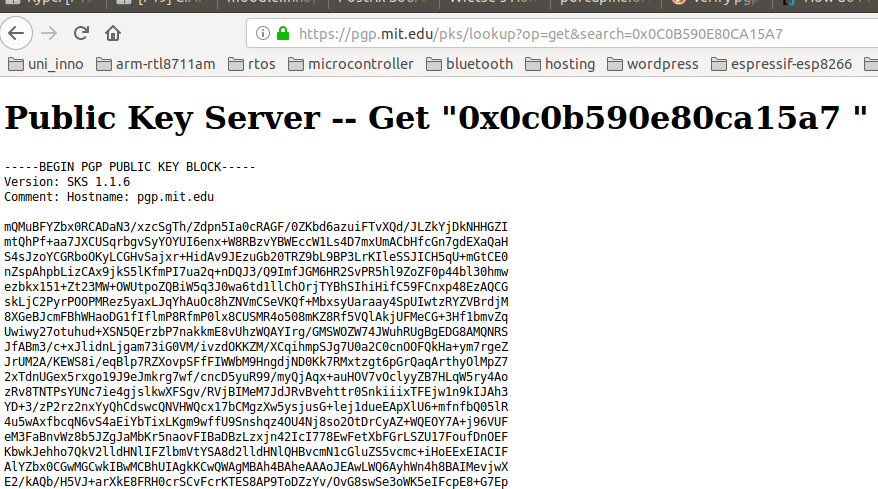
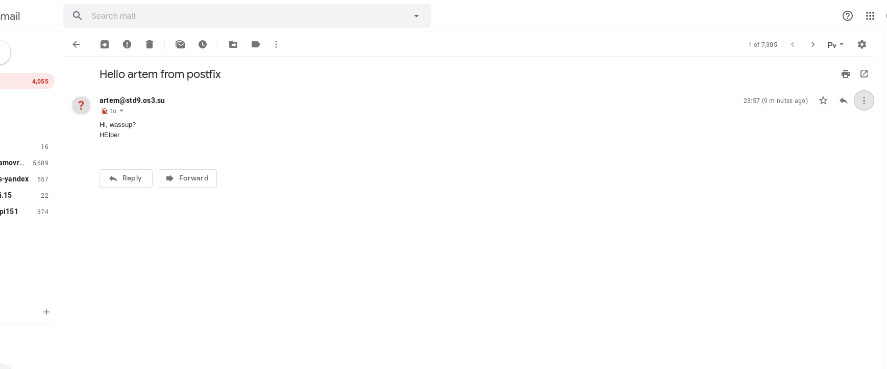
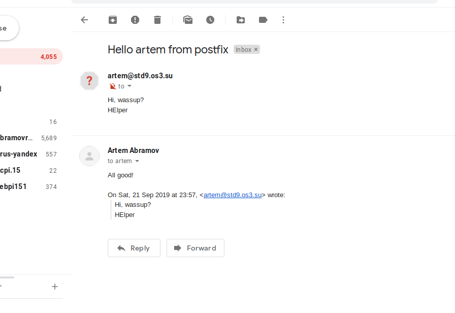
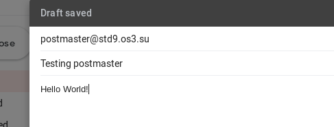
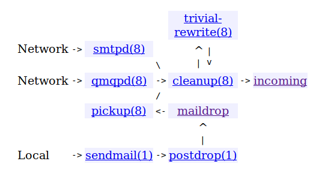
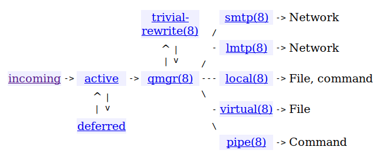
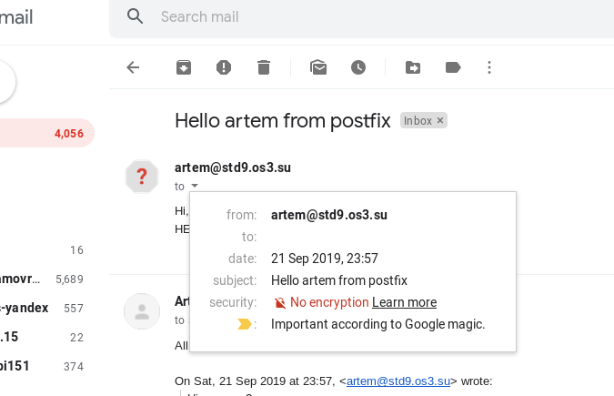
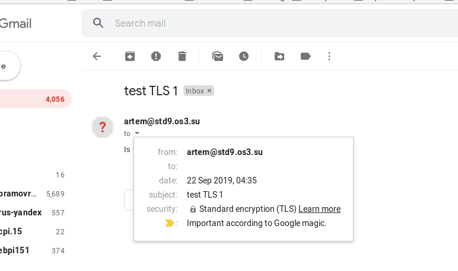

# FIA Lab 5 - Mail
#### Artem Abramov SNE19

##  Task 1 - MX from scratch

### Make sure that your system does not contain a pre-installed version of your MTA of choice. If so, remove it before you continue.

I decided to choose Postfix. After checking for postfix related directories and binaries they were found to be absent on my system.

### Make sure the source code is retrieved from a secure location. Use the official website for the MTA of your choosing. Because it is important that an archive retrieval be correct and secure, it is often signed using a digital PGP signature. If the archive you retrived is signed somehow, then make sure you have downloaded the correct sources by checking the validity of the key and the signature.

Postfix version 3.4 gzipped tarball http://mirror.host.ag/postfix/postfix-release/official/postfix-3.4.6.tar.gz

Note that the connection is via the plain HTTP, which means it is critically important to validate the source code.

The download page http://mirror.host.ag/postfix/postfix-release/index.html also has:
1.	The PGP signature for the tarball (http://mirror.host.ag/postfix/postfix-release/official/postfix-3.4.6.tar.gz.sig)
2.	Wietse Zweitze Venema's PGP key (http://mirror.host.ag/postfix/postfix-release/wietse.pgp)
3.	A mention that all postfix code is signed with Wietse's PGP key.

The problem is that all data, including Wietse's PGP key is transferred over plain HTTP, thus we can not be sure that it was not tampered with. 

The first step is verifying Wietse's PGP key. 

My first attempt was going to his homepage and checking for the PGP signature he published there: http://www.porcupine.org/wietse/wietse.pgp. Unfortunately his website does not support HTTPS. This means that:
1. Data integrity can not be verified
2. Authenticity can not be verified. 
Therefore the information retrieved from http://www.porcupine.org/wietse/wietse.pgp can not be trusted to be Wietse's PGP key. 

The second attempts was probing for a Web Key Directory running on `porcupine.org`. The Web Key Directory is used to distribute PGP keys over HTTPS:  https://wiki.gnupg.org/WKD For example (https://www.kernel.org/signature.html) the linux kernel has a Web Key Directory at `kernel.org` to make importing kernel developer keys as simple as:
```
$ gpg2 --locate-keys torvalds@kernel.org gregkh@kernel.org
```
The keys imported in this manner can be trusted because:
1.	The developers emails are taken from the kernel website (which is delivered over HTTPS thus guaranteeing integrity and authenticity) 
2.	GPG verifies the TLS certificate presented by `kernel.org` before downloading the keys. 
However `porcupine.org` does not host a Web Key Directory and importing Wietse's key in this manner is impossible.

The third attempt was searching for his key on a PGP server such as:
1.	https://keyserver.ubuntu.com
2.	https://pgp.mit.edu/
3.	http://keys2.kfwebs.net
4.	https://pgp.circl.lu
Information on this can be found at: https://wiki.gnupg.org/WebOfTrust

The servers can be searched for a person's name or key id. When entering the key id it should be prefixed with `0x` like: `0x0C0B590E80CA15A7`.
1. To figure out how the Fingerprint and Long and Short key IDs are related see: https://security.stackexchange.com/questions/84280/short-openpgp-key-ids-are-insecure-how-to-configure-gnupg-to-use-long-key-ids-i
2. Note that the Short key IDs are not secure and are obsolete: https://slashdot.org/submission/6212493/pgp-short-id-collision-attacks-continued-now-targeted-linus-torvalds

Indeed multiple keys were found on the MIT server for Wietse: https://pgp.mit.edu/pks/lookup?search=Wietse&op=index

The latest one is dated in 2015 and I was able to retrieve it with HTTPS as shown below:



Using HTTPS means that the integrity is guaranteed while data is transferred from the PGP server to my machine. However it remains to validate the authenticity of the data. In other words we must check if this key actually belongs to Wietse or if someone just uploaded it to the PGP server and supplied `Wietse Venema <wietse@porcupine.org>` as the metadata during the upload (an attacker trying to impersonate Wietse).

In fact after compaing the public key from the MIT PGP server (over HTTPS) with the one availiable from Wietse's website (over HTTP), the keys do NOT match. In other words, one of them is wrong!

In order to verify the authenticity of this key, we must build a chain of trust from a known signature that we trust. I do not have a signed public PGP key, so I can not participate in the chain. However suppose I know the public key used by Alice (so I trust it), then Alice has signed Bob's public key (thus Alice vouches that this public key belongs to a human being Bob), then suppose further that Bob used his private key to sign Wietse Venema's public key. This would form a trust chain from Alice to Wietse. Assuming that I have verified Alice's public key, this forms a chain of trust from me to Wietse's public PGP key. In other words this way we would be able to verify Wietse's public key. 

An online tool to view the trust chains can be found at https://pgp.cs.uu.nl/ (also provides key statistics) or alternatively http://www.lysator.liu.se/~jc/wotsap/index.html.

What is left is to find some PGP user that would act as Alice. I.e. a user for whom I would be able to verify the public PGP. For example we can take Linus Torvalds. His public key is published on https://www.kernel.org/doc/wot/torvalds.html (actually its not the whole key, only the fingerprint). So I can trust him to be the first link in the chain to Wietse. However it seems that his key is not published on PGP servers (its used solely for kernel signature, I guess). Thus I had to find another person who would serve as the first link in the chain.


Unfortunately after about two hours of trying to find a valid first link I had to give up.  And actually looking at an extract from the build log of how the postfix package gets compiled by the Ubuntu package managers, we can see that they don't care for the signatures either (and its a distribution!) (source: https://launchpadlibrarian.net/441280423/buildlog_ubuntu-eoan-amd64.postfix_3.4.5-1ubuntu1_BUILDING.txt.gz):

```
Unpack source
-------------

gpgv: Signature made Mon Sep  9 13:00:16 2019 UTC
gpgv:                using RSA key 886641D6358CDA46A56C1C72AC983EB5BF6BCBA9
gpgv: Can't check signature: No public key
dpkg-source: warning: failed to verify signature on ./postfix_3.4.5-1ubuntu1.dsc
dpkg-source: info: extracting postfix in postfix-3.4.5
```


In the end to verify the integrity of the download I just used public provided on the Wietse's website. The commands are shown below:

  


Step by step, first download the key:
```
artem@ lab5$ wget http://www.porcupine.org/wietse/wietse.pgp
--2019-09-21 18:51:08--  http://www.porcupine.org/wietse/wietse.pgp
Resolving www.porcupine.org (www.porcupine.org)... 168.100.185.125
Connecting to www.porcupine.org (www.porcupine.org)|168.100.185.125|:80... connected.
HTTP request sent, awaiting response... 200 OK
Length: 9281 (9.1K) [text/plain]
Saving to: ‘wietse.pgp’

wietse.pgp                              100%[===============================================================================>]   9.06K  10.4KB/s    in 0.9s    

2019-09-21 18:51:09 (10.4 KB/s) - ‘wietse.pgp’ saved [9281/9281]
```
Import the key:
```
artem@ lab5$ gpg2 --import wietse.pgp 
gpg: key 0C0B590E80CA15A7: 2 signatures not checked due to missing keys
gpg: key 0C0B590E80CA15A7: public key "Wietse Venema <wietse@porcupine.org>" imported
gpg: Total number processed: 3
gpg:     skipped PGP-2 keys: 2
gpg:               imported: 1
gpg: no ultimately trusted keys found
```

Verify the integrity of the download with the signature:
```
artem@ lab5$ gpg2 --verify postfix-3.4.6.tar.gz.gpg2 postfix-3.4.6.tar.gz
gpg: Signature made Sun 30 Jun 2019 02:38:08 MSK
gpg:                using DSA key 0C0B590E80CA15A7
gpg: Good signature from "Wietse Venema <wietse@porcupine.org>" [unknown]
gpg: WARNING: This key is not certified with a trusted signature!
gpg:          There is no indication that the signature belongs to the owner.
Primary key fingerprint: 622C 7C01 2254 C186 6774  69C5 0C0B 590E 80CA 15A7
```


2. https://lwn.net/Articles/461236/

3. https://www.kernel.org/doc/html/latest/process/maintainer-pgp-guide.html

4. https://2hourscrypto.info/

5. http://www.stargrave.org/

6. https://www.devdungeon.com/content/how-verify-gpg-signature

   


### There are a number of options that you will have to enter for (re-)compilation. Look at the available features beforehand.

The build options are described in `INSTALL` document. In particular it describes how to build Postfix in order to: 
1.	Send mail only, without changing an existing Sendmail installation.
2.	Send and receive mail via a virtual host interface, still without any change to an existing Sendmail installation.
3.	Run Postfix instead of Sendmail.

And the various options that can be passed to `make`,.

One way to pass parameters is as shown below:

```
$ make makefiles CCARGS='-DDEF_CONFIG_DIR=\"/some/where\"'
$ make
```

More Postfix parameters can also be specified by the configuration file (except for the location of the configuration file). These parameters include:

```
	 ____________________________________________________________
    |Macro name       |default value for    |typical default     |
    |_________________|_____________________|____________________|
    |DEF_COMMAND_DIR  |command_directory    |/usr/sbin           |
    |_________________|_____________________|____________________|
    |DEF_CONFIG_DIR   |config_directory     |/etc/postfix        |
    |_________________|_____________________|____________________|
    |DEF_DB_TYPE      |default_database_type|hash                |
    |_________________|_____________________|____________________|
    |DEF_DAEMON_DIR   |daemon_directory     |/usr/libexec/postfix|
    |_________________|_____________________|____________________|
    |DEF_DATA_DIR     |data_directory       |/var/lib/postfix    |
    |_________________|_____________________|____________________|
    |DEF_MAILQ_PATH   |mailq_path           |/usr/bin/mailq      |
    |_________________|_____________________|____________________|
    |DEF_HTML_DIR     |html_directory       |no                  |
    |_________________|_____________________|____________________|
    |DEF_MANPAGE_DIR  |manpage_directory    |/usr/local/man      |
    |_________________|_____________________|____________________|
    |DEF_NEWALIAS_PATH|newaliases_path      |/usr/bin/newaliases |
    |_________________|_____________________|____________________|
    |DEF_QUEUE_DIR    |queue_directory      |/var/spool/postfix  |
    |_________________|_____________________|____________________|
    |DEF_README_DIR   |readme_directory     |no                  |
    |_________________|_____________________|____________________|
    |DEF_SENDMAIL_PATH|sendmail_path        |/usr/sbin/sendmail  |
    |_________________|_____________________|____________________|
```

Another way to pass configuration parameters is shown below:

```
$ make makefiles name=value name=value...
$ make
```


The list of possible name and values is below:
```
 _____________________________________________________________________________
|Name/Value                     |Description                                  |
|_______________________________|_____________________________________________|
|                               |Specifies one or more non-default object     |
|                               |libraries. Postfix 3.0 and later specify some|
|                               |of their database library dependencies with  |
|AUXLIBS="object_library..."    |AUXLIBS_CDB, AUXLIBS_LDAP, AUXLIBS_LMDB,     |
|                               |AUXLIBS_MYSQL, AUXLIBS_PCRE, AUXLIBS_PGSQL,  |
|                               |AUXLIBS_SDBM, and AUXLIBS_SQLITE,            |
|                               |respectively.                                |
|_______________________________|_____________________________________________|
|CC=compiler_command            |Specifies a non-default compiler. On many    |
|                               |systems, the default is gcc.                 |
|_______________________________|_____________________________________________|
|                               |Specifies non-default compiler arguments, for|
|CCARGS="compiler_arguments..." |example, a non-default include directory. The|
|                               |following directives turn off Postfix        |
|                               |features at compile time:                    |
|_______________________________|_____________________________________________|
||                              |Do not build with Berkeley DB support. By    |
||                              |default, Berkeley DB support is compiled in  |
||-DNO_DB                       |on platforms that are known to support this  |
||                              |feature. If you override this, then you      |
||                              |probably should also override DEF_DB_TYPE as |
||                              |described in section 4.6.                    |
||______________________________|_____________________________________________|
||-DNO_DNSSEC                   |Do not build with DNSSEC support, even if the|
||                              |resolver library appears to support it.      |
||______________________________|_____________________________________________|
||                              |Do not build with Solaris /dev/poll support. |
||-DNO_DEVPOLL                  |By default, /dev/poll support is compiled in |
||                              |on Solaris versions that are known to support|
||                              |this feature.                                |
||______________________________|_____________________________________________|
||                              |Do not build with Linux EPOLL support. By    |
||-DNO_EPOLL                    |default, EPOLL support is compiled in on     |
||                              |platforms that are known to support this     |
||                              |feature.                                     |
||______________________________|_____________________________________________|
||                              |Do not build with EAI (SMTPUTF8) support. By |
||-DNO_EAI                      |default, EAI support is compiled in when the |
||                              |"icuuc" library and header files are found.  |
||______________________________|_____________________________________________|
||                              |Do not require support for C99 "inline"      |
||                              |functions. Instead, implement argument       |
||-DNO_INLINE                   |typechecks for non-printf/scanf-like         |
||                              |functions with ternary operators and         |
||                              |unreachable code.                            |
||______________________________|_____________________________________________|
||                              |Do not build with IPv6 support. By default,  |
||                              |IPv6 support is compiled in on platforms that|
||                              |are known to have IPv6 support. Note: this   |
||-DNO_IPV6                     |directive is for debugging And testing only. |
||                              |It is not guaranteed to work on all          |
||                              |platforms. If you don't want IPv6 support,   |
||                              |set "inet_protocols = ipv4" in main.cf.      |
||______________________________|_____________________________________________|
||                              |Do not build with FreeBSD / NetBSD / OpenBSD |
||-DNO_KQUEUE                   |/ MacOSX KQUEUE support. By default, KQUEUE  |
||                              |support is compiled in on platforms that are |
||                              |known to support it.                         |
||______________________________|_____________________________________________|
||                              |Do not build with NIS or NISPLUS support. NIS|
||-DNO_NIS                      |is not available on some recent Linux        |
||                              |distributions.                               |
||______________________________|_____________________________________________|
||                              |Do not build with NISPLUS support. NISPLUS is|
||-DNO_NISPLUS                  |not available on some recent Solaris         |
||                              |distributions.                               |
||______________________________|_____________________________________________|
||                              |Do not build with PCRE support. By default,  |
||-DNO_PCRE                     |PCRE support is compiled in when the pcre-   |
||                              |config utility is installed.                 |
||______________________________|_____________________________________________|
||                              |Disable support for POSIX getpwnam_r/        |
||-DNO_POSIX_GETPW_R            |getpwuid_r. By default Postfix uses these    |
||                              |where they are known to be available.        |
||______________________________|_____________________________________________|
||                              |Use setjmp()/longjmp() instead of sigsetjmp  |
||-DNO_SIGSETJMP                |()/siglongjmp(). By default, Postfix uses    |
||                              |sigsetjmp()/siglongjmp() when they are known |
||                              |to be available.                             |
||______________________________|_____________________________________________|
||                              |Use sprintf() instead of snprintf(). By      |
||-DNO_SNPRINTF                 |default, Postfix uses snprintf() except on   |
||                              |ancient systems.                             |
||______________________________|_____________________________________________|
|                               |Specifies a non-default compiler debugging   |
|DEBUG=debug_level              |level. The default is "-g". Specify DEBUG= to|
|                               |turn off debugging.                          |
|_______________________________|_____________________________________________|
|                               |Specifies a non-default optimization level.  |
|OPT=optimization_level         |The default is "-O". Specify OPT= to turn off|
|                               |optimization.                                |
|_______________________________|_____________________________________________|
|                               |Specifies options for the postfix-install    |
|POSTFIX_INSTALL_OPTS=-option...|command, separated by whitespace. Currently, |
|                               |the only supported option is "-keep-build-   |
|                               |mtime".                                      |
|_______________________________|_____________________________________________|
|                               |Specifies non-default compiler options for   |
|SHLIB_CFLAGS=flags             |building Postfix dynamically-linked libraries|
|                               |and database plugins. The typical default is |
|                               |"-fPIC".                                     |
|_______________________________|_____________________________________________|
|                               |Specifies a non-default runpath for Postfix  |
|SHLIB_RPATH=rpath              |dynamically-linked libraries. The typical    |
|                               |default is "'-Wl,-rpath,${SHLIB_DIR}'".      |
|_______________________________|_____________________________________________|
|                               |Specifies a non-default suffix for Postfix   |
|SHLIB_SUFFIX=suffix            |dynamically-linked libraries and database    |
|                               |plugins. The typical default is ".so".       |
|_______________________________|_____________________________________________|
|                               |Specifies non-default compiler warning       |
|WARN="warning_flags..."        |options for use when "make" is invoked in a  |
|                               |source subdirectory only.                    |
|_______________________________|_____________________________________________|

```

There are more optional features that expose multiple configuration parameters. The parameters for each feature are described in the respective README document:
```
     _____________________________________________________________
    |Optional feature                  |Document     |Availability|
    |__________________________________|_____________|____________|
    |Berkeley DB database              |DB_README    |Postfix 1.0 |
    |__________________________________|_____________|____________|
    |LMDB database                     |LMDB_README  |Postfix 2.11|
    |__________________________________|_____________|____________|
    |LDAP database                     |LDAP_README  |Postfix 1.0 |
    |__________________________________|_____________|____________|
    |MySQL database                    |MYSQL_README |Postfix 1.0 |
    |__________________________________|_____________|____________|
    |Perl compatible regular expression|PCRE_README  |Postfix 1.0 |
    |__________________________________|_____________|____________|
    |PostgreSQL database               |PGSQL_README |Postfix 2.0 |
    |__________________________________|_____________|____________|
    |SASL authentication               |SASL_README  |Postfix 1.0 |
    |__________________________________|_____________|____________|
    |SQLite database                   |SQLITE_README|Postfix 2.8 |
    |__________________________________|_____________|____________|
    |STARTTLS session encryption       |TLS_README   |Postfix 2.2 |
    |__________________________________|_____________|____________|
```


Before building, clean up the previous build:

```
$ make tidy
```

And then applied roughly the same configuration as the Ubuntu package (from https://launchpadlibrarian.net/441280423/buildlog_ubuntu-eoan-amd64.postfix_3.4.5-1ubuntu1_BUILDING.txt.gz):

```
$ make makefiles CCARGS="-DHAS_PCRE -DHAS_SQLITE -I/usr/include -DHAS_SSL -I/usr/include/openssl -DUSE_TLS" DEBUG="-g" \
	AUXLIBS="-lssl -lcrypto -lsasl2 -lpthread" OPT="-O2"\
	AUXLIBS_SQLITE="-lsqlite3 -L../../lib -L. -lpostfix-util -lpostfix-global -lpthread" \
	shared=yes \
	daemon_directory=/usr/lib/postfix/sbin \
	shlibs_directory=/usr/lib/postfix manpage_directory=/usr/share/man \
	sample_directory=/usr/share/doc/postfix/examples
	readme_directory=/usr/share/doc/postfix \
	html_directory=/usr/share/doc/postfix/html
```

To find the build log for Ubuntu I used info from the following link: https://askubuntu.com/questions/48499/where-can-i-find-the-configure-options-used-to-build-a-package


### Configure the daemon for your zone in view to host emails addressed to @stdX.os3.su.

The syntax and initial config for postfix: http://www.postfix.org/BASIC_CONFIGURATION_README.html

The initial configuration file is shown below:

```
# See /usr/share/postfix/main.cf.dist for a commented, more complete version
myorigin = $mydomain
mydestination = $mydomain, www.$mydomain, mail.$mydomain, lab.$mydomain, $myhostname, artem-209-HP-EliteDesk-800-G1-SFF, localhost.localdomain, localhost
mynetworks_style = host
relayhost = 
myhostname = mail.std9.os3.su
inet_interfaces = all
smtpd_banner = $myhostname ESMTP $mail_name
biff = no
# TLS parameters
# See /usr/share/doc/postfix/TLS_README.gz in the postfix-doc package for SSL in smtp client
smtpd_tls_cert_file=/etc/ssl/certs/ssl-cert-snakeoil.pem
smtpd_tls_key_file=/etc/ssl/private/ssl-cert-snakeoil.key
smtpd_use_tls=yes
smtpd_tls_session_cache_database = btree:${data_directory}/smtpd_scache
smtp_tls_session_cache_database = btree:${data_directory}/smtp_scache
append_dot_mydomain = no
readme_directory = no
compatibility_level = 2
smtpd_relay_restrictions = permit_mynetworks permit_sasl_authenticated defer_unauth_destination
alias_maps = hash:/etc/aliases
alias_database = hash:/etc/aliases
mailbox_size_limit = 0
recipient_delimiter = +
inet_protocols = all
```

To test the setup I followed the instructions at https://stackoverflow.com/questions/4798772/postfix-its-installed-but-how-do-i-test

Quoted here for reference. Check that postfix is running:
```
artem@ mail$ ps aux | grep postfix
root       781  0.0  0.0  67372  4204 ?        Ss   23:42   0:00 /usr/lib/postfix/sbin/master -w
postfix    782  0.0  0.0  73808  5512 ?        S    23:42   0:00 pickup -l -t unix -u -c
postfix    783  0.0  0.0  73856  5432 ?        S    23:42   0:00 qmgr -l -t unix -u
postfix   1475  0.0  0.0  87720  8356 ?        S    23:51   0:00 tlsmgr -l -t unix -u -c
```

And that its listening on port 25:
```
artem@ mail$ netstat -lnt
Active Internet connections (only servers)
Proto Recv-Q Send-Q Local Address           Foreign Address         State      
tcp        0      0 0.0.0.0:25              0.0.0.0:*               LISTEN     
tcp        0      0 188.130.155.42:53       0.0.0.0:*               LISTEN     
tcp        0      0 127.0.0.1:631           0.0.0.0:*               LISTEN     
tcp6       0      0 :::25                   :::*                    LISTEN     
tcp6       0      0 ::1:631                 :::*                    LISTEN 
```

Then telnet to localhost port 25 to test sending mail to a local user from root (lines prefixed with numbers `250`, `354` are written by postfix, everything is typed by the user).
Also do not forget the `.` at the end, which indicates end of line:
```
artem@ postfix-3.4.6$ telnet localhost 25
Trying 127.0.0.1...
Connected to localhost.
Escape character is '^]'.
220 mail.std9.os3.su ESMTP Postfix
ehlo localhost
250-mail.std9.os3.su
250-PIPELINING
250-SIZE 10240000
250-VRFY
250-ETRN
250-STARTTLS
250-ENHANCEDSTATUSCODES
250-8BITMIME
250-DSN
250 SMTPUTF8
mail from: root@localhost
250 2.1.0 Ok
rcpt to: artem@std9.os3.su
250 2.1.5 Ok
data
354 End data with <CR><LF>.<CR><LF>
Subject: My first email

Hi,
Artem you there?
Admin
.
250 2.0.0 Ok: queued as DE8FFB616AC
```

Check that mail arrived (it was send to a local user):
```
artem@ mail$ cat /var/mail/artem 
From root@localhost  Sat Sep 21 23:52:54 2019
Return-Path: <root@localhost>
X-Original-To: artem@std9.os3.su
Delivered-To: artem@std9.os3.su
Received: from localhost (localhost [127.0.0.1])
	by mail.std9.os3.su (Postfix) with ESMTP id DE8FFB616AC
	for <artem@std9.os3.su>; Sat, 21 Sep 2019 23:52:09 +0300 (MSK)
Subject: My first email
Message-Id: <20190921205227.DE8FFB616AC@mail.std9.os3.su>
Date: Sat, 21 Sep 2019 23:52:09 +0300 (MSK)
From: root@localhost

Hi,
Artem you there?
Admin
```


Then telnet to port 25 and send mail from local account `artem@std9.os3.su` to my gmail account `tematibr@gmai.com` (Again do not forget the `.`):
```
artem@ mail$ telnet localhost 25
Trying 127.0.0.1...
Connected to localhost.
Escape character is '^]'.
220 mail.std9.os3.su ESMTP Postfix
ehlo std9.os3.su
250-mail.std9.os3.su
250-PIPELINING
250-SIZE 10240000
250-VRFY
250-ETRN
250-STARTTLS
250-ENHANCEDSTATUSCODES
250-8BITMIME
250-DSN
250 SMTPUTF8
mail from: artem@std9.os3.su
250 2.1.0 Ok
rcpt to: tematibr@gmail.com
250 2.1.5 Ok
data
354 End data with <CR><LF>.<CR><LF>
Subject: Hello artem from postfix

Hi, wassup?
HElper
.
250 2.0.0 Ok: queued as 2459FB616AC
```

Check that mail arrived to gmail:



Below is a raw email view provided by gmail that shows the details:

```
Delivered-To: tematibr@gmail.com
Received: by 2002:ac2:515c:0:0:0:0:0 with SMTP id q28csp851474lfd;
        Sat, 21 Sep 2019 13:57:49 -0700 (PDT)
X-Google-Smtp-Source: APXvYqzg/Wy5bGbG4CqlfoQVcoBiPinoE/TdCp8svAng7GhWFe16Axo8i3Fd2K+yuPVtTcmIkyE5
X-Received: by 2002:a2e:9450:: with SMTP id o16mr2785605ljh.178.1569099469049;
        Sat, 21 Sep 2019 13:57:49 -0700 (PDT)
ARC-Seal: i=1; a=rsa-sha256; t=1569099469; cv=none;
        d=google.com; s=arc-20160816;
        b=Bydc1dM1gj0KHwaKxX9MPjZBwaIBlbxrdT8GDHWeJu9g/bGtCUDM6/0VpDQcvYpWcu
         XJrFj5C95Z4yzRr2TU4TpPjmwy5FCe2w21KnXhrTyb2GyuhguoMFqlk8F/S8T4fazjaa
         5ZlqjlFw9yH3hLMmCyd1sJ6VdIjFZrlqxeGleLRqEOriSCnXUhd7oNB3ac51H6cCo64k
         +k2ztDK8HLqH6Zfn3przDXR4AbB7anoYB1r2kunnQq+C19gdfXmII2kLux5IU1swJzvJ
         PtUjAVQXw/0ZRSosJNaAQL2JfbRR3SWNw2BT6VePVZQP0HOUqcFj6AQ3ErCcCcqzwc2B
         HxSQ==
ARC-Message-Signature: i=1; a=rsa-sha256; c=relaxed/relaxed; d=google.com; s=arc-20160816;
        h=from:date:message-id:subject;
        bh=HV7lMBeXw9LGybkaztiivpB1giGiJv8urJI8kVZc/cw=;
        b=VoOjPfAbVJxXtMN5k/OuIOAeXUu7rkPMKjLN6F3cD9LCi3Dm+XVf+5vxPh3aT76662
         H+cilMaRbdgPeRX/vVsd8Y0uDwR3DXhD5eAhdoNZ+dCjkIBeufx7rU0Y/JylrNY086xy
         /6VvPRtBBMKx9o8yCl+E9AtV6bVEx8joKJ49Lrnw50VsGf7GJAOy5xCFWmNZL9DCx4/K
         SGXV1UIINyFGfmroD26FsY5yZtx6Il9Q1cyr94l+AQ/gC0J4J8HWeUJLfFT7HWe27yT4
         39Mi4p+dT1ByS9OlwWOcWuypSFvodyLywzNsn+WAHhqQPST19tekvOZ39+vXjMQhs8wd
         nXuQ==
ARC-Authentication-Results: i=1; mx.google.com;
       spf=neutral (google.com: 188.130.155.42 is neither permitted nor denied by best guess record for domain of artem@std9.os3.su) smtp.mailfrom=artem@std9.os3.su
Return-Path: <artem@std9.os3.su>
Received: from mail.std9.os3.su ([188.130.155.42])
        by mx.google.com with ESMTP id z11si5075040ljn.232.2019.09.21.13.57.48
        for <tematibr@gmail.com>;
        Sat, 21 Sep 2019 13:57:48 -0700 (PDT)
Received-SPF: neutral (google.com: 188.130.155.42 is neither permitted nor denied by best guess record for domain of artem@std9.os3.su) client-ip=188.130.155.42;
Authentication-Results: mx.google.com;
       spf=neutral (google.com: 188.130.155.42 is neither permitted nor denied by best guess record for domain of artem@std9.os3.su) smtp.mailfrom=artem@std9.os3.su
Received: from std9.os3.su (localhost [127.0.0.1]) by mail.std9.os3.su (Postfix) with ESMTP id 2459FB616AC for <tematibr@gmail.com>; Sat, 21 Sep 2019 23:57:07 +0300 (MSK)
Subject: Hello artem from postfix
Message-Id: <20190921205720.2459FB616AC@mail.std9.os3.su>
Date: Sat, 21 Sep 2019 23:57:07 +0300 (MSK)
From: artem@std9.os3.su

Hi, wassup?
HElper

```


Lets try sending a reply!



And it works as shown below!

```
artem@ mail$ cat /var/mail/artem 
From root@localhost  Sat Sep 21 23:52:54 2019
Return-Path: <root@localhost>
X-Original-To: artem@std9.os3.su
Delivered-To: artem@std9.os3.su
Received: from localhost (localhost [127.0.0.1])
	by mail.std9.os3.su (Postfix) with ESMTP id DE8FFB616AC
	for <artem@std9.os3.su>; Sat, 21 Sep 2019 23:52:09 +0300 (MSK)
Subject: My first email
Message-Id: <20190921205227.DE8FFB616AC@mail.std9.os3.su>
Date: Sat, 21 Sep 2019 23:52:09 +0300 (MSK)
From: root@localhost

Hi,
Artem you there?
Admin

From tematibr@gmail.com  Sun Sep 22 00:09:13 2019
Return-Path: <tematibr@gmail.com>
X-Original-To: artem@std9.os3.su
Delivered-To: artem@std9.os3.su
Received: from mail-lj1-f171.google.com (mail-lj1-f171.google.com [209.85.208.171])
	by mail.std9.os3.su (Postfix) with ESMTPS id E62A0B616AC
	for <artem@std9.os3.su>; Sun, 22 Sep 2019 00:09:12 +0300 (MSK)
Received: by mail-lj1-f171.google.com with SMTP id v24so10219077ljj.3
        for <artem@std9.os3.su>; Sat, 21 Sep 2019 14:09:12 -0700 (PDT)
DKIM-Signature: v=1; a=rsa-sha256; c=relaxed/relaxed;
        d=gmail.com; s=20161025;
        h=mime-version:references:in-reply-to:from:date:message-id:subject:to;
        bh=V4yKZYsHcqjb7MyJ8YdVcJalLmWG1/MaEMoLfgBGeQU=;
        b=A4KEzDbnC9f2Cj66F4jkqwgB4eCrd2RCidXM5sXA1eyQqbs2Z4F1Eiy09jVQZ0zwYu
         RrRxlltM2Z3v35Ygc48Wbgr6Eql878KAHC1ciiO2iFToRn4HNTVWfY7uLsW+Op85qz/7
         9l5+DpGh1VUVeNH1m8yC29Z/1QZAXURo27DLLEsrwqiWzRQZD6T19Xszcq8RnHEK2/hH
         4fu3HI95vCPz2Yl1vk5NgQkL2MpH+ZD2yPm4Uyc4ttnlvYVF+cJ4HqvtvuYgre9L+9PK
         DDxJMzv85bPKPW0dMxQFabRhuPSbUhg/PQyeWSiRx8qxbbh8Q/p7slba3vtpGlXXsUxM
         jOAw==
X-Google-DKIM-Signature: v=1; a=rsa-sha256; c=relaxed/relaxed;
        d=1e100.net; s=20161025;
        h=x-gm-message-state:mime-version:references:in-reply-to:from:date
         :message-id:subject:to;
        bh=V4yKZYsHcqjb7MyJ8YdVcJalLmWG1/MaEMoLfgBGeQU=;
        b=ojYRXjzzPqL776R+sKYMHJS33s4XvVvkKrAFkxloN5uW7J7bCvVcZYCuTRtdqWytpb
         CmqKJXp2SkbVegi4gvGkTSrbD2cPc6H6hkh4RDoEWmtlomnhHLQEkmWgrB1ZtksRQ/Ab
         npPumawnbjoP4T0BhNvhK4oQI7wa3DkhplKTAkOz1nOZQe3uRTMzO13Bt3d2eQZUnWfz
         05xIFf8VphxsnStF42/oQkq6FkLj6EYpD40Gj0lwl/8/D9wefAIegay5VVAvcuSu4LK3
         kXd7mMKmCa0oLf5Yy+EXzZKMYKXZ0rRxU8PdDMQzH/wV/aAwDOCgOZs4zAwS8CQEB2ga
         V2pw==
X-Gm-Message-State: APjAAAXPqiNxRIX76ypTyy35hLIAfO6bnQcgAof0P6WP962ueznO5vAY
	lbDGVh/lXLRLBlO90PVT/rIIhF+x9d4XKmslQbW+VQ==
X-Google-Smtp-Source: APXvYqwBKGXHOOldBaiGr6hxjVzzdA65BY+El51XYRjyvoPjqEbZyW1nDJV3taiRDj4tYhfKkzZ9k1cjzcLh+keA0/w=
X-Received: by 2002:a2e:b055:: with SMTP id d21mr5610746ljl.236.1569100151794;
 Sat, 21 Sep 2019 14:09:11 -0700 (PDT)
MIME-Version: 1.0
References: <20190921205720.2459FB616AC@mail.std9.os3.su>
In-Reply-To: <20190921205720.2459FB616AC@mail.std9.os3.su>
From: Artem Abramov <tematibr@gmail.com>
Date: Sun, 22 Sep 2019 00:09:00 +0300
Message-ID: <CAHWOQyjq81DYATZcO3L23SiLXCk8Tv+k7LC3ZEo4YKQk+VbsmA@mail.gmail.com>
Subject: Re: Hello artem from postfix
To: artem@std9.os3.su
Content-Type: multipart/alternative; boundary="0000000000002a307e05931699c7"

--0000000000002a307e05931699c7
Content-Type: text/plain; charset="UTF-8"

All good!

On Sat, 21 Sep 2019 at 23:57, <artem@std9.os3.su> wrote:

> Hi, wassup?
> HElper
>

--0000000000002a307e05931699c7
Content-Type: text/html; charset="UTF-8"
Content-Transfer-Encoding: quoted-printable

<div dir=3D"ltr">All good!<br></div><br><div class=3D"gmail_quote"><div dir=
=3D"ltr" class=3D"gmail_attr">On Sat, 21 Sep 2019 at 23:57, &lt;<a href=3D"=
mailto:artem@std9.os3.su">artem@std9.os3.su</a>&gt; wrote:<br></div><blockq=
uote class=3D"gmail_quote" style=3D"margin:0px 0px 0px 0.8ex;border-left:1p=
x solid rgb(204,204,204);padding-left:1ex">Hi, wassup?<br>
HElper<br>
</blockquote></div>

--0000000000002a307e05931699c7--
```


The commands used to communicate with the mail daemon are described in detail in RFC821: https://tools.ietf.org/html/rfc821

Where the mailbox is located: https://unix.stackexchange.com/questions/23277/where-does-postfix-store-email


After sending and receiving the first mail, is a good time to harden the postfix configuration (for example disabling the VERIFY command, which can enumerate all users on the system): https://linux-audit.com/postfix-hardening-guide-for-security-and-privacy/


### Add a local account, setup an alias for postmaster@stdX.os3. su against it, and make sure that the MTA delivers mail to it. Send and show a received test message in full (incl. headers) in your report.

Adding the new local user:

```
artem@ mail$ sudo adduser mailman
Adding user `mailman' ...
Adding new group `mailman' (1001) ...
Adding new user `mailman' (1001) with group `mailman' ...
Creating home directory `/home/mailman' ...
Copying files from `/etc/skel' ...
Enter new UNIX password: 
Retype new UNIX password: 
passwd: password updated successfully
Changing the user information for mailman
Enter the new value, or press ENTER for the default
	Full Name []: mailman
	Room Number []: 
	Work Phone []: 
	Home Phone []: 
	Other []: 
Is the information correct? [Y/n] y
```


Setting up the alias (file format is defined in `man 5 aliases`):

```
artem@ mail$ cat /etc/aliases
postmaster:    mailman
```

Trigger reconfiguration:

```
artem@ mail$ sudo newaliases 
artem@ mail$ echo $?
0
```


Send mail from gmail to `postmaster@std9.os3.su`:



Gmail can show the email details for send mail:

```
MIME-Version: 1.0
Date: Sun, 22 Sep 2019 00:40:36 +0300
Message-ID: <CAHWOQyhR2oTzCfRnf6ov33Bd2866uzsqOvUhejCNodshCkz2Cg@mail.gmail.com>
Subject: Testing postmaster
From: Artem Abramov <tematibr@gmail.com>
To: postmaster@std9.os3.su
Content-Type: multipart/alternative; boundary="000000000000849ee405931709b4"

--000000000000849ee405931709b4
Content-Type: text/plain; charset="UTF-8"

Hello World!

--000000000000849ee405931709b4
Content-Type: text/html; charset="UTF-8"

<div dir="ltr"><div>Hello World!</div></div>

--000000000000849ee405931709b4--
```


Check that response has arrived:

```
artem@ mail$ ll /var/mail/
total 16
drwxrwsr-x  2 root    mail 4096 Sep 22 00:40 ./
drwxr-xr-x 15 root    root 4096 Sep  5 04:42 ../
-rw-------  1 artem   mail 3784 Sep 22 00:09 artem
-rw-------  1 mailman mail 2657 Sep 22 00:40 mailman
```

View the response:

```
artem@ mail$ sudo cat mailman 
From tematibr@gmail.com  Sun Sep 22 00:40:48 2019
Return-Path: <tematibr@gmail.com>
X-Original-To: postmaster@std9.os3.su
Delivered-To: postmaster@std9.os3.su
Received: from mail-lf1-f53.google.com (mail-lf1-f53.google.com [209.85.167.53])
	by mail.std9.os3.su (Postfix) with ESMTPS id 7B92FB616AC
	for <postmaster@std9.os3.su>; Sun, 22 Sep 2019 00:40:48 +0300 (MSK)
Received: by mail-lf1-f53.google.com with SMTP id d17so7419129lfa.7
        for <postmaster@std9.os3.su>; Sat, 21 Sep 2019 14:40:48 -0700 (PDT)
DKIM-Signature: v=1; a=rsa-sha256; c=relaxed/relaxed;
        d=gmail.com; s=20161025;
        h=mime-version:from:date:message-id:subject:to;
        bh=TP7LrnJJQYReLrnt5eHe30HM/ajXu+jq6mI2JRGYbOQ=;
        b=R/OsgnCHtjHuwc10HZsDxNKbJIfaz9EFAwCe1DomeL5AtNJLDGCkvh5jURlrqToMAX
         x67MNh23eA9bgmSIQMhMC5PS/Q6sBALXch0+fKjSmd6/a2dVQ9McUhrZNGJguiigdQEn
         npxPDbzg3A365EWfJ903QPZz9XF3d/hfEEyGiXGFipm9EHE6++kRETlAnt4mhhf6NAmp
         6hN8aLh3jVTBKhc7Ra76F9EOMHKIANwCCeGp9OqQ2KnEdU3oRUuiJ0q8+QG0cV0QOhZ5
         NUx96AqP/4sjDmlcj92z2SCcURUXtOKQ1XJrubpSdw9JwVuUjGvT1vo+6t/urNdObqM7
         qb7A==
X-Google-DKIM-Signature: v=1; a=rsa-sha256; c=relaxed/relaxed;
        d=1e100.net; s=20161025;
        h=x-gm-message-state:mime-version:from:date:message-id:subject:to;
        bh=TP7LrnJJQYReLrnt5eHe30HM/ajXu+jq6mI2JRGYbOQ=;
        b=bnhIvi/BWXcEVaHtBRiSuebImd5gXTWvNgud/psMfBQ1uquapqQA+fYueUACf+3vKV
         0NrH3gYDBRg+gYNmuGjz0yQBqYgXki4JHwj+G5SrPh9B142rFGg6V78qbl7IMjJ8fs/9
         VCgg+d0TcHoV7Wm1JNJifdUlNTlWY5caGQsgAg9R90S9FXXA7zUWQNHbFB0aV60ldK/a
         CRtAwDgH1k9YO6Cy4pCSDvHOqQLO6HO5mH+ULFKUL0OCGlXXJ1vj00/I1VQTqlB3gbT/
         x/TX3Du3grqxn51vMSU2Wb1vWTED+TKCcTRhGTbfyAReOHActXqQ74x2haiJOMZpkCUx
         igvw==
X-Gm-Message-State: APjAAAXVm3ybe2Fm+MP5/ff+cn2h6/28jOpzNNb+PdaXrELE4ws+O61J
	2fT+V7ATlX5+i3Jm8VxgNpqJ0NZ4cKDpmucgn4rXaw==
X-Google-Smtp-Source: APXvYqy+zFStxQAddBhQfgdCXKVB/1yhYIDDSGhsef2bNJgeW+TY1P4d3vPy80mZzI2j4My+POyqQry7IOGitEd01e4=
X-Received: by 2002:ac2:53a3:: with SMTP id j3mr12577260lfh.155.1569102047592;
 Sat, 21 Sep 2019 14:40:47 -0700 (PDT)
MIME-Version: 1.0
From: Artem Abramov <tematibr@gmail.com>
Date: Sun, 22 Sep 2019 00:40:36 +0300
Message-ID: <CAHWOQyhR2oTzCfRnf6ov33Bd2866uzsqOvUhejCNodshCkz2Cg@mail.gmail.com>
Subject: Testing postmaster
To: postmaster@std9.os3.su
Content-Type: multipart/alternative; boundary="00000000000029c2ae0593170a49"

--00000000000029c2ae0593170a49
Content-Type: text/plain; charset="UTF-8"

Hello World!

--00000000000029c2ae0593170a49
Content-Type: text/html; charset="UTF-8"

<div dir="ltr"><div>Hello World!</div></div>

--00000000000029c2ae0593170a49--
```

source: https://serverfault.com/questions/133326/postfix-how-do-i-make-email-aliases-work

### What mail queues your mail server uses? What is their purpose? Where are they located on your machine? How can you interact with them?

Mail queue is a directory used to store the contents and metadata for messages. 

Postfix has five different queues and they are listed below: 
1.	maildrop
2. 	hold
3.  incoming
4.	active
5.	deferred

source: http://www.postfix.org/QSHAPE_README.html#queues

In the tasks above when I was sending an email with telnet client the email was first given an ID and queued for sending in the `maildrop` queue. Outgoing mail can also be put into the  `deferred` queue, if the remote host (or relay) does not answer the request, then postfix will try to send the message later. Another reason is if postfix is configured to process the queues at certain intervals, rather than immediately, in which case the messages must be stored temporarily. 

The administrator can define policies, or cleanup checks that cause messages to be automatically placed indefinitely in the `hold` queue. 

Incoming mail gets queued in the `incoming` queue. When a message reaches the incoming queue the next step is to deliver it to the actual recipient on this machine. 

The `active queue` acts as a window on potentially large `incoming`or `deferred queues`.  

The deferred queue is used for mail that cannot be delivered, if for example the remote host could not be contacted.

Diagram showing how Postfix receives mail is shown below, the nodes without numbers represent queues (i.e. `incoming` and `maildrop`):




Diagram showing how Postfix delivers mail is shown below, the nodes without numbers represent queues (i.e. `incoming`,  `active` and `deferred`):



source: http://www.postfix.org/OVERVIEW.html

Location of the queues is in `/var/spool/postfix` as shown below:

```
artem@ mail$ postconf | grep queue_directory
queue_directory = /var/spool/postfix
```

The queue directory has a complex structure as shown below:

```
artem@ mail$ cd /var/spool/postfix/
artem@ postfix$ sudo tree
.
├── active
├── bounce
├── corrupt
├── defer
├── deferred
├── dev
│   ├── log
│   ├── random
│   └── urandom
├── etc
│   ├── host.conf
│   ├── hosts
│   ├── localtime
│   ├── nsswitch.conf
│   ├── resolv.conf
│   ├── services
│   └── ssl
│       └── certs
│           └── ca-certificates.crt
├── flush
├── hold
├── incoming
├── lib
│   ├── i386-linux-gnu
│   │   ├── libgcc_s.so.1
│   │   ├── libnss_compat-2.27.so
│   │   ├── libnss_compat.so.2 -> libnss_compat-2.27.so
│   │   ├── libnss_dns-2.27.so
│   │   ├── libnss_dns.so.2 -> libnss_dns-2.27.so
│   │   ├── libnss_files-2.27.so
│   │   ├── libnss_files.so.2 -> libnss_files-2.27.so
│   │   ├── libnss_hesiod-2.27.so
│   │   ├── libnss_hesiod.so.2 -> libnss_hesiod-2.27.so
│   │   ├── libnss_nis-2.27.so
│   │   ├── libnss_nisplus-2.27.so
│   │   ├── libnss_nisplus.so.2 -> libnss_nisplus-2.27.so
│   │   ├── libnss_nis.so.2 -> libnss_nis-2.27.so
│   │   ├── libresolv-2.27.so
│   │   └── libresolv.so.2 -> libresolv-2.27.so
│   └── x86_64-linux-gnu
│       ├── libgcc_s.so.1
│       ├── libnss_compat-2.27.so
│       ├── libnss_compat.so.2 -> libnss_compat-2.27.so
│       ├── libnss_dns-2.27.so
│       ├── libnss_dns.so.2 -> libnss_dns-2.27.so
│       ├── libnss_files-2.27.so
│       ├── libnss_files.so.2 -> libnss_files-2.27.so
│       ├── libnss_hesiod-2.27.so
│       ├── libnss_hesiod.so.2 -> libnss_hesiod-2.27.so
│       ├── libnss_mdns4_minimal.so.2
│       ├── libnss_mdns4.so.2
│       ├── libnss_mdns6_minimal.so.2
│       ├── libnss_mdns6.so.2
│       ├── libnss_mdns_minimal.so.2
│       ├── libnss_mdns.so.2
│       ├── libnss_myhostname.so.2
│       ├── libnss_nis-2.27.so
│       ├── libnss_nisplus-2.27.so
│       ├── libnss_nisplus.so.2 -> libnss_nisplus-2.27.so
│       ├── libnss_nis.so.2 -> libnss_nis-2.27.so
│       ├── libnss_systemd.so.2
│       ├── libresolv-2.27.so
│       └── libresolv.so.2 -> libresolv-2.27.so
├── maildrop
├── pid
│   ├── inet.smtp
│   ├── master.pid
│   ├── unix.cleanup
│   ├── unix.local
│   ├── unix.showq
│   └── unix.smtp
├── private
│   ├── anvil
│   ├── bounce
│   ├── bsmtp
│   ├── defer
│   ├── discard
│   ├── error
│   ├── ifmail
│   ├── lmtp
│   ├── local
│   ├── maildrop
│   ├── mailman
│   ├── proxymap
│   ├── proxywrite
│   ├── relay
│   ├── retry
│   ├── rewrite
│   ├── scache
│   ├── scalemail-backend
│   ├── smtp
│   ├── tlsmgr
│   ├── trace
│   ├── uucp
│   ├── verify
│   └── virtual
├── public
│   ├── cleanup
│   ├── flush
│   ├── pickup
│   ├── qmgr
│   └── showq
├── saved
├── trace
└── usr
    └── lib
        ├── sasl2
        └── zoneinfo
            └── localtime -> /etc/localtime

25 directories, 84 files
```

We can see that there are a number of internal queues such as `corrupt`, `flush` and  `bounce` that are not mentioned in the documentation for queues. Their use is pretty obvious from their names: corrupt contains corrupt mail, flush is a temporary queue, and bounce is used for messages that must be relayed to another server.

To work with the queue postfix provides `mailq` ,  `postqueue`, `postdrop` and `qmgr` programs. Note: all postfix commands are prefixed with `post` and commands such as `mailq` and `qmgr` are provided for sendmail compatiability. The commands can be used to produce a listing of the email IDs in the queue, the sizes of the messages, the dates, and the senders and recipients, or to manipulate the queue in other ways.


## Task 2 - MX Fallback

### You have backup
#### Adapt the DNS information for /var/spool/postfixyour domain, so that the backup MX on your colleague’s server can be found.
#### (...your colleague configures its MTA as a backup MX...)
#### Validate by shutting your service down and sending a message to your domain
#### (...your colleague sees its logs and where the message is temporarily stored...)
#### Bring your service back up and wait

### You provide backup
#### Make your MX act as a backup for your colleague’s domain
#### Show the logs while doing your mate’s acceptance test and show where the message is temporarily stored.
#### Once you colleague’s MX is back online, eventually force an immediate delivery and show your mail logs

## Task 3 - Mailing Loops
### Create an email loop within your colleague from domain to domain using email aliases.
#### Send an email to the loop using your own email address and see what happens on your MTA.
#### Can you change the behaviour of your MTA in response to this loop?


## Task 4 - Virtual Domains

### Create a new subdomain within your domain and add an MX entry to it

The new subdomain will be `subdom.std9.os3.su.`.

Edit existing `std9.os3.su.zone.signed` to add:
```
subdom.std9.os3.su.	3600	IN	NS	ns0.std9.os3.su.
```

Update the serial number and check format with:
```
# ldns-read-zone -S YYYYMMDDxx std9.os3.su.zone.signed > std9.os3.su.zone.tmp
```

Check the contents:
```
# cat std9.os3.su.zone.tmp 
std9.os3.su.	3600	IN	SOA	ns0.std9.os3.su. admin.std9.os3.su. 2019092200 10800 3600 604800 38400
subdom.std9.os3.su.	3600	IN	NS	ns0.std9.os3.su.
www.std9.os3.su.	3600	IN	CNAME	notes.std9.os3.su.
tst.std9.os3.su.	3600	IN	AAAA	2400:6180:100:d0::8c4:9001
tst.std9.os3.su.	3600	IN	A	68.183.92.166
ns0.std9.os3.su.	3600	IN	A	188.130.155.42
notes.std9.os3.su.	3600	IN	CNAME	temach.github.io.
mail.std9.os3.su.	3600	IN	A	188.130.155.42
lab.std9.os3.su.	3600	IN	A	188.130.155.42
ansible.std9.os3.su.	3600	IN	AAAA	2a00:b700::6:220
ansible.std9.os3.su.	3600	IN	A	185.22.153.49
std9.os3.su.	3600	IN	DNSKEY	257 3 13 ZP8yUKKmSdi8H03m2Pzynh8nTyis1LV72Bmf+ZBbdS0/bBoVIVIBEJ3uYPGMoOlu7kbybMNfLRW1kKRvb6Gv5g== ;{id = 59198 (ksk), size = 256b}
std9.os3.su.	3600	IN	DNSKEY	256 3 13 tMVV1aZA+72bTZUh53xB12Xl/dsxcGR5W/aIeZ3+rzSceq3WT88CitEzzcaC8dwcJ2jtZlFXmDRGnf55f6RgVw== ;{id = 62425 (zsk), size = 256b}
std9.os3.su.	3600	IN	MX	20 ansible.std9.os3.su.
std9.os3.su.	3600	IN	MX	10 mail.std9.os3.su.
std9.os3.su.	3600	IN	NS	ns0.std9.os3.su.
```


Copy it to override the zone file:
```
# cp std9.os3.su.zone.tmp std9.os3.su.zone
```

Sign the zone again:
```
# ldns-signzone -e $(date -d "1 month 2 days" "+%Y%m%d") std9.os3.su.zone Kstd9.os3.su.+013+59198 Kstd9.os3.su.+013+62425
```

Modify the NSD config by adding the following:
```
zone:
 	name: "subdom.std9.os3.su"
 	zonefile: "subdom.std9.os3.su.zone"
```

Restart NSD. Check ping:
```
# ping mail.subdom.std9.os3.su.
PING mail.subdom.std9.os3.su (188.130.155.42) 56(84) bytes of data.
64 bytes from mail.st9.os3.su (188.130.155.42): icmp_seq=1 ttl=64 time=0.072 ms
64 bytes from mail.st9.os3.su (188.130.155.42): icmp_seq=2 ttl=64 time=0.078 ms
64 bytes from mail.st9.os3.su (188.130.155.42): icmp_seq=3 ttl=64 time=0.057 ms
^C
--- mail.subdom.std9.os3.su ping statistics ---
3 packets transmitted, 3 received, 0% packet loss, time 2033ms
rtt min/avg/max/mdev = 0.057/0.069/0.078/0.008 ms
```

Check mail records:
```
# dig mx +dnssec subdom.std9.os3.su.

; <<>> DiG 9.11.3-1ubuntu1.8-Ubuntu <<>> mx +dnssec subdom.std9.os3.su.
;; global options: +cmd
;; Got answer:
;; ->>HEADER<<- opcode: QUERY, status: NOERROR, id: 24643
;; flags: qr rd ra; QUERY: 1, ANSWER: 1, AUTHORITY: 0, ADDITIONAL: 1

;; OPT PSEUDOSECTION:
; EDNS: version: 0, flags: do; udp: 512
;; QUESTION SECTION:
;subdom.std9.os3.su.		IN	MX

;; ANSWER SECTION:
subdom.std9.os3.su.	3599	IN	MX	10 mail.subdom.std9.os3.su.

;; Query time: 246 msec
;; SERVER: 8.8.8.8#53(8.8.8.8)
;; WHEN: Sun Sep 22 02:31:06 MSK 2019
;; MSG SIZE  rcvd: 68
```

The subdomain does not have DNSSEC enabled, so the reply is as expected.


### Then extend your MTA configuration to handle virtual domains, and have it handle the email for the newly created domain

Edit postfix configuration `/etc/postfix/main.cf`, add the following:

```
virtual_alias_maps = hash:/etc/virtual
virtual_alias_domains = subdom.std9.os3.su
```

Edit the virtual domain file `/etc/virtual`:

```
$ cat /etc/virtual
admin@subdom.std9.os3.su    mailman
```

This configuration will put all mail that is send to `admin@subdom.std9.os3.su` (which is the default mail specified in the SOA record for `subdom.std9.os3.su`) into the `mailman` inbox. I could have also just created another user such as `admin-subdom`, but this was simpler.

Refresh postfix configuration:

```
$ sudo postmap /etc/virtual
$ sudo postfix reload
postfix/postfix-script: refreshing the Postfix mail system
```

sources:

1. http://www.berkes.ca/guides/postfix_virtual.html
2. http://www.postfix.org/postconf.5.html#virtual_alias_maps
3. http://www.postfix.org/virtual.5.html
4. www.postfix.org/VIRTUAL_README.html


### Validate that you are now receiving emails for both domains


Validate the setup by sending an email from gmail:
```
MIME-Version: 1.0
Date: Sun, 22 Sep 2019 02:56:43 +0300
Message-ID: <CAHWOQyinuUCE++8zKE+w9DTHxqjWRbTEGcbp8Na8MXueYiK1vA@mail.gmail.com>
Subject: Hello brave new world!
From: Artem Abramov <tematibr@gmail.com>
To: admin@subdom.std9.os3.su
Content-Type: multipart/alternative; boundary="0000000000004a7b45059318f0ef"

--0000000000004a7b45059318f0ef
Content-Type: text/plain; charset="UTF-8"

This is the message body.

--0000000000004a7b45059318f0ef
Content-Type: text/html; charset="UTF-8"

<div dir="ltr"><div>This is the message body.</div><div><br></div></div>

--0000000000004a7b45059318f0ef--
```


Receiving the email, we can see that it was put in the `mailman` inbox:

```
$ cat /var/mail/mailman
From tematibr@gmail.com  Sun Sep 22 02:56:55 2019
Return-Path: <tematibr@gmail.com>
X-Original-To: admin@subdom.std9.os3.su
Delivered-To: mailman@std9.os3.su
Received: from mail-lj1-f179.google.com (mail-lj1-f179.google.com [209.85.208.179])
	by mail.std9.os3.su (Postfix) with ESMTPS id 5090BB616AC
	for <admin@subdom.std9.os3.su>; Sun, 22 Sep 2019 02:56:55 +0300 (MSK)
Received: by mail-lj1-f179.google.com with SMTP id e17so10277442ljf.13
        for <admin@subdom.std9.os3.su>; Sat, 21 Sep 2019 16:56:55 -0700 (PDT)
DKIM-Signature: v=1; a=rsa-sha256; c=relaxed/relaxed;
        d=gmail.com; s=20161025;
        h=mime-version:from:date:message-id:subject:to;
        bh=W7/5qnEjoWlks/wgsZED0M/eltODj2XmqH6VUDZjzWY=;
        b=Akp/ZggpSiEM76RhE0fRWJMDFy+BKSwyqLL2OvvH3VOM8YvbJH4xxZmGI6w1ga51PX
         ABJspuTwpyFh2ELais96IlRnPG3sjPsP67zJXncw1c21lEAjCOxsyyKl5bVAMaYZSFeA
         hnIcJXKMhyHPRap3HPr7aAurVXW2l1GvaHyl/BDDGyELInvpfGqUtJfaNcjFFF0hBBiR
         5m2O37bMQvmXLNxEnoMmEkwEjHhJY6OyVlrXfB0EBNIA0bOgnbxWB/+lPUz8pr/BrxiD
         tHQrGqTgK57s76Kvh21PelZ3t4x5XQgBV80mNaCidNwolaULhAQ7JA865I2bCk94i6nZ
         9/3A==
X-Google-DKIM-Signature: v=1; a=rsa-sha256; c=relaxed/relaxed;
        d=1e100.net; s=20161025;
        h=x-gm-message-state:mime-version:from:date:message-id:subject:to;
        bh=W7/5qnEjoWlks/wgsZED0M/eltODj2XmqH6VUDZjzWY=;
        b=oQfw36pa/FkibKFT9GlB28vuHpNWHb2hGK1GXkyR0XoTGaYKCZidDz6Aqt1pbvVqzn
         gkolIDOaGc9AlF1TMdcbQZgJuUrwJP2/pnI44Eus0ngobqOPqdRh5pDCMk9G1a9f/Dnp
         +eZpjKQOd+ql2SSBgAaueRl1/6yYaKXCYs2ex/5wKkmbyc+okWwdTgJ6Ri66tcXuXQJw
         uM2mNCtwfUKyPQmPazLfBwsHUNdZhlUHEzmOFh+YVRUtKcSx4Fe/edKHAzJ1gTZJrN3d
         aWycCHMKwmH3aVNgUrIuZ18HNhbkj651iL24680MTPItpAQXSVH+dNKRDrSxZmIp0YIH
         2XZg==
X-Gm-Message-State: APjAAAUhTOgB/e9b6RbqEgt1k/PkQ8NBMP/5XFk+zTE+CWOuck5pc9/T
	XXkzomPAk9S183Bpk56yyNuliJvFN0kPwB2v2jFiYA==
X-Google-Smtp-Source: APXvYqw9GiNQf6wGf+kZp4hUPGicjdYIzyB3DjwTbnqKjS6w1j0i/l2mjIYYpvMbrmjjf9Hc3ofE+g6ExN7Ds7Vg7+4=
X-Received: by 2002:a2e:810e:: with SMTP id d14mr13455276ljg.160.1569110214318;
 Sat, 21 Sep 2019 16:56:54 -0700 (PDT)
MIME-Version: 1.0
From: Artem Abramov <tematibr@gmail.com>
Date: Sun, 22 Sep 2019 02:56:43 +0300
Message-ID: <CAHWOQyinuUCE++8zKE+w9DTHxqjWRbTEGcbp8Na8MXueYiK1vA@mail.gmail.com>
Subject: Hello brave new world!
To: admin@subdom.std9.os3.su
Content-Type: multipart/alternative; boundary="000000000000f01c99059318f03c"

--000000000000f01c99059318f03c
Content-Type: text/plain; charset="UTF-8"

This is the message body.

--000000000000f01c99059318f03c
Content-Type: text/html; charset="UTF-8"

<div dir="ltr"><div>This is the message body.</div><div><br></div></div>

--000000000000f01c99059318f03c--
```


Test further by trying to send mail from the subdomain to gmail:
```
artem@ etc$ telnet mail.subdom.std9.os3.su 25
Trying 188.130.155.42...
Connected to mail.subdom.std9.os3.su.
Escape character is '^]'.
220 mail.std9.os3.su ESMTP Postfix
ehlo subdom.std9.os3.su
250-mail.std9.os3.su
250-PIPELINING
250-SIZE 10240000
250-VRFY
250-ETRN
250-STARTTLS
250-ENHANCEDSTATUSCODES
250-8BITMIME
250-DSN
250 SMTPUTF8
mail from: admin@subdom.std9.os3.su
250 2.1.0 Ok
rcpt to: tematibr@gmail.com
250 2.1.5 Ok
data
354 End data with <CR><LF>.<CR><LF>
Subject: Hello from the subdom!

Does this work?
.
250 2.0.0 Ok: queued as 99C8DB616AC
^]
telnet> q
Connection closed.
```

Indeed this works as well!
```
Delivered-To: tematibr@gmail.com
Received: by 2002:ac2:515c:0:0:0:0:0 with SMTP id q28csp985851lfd;
        Sat, 21 Sep 2019 17:02:26 -0700 (PDT)
X-Google-Smtp-Source: APXvYqwAIB9hbPUjgePDLpdnOox7UcozhES5aqbX2Mcg/NMTTJ8tWqioINQJPz2fpcJLW3z8sl1/
X-Received: by 2002:a2e:9615:: with SMTP id v21mr12760763ljh.46.1569110546569;
        Sat, 21 Sep 2019 17:02:26 -0700 (PDT)
ARC-Seal: i=1; a=rsa-sha256; t=1569110546; cv=none;
        d=google.com; s=arc-20160816;
        b=uvbg1SA7K73rbIJ24w8l3SsfYcp2Zmh6BPM8V90LCpS3cmncW9eASVYmdmbJM4wBT+
         s73lSKbCEVNGkWbhE+PeI0BvQ9RAgNi+xAi1cSWUuu8shuHLdc8O1tZcz6j9gJU8FD7r
         6JKe/NimtWuw3rblmHTwwnLRPNBhesKbzd5QuBH8bqeLG/5uxrqgSIlIvzvMtBjGeEdh
         DaIiSYnGf/MyglLZ6IkhE9cipkMrTMfTXMFrlZ+J8joFtEJnsT1a4rwSLzzqPq+Fmm4/
         dNPI/xK4n7esv5teo8sK8Wyb2V1ZLBQCDhGE/NEFqpGBbTxq1k+tvhzFbRHYusRG3lm9
         1ATA==
ARC-Message-Signature: i=1; a=rsa-sha256; c=relaxed/relaxed; d=google.com; s=arc-20160816;
        h=from:date:message-id:subject;
        bh=ur9axtpPVeG7PhykPQ/CSkA+1LlRE91CGIPNVZoC+sM=;
        b=B2XkgtgBdVqDOsKqhOfRSLNxM7d5NWCf9mXGS9/pEATwPNmFkSpWUj6knqFHFZGahh
         g1OBh1ZPMpqv6R8DFqO2DlyuhqO4hIwwAmzQSQYBfhgRNRHMkuVbymtzsbZz3CDdbVSp
         3EgluNpS97+dVK3HSD5umNFFBbteLB//MKk+x7rDlgHKr8FnDn0MnsQlZFs1u98eHik0
         zvZ0+Dz3+C+UaQ1L7RuZXpmMyaqYbd+DbNsWk/GYyQ9UkXE956cs/83pY0YuqWBTq648
         TxD2b1YXGWvzxKSyqpX2tkdW9xt7hqE8eg4yQZQqHmxnCmyXtsT28yoeifeztoq6nfkD
         l29A==
ARC-Authentication-Results: i=1; mx.google.com;
       spf=neutral (google.com: 188.130.155.42 is neither permitted nor denied by best guess record for domain of admin@subdom.std9.os3.su) smtp.mailfrom=admin@subdom.std9.os3.su
Return-Path: <admin@subdom.std9.os3.su>
Received: from mail.std9.os3.su ([188.130.155.42])
        by mx.google.com with ESMTP id z8si5955697ljh.15.2019.09.21.17.02.26
        for <tematibr@gmail.com>;
        Sat, 21 Sep 2019 17:02:26 -0700 (PDT)
Received-SPF: neutral (google.com: 188.130.155.42 is neither permitted nor denied by best guess record for domain of admin@subdom.std9.os3.su) client-ip=188.130.155.42;
Authentication-Results: mx.google.com;
       spf=neutral (google.com: 188.130.155.42 is neither permitted nor denied by best guess record for domain of admin@subdom.std9.os3.su) smtp.mailfrom=admin@subdom.std9.os3.su
Received: from subdom.std9.os3.su (unknown [188.130.155.42]) by mail.std9.os3.su (Postfix) with ESMTP id 99C8DB616AC for <tematibr@gmail.com>; Sun, 22 Sep 2019 03:01:42 +0300 (MSK)
Subject: Hello from the subdom!
Message-Id: <20190922000154.99C8DB616AC@mail.std9.os3.su>
Date: Sun, 22 Sep 2019 03:01:42 +0300 (MSK)
From: admin@subdom.std9.os3.su

Does this work?
```


## Task 5 - Transport Encryption

### Which one is better, SSL/TLS or STARTTLS, why?

STARTTLS for SMTP is defined in RFC 3207:  https://tools.ietf.org/html/rfc3207
(related documents: RFC2595 and RFC3501). In this scheme, depending on the capabilities of the server/client the client can issue a STARTTLS command, followed by a TLS handshake that can upgrade the connection. (Similar to SMTP - SMTPS, FTP - FTPS, etc.)

TLS 1.3 is defined in RFC 8446: https://tools.ietf.org/html//rfc8446.html requiers that TLS is negotiated immediately at connection start on a separate port. The term "Implicit TLS" is used to contrast the use of TLS on a separate port from STARTTLS.

The main reason why Implicit TLS is better than STARTTLS is because it either guarantees the establishment of an encrypted channel or disallows the connection. STARTTLS on the other hand tries to negotiate an encrypted session and if that fails it allows to fallback to plain-text. 
Furthermore if encryption is negotiated SMARTTLS allows the use of SSL which has multiple drawbacks. This means that the security with SMARTTLS  is not as clear cut as with Implicit TLS. 

Quoting from the RFC 3207:
```
A man-in-the-middle attack can be launched by deleting the "250 STARTTLS" response from the server.  This would cause the client not to try to start a TLS session. [...] An implementation MAY provide the ability to record that TLS was used in communicating with a given peer and generating a warning if it is not used in a later session.

If the TLS negotiation fails or if the client receives a 454 response, the client has to decide what to do next.  There are three main choices: go ahead with the rest of the SMTP session, retry TLS at a later time, or give up and return the mail to the sender.
```

The last paragraph essentially means that when encryption negotiation fails the client can decide to quietly go ahead with the rest of the session in plain-text (this is being standard compliant). This is a security issue.

More differences are outlines in the RFC 8314 (January 2018) https://tools.ietf.org/html/rfc8314

Specifically RFC 8314 mentions that:
```
   o  TLS version 1.2 or greater be used for all traffic between MUAs
      and Mail Submission Servers, and also between MUAs and Mail Access
      Servers.

   o  Connections to Mail Submission Servers and Mail Access Servers be
      made using "Implicit TLS" (as defined below), in preference to
      connecting to the "cleartext" port and negotiating TLS using the
      STARTTLS command or a similar command.
```

source: https://serverfault.com/questions/523804/is-starttls-less-safe-than-tls-ssl

### Which one is actually in use for SMTP? Any problem there?

SMTP/TLS is offered on port 465 however in practice support for STARTTLS is widespread enougth now that many clients and servers just use the old way of upgrading the connection.

Assuming that the client is responsible and does not start a plain text conversation if the server does not support encryption, furthermore if the client enforces TLS with STARTTLS then the only concern is that the initial communication begins unencrypted allowing for sniffing.

source: https://stackoverflow.com/questions/803899/how-do-smtp-clients-determine-whether-to-use-explicit-or-implicit-ssl


### Add transport encryption to your MX

Certificates were generated with  `postfix tls new-server-cert`  and added to the configuration as shown below:

```
# TLS parameters
# See /usr/share/doc/postfix/TLS_README.gz in the postfix-doc package for SSL in smtp client
smtpd_tls_cert_file=/etc/ssl/certs/ssl-cert-snakeoil.pem
smtpd_tls_key_file=/etc/ssl/private/ssl-cert-snakeoil.key
smtpd_tls_session_cache_database = btree:${data_directory}/smtpd_scache
smtpd_tls_security_level = may
smtpd_tls_loglevel = 1

smtp_tls_session_cache_database = btree:/var/lib/postfix/smtp_scache
smtp_tls_security_level = may
smtp_tls_loglevel = 1

tls_random_source = dev:/dev/urandom
```


Before encryption was enabled sending mail from std9.os3.su to a gmail account looked as below:




First step is to enable opportunistic client encryption with STARTTLS:
```
$ sudo postfix tls enable-client
postfix/postfix-tls-script: *** Non-default SMTP client TLS settings detected, no changes made.
postfix/postfix-tls-script: For opportunistic TLS in the Postfix SMTP client, the below settings
postfix/postfix-tls-script: are typical:
postfix/postfix-tls-script:   smtp_tls_security_level = may
postfix/postfix-tls-script:   smtp_tls_loglevel = 1
postfix/postfix-tls-script:   smtp_tls_session_cache_database = btree:${data_directory}/smtp_scache
```

Then enable opportunistic server encryption:
```
$ sudo postfix tls enable-server
postfix/postfix-tls-script: *** Non-default SMTP server TLS settings detected, no changes made.
postfix/postfix-tls-script: For opportunistic TLS in the Postfix SMTP server, the below settings
postfix/postfix-tls-script: are typical:
postfix/postfix-tls-script:   smtpd_tls_security_level = may
postfix/postfix-tls-script:   smtpd_tls_loglevel = 1
postfix/postfix-tls-script: You can use "postfix tls new-server-cert" to create a new certificate.
postfix/postfix-tls-script: Or, "postfix tls new-server-key" to also force a new private key.
postfix/postfix-tls-script: If you publish DANE TLSA records, see:
postfix/postfix-tls-script:   https://tools.ietf.org/html/rfc7671#section-8
postfix/postfix-tls-script:   https://tools.ietf.org/html/rfc7671#section-5.1
postfix/postfix-tls-script:   https://tools.ietf.org/html/rfc7671#section-5.2
postfix/postfix-tls-script:   https://community.letsencrypt.org/t/please-avoid-3-0-1-and-3-0-2-dane-tlsa-records-with-le-certificates/7022
```

Reload postfix with:

```
$ sudo postfix reload
```

Check for encryption by sending email to gmail:

```
artem@ etc$ telnet localhost 25
Trying 127.0.0.1...
Connected to localhost.
Escape character is '^]'.
220 mail.std9.os3.su ESMTP Postfix
ehlo std9.os3.su
250-mail.std9.os3.su
250-PIPELINING
250-SIZE 10240000
250-VRFY
250-ETRN
250-STARTTLS
250-ENHANCEDSTATUSCODES
250-8BITMIME
250-DSN
250 SMTPUTF8
mail from: artem@std9.os3.su
250 2.1.0 Ok
rcpt tp: tematibr@gmail.com
501 5.5.4 Syntax: RCPT TO:<address>
rcpt to: tematibr@gmail.com
250 2.1.5 Ok
data
354 End data with <CR><LF>.<CR><LF>
Subject: test TLS 1

Is this encrypted?
.
250 2.0.0 Ok: queued as 0F039B616AC
^]
telnet> q
Connection closed.
```

Indeed encryption is present!




source: http://www.postfix.org/TLS_README.html

### Eventually force the transport to be encrypted only (refuse non encrypted transport)

Note that requiring clients to use TLS encryption is breaking RFC 2487 http://www.postfix.org/postconf.5.html#smtpd_tls_security_level.

DANE allows to generate a self-signed certificate that would be verifiable by third parties. This is done by putting the hash of the certificate on the DNS server that is DNSSEC enabled and that is responsible for the domain. To quote RFC 6689 which defines DANE:

```
Encrypted communication on the Internet often uses Transport Layer Security (TLS), which depends on third parties to certify the keys used. This document improves on that situation by enabling the administrators of domain names to specify the keys used in that domain’s TLS servers.
```

This allows remote parties that are connecting to the server to verify the authenticity of the TLS certificate.

Below is the certificate generate for the server: https://www.huque.com/bin/gen_tlsa


source: https://kostikov.co/tehnologiya-dane-bezopasnostj-cherez-dns

### Proceed with validation (proof or acceptance testing ), as usual.


## Task 6 - SPF & DKIM


## Appendix

** DANE**

While doing task 5 at first I though that the task asked for encryption AND authentication. Which is an interesting question, of how can clients of my postfix server verify its authenticity.

The issue is about verifiyng the match between a physical entity such as a person or an organisation with its online presence. The online presence is a public key (which is used to securely communicate with the organisation) and with the server ip (where the communication will be directed).

One approach would be to get the certificate signed by a CA such as Let's Encrypt. 

What is a certificate? It combines the name of a physical person (or an organisation) with its private key. The certificate is signed (i.e. hash of the `organisation name` + `organisation public key` is calculated and that hash is encrypted with a private key). 

So who signs the certificate? A Certificate Authority which is a third party organisation. The certificate authority is trusted by with OS and browser vendors. Becasue you use the OS and the browser it means you trust them, thus you implicitly trust the CA's. What do you trust them to do? You trust them to validate the organisation before issuing a certificate to that organisation. What does it mean to validate? They make sure that the organisation that applied to have its name connected to a domain and a public key, indeed owns the domain. How do they validate the organisation? By checking that the organisation owns the domain

the computer user uses the OS and the browser 

The format for storing a certificate is x509. It is a binary format. For easier distribution the certificate is normally base-64 encoded and surrounded with lines 
```
-----BEGIN CERTIFICATE-----
```
and 
```
-----END CERTIFICATE-----
```

More info on certificates  and its byte-by-byte analysis: 
https://github.com/ajanicij/x509-tutorial/blob/master/x509-analysis.md


The certificate is signed 

http://www.moserware.com/2009/06/first-few-milliseconds-of-https.html

https://github.com/ajanicij/x509-tutorial/blob/master/x509-analysis.md


```
$ openssl x509 -in www_google_com.crt -text
Certificate:
    Data:
        Version: 3 (0x2)
        Serial Number:
            01:a7:8a:7f:5e:bb:b7:ba:02:00:00:00:00:42:ff:ed
        Signature Algorithm: sha256WithRSAEncryption
        Issuer: C = US, O = Google Trust Services, CN = GTS CA 1O1
        Validity
            Not Before: Sep  5 20:21:24 2019 GMT
            Not After : Nov 28 20:21:24 2019 GMT
        Subject: C = US, ST = California, L = Mountain View, O = Google LLC, CN = www.google.com
        Subject Public Key Info:
            Public Key Algorithm: id-ecPublicKey
                Public-Key: (256 bit)
                pub:
                    04:16:8c:e9:70:f2:f4:44:f1:6a:3d:dc:69:60:21:
                    2e:77:19:27:fc:85:89:53:92:54:f3:50:ea:a7:5a:
                    6c:3a:f5:6a:58:70:7c:4d:cb:cb:96:c7:0f:6f:1d:
                    38:04:db:09:66:c6:5a:49:24:05:e4:ac:b4:49:e2:
                    5c:87:11:eb:2f
                ASN1 OID: prime256v1
                NIST CURVE: P-256
        X509v3 extensions:
            X509v3 Key Usage: critical
                Digital Signature
            X509v3 Extended Key Usage: 
                TLS Web Server Authentication
            X509v3 Basic Constraints: critical
                CA:FALSE
            X509v3 Subject Key Identifier: 
                AF:2D:65:33:D0:31:8D:66:D9:32:C8:A9:32:BD:0E:AB:7C:72:92:4C
            X509v3 Authority Key Identifier: 
                keyid:98:D1:F8:6E:10:EB:CF:9B:EC:60:9F:18:90:1B:A0:EB:7D:09:FD:2B

            Authority Information Access: 
                OCSP - URI:http://ocsp.pki.goog/gts1o1
                CA Issuers - URI:http://pki.goog/gsr2/GTS1O1.crt

            X509v3 Subject Alternative Name: 
                DNS:www.google.com
            X509v3 Certificate Policies: 
                Policy: 2.23.140.1.2.2
                Policy: 1.3.6.1.4.1.11129.2.5.3

            X509v3 CRL Distribution Points: 

                Full Name:
                  URI:http://crl.pki.goog/GTS1O1.crl

            CT Precertificate SCTs: 
                Signed Certificate Timestamp:
                    Version   : v1 (0x0)
                    Log ID    : 63:F2:DB:CD:E8:3B:CC:2C:CF:0B:72:84:27:57:6B:33:
                                A4:8D:61:77:8F:BD:75:A6:38:B1:C7:68:54:4B:D8:8D
                    Timestamp : Sep  5 21:21:25.149 2019 GMT
                    Extensions: none
                    Signature : ecdsa-with-SHA256
                                30:45:02:20:4D:22:66:B3:6A:58:86:12:BD:7E:A7:93:
                                17:11:5E:CF:E2:61:0D:D2:2D:08:84:10:5A:0C:DA:04:
                                F9:09:BF:FA:02:21:00:8B:7D:1E:23:B6:74:E5:33:84:
                                3E:DC:3B:27:26:45:29:38:BC:95:19:ED:7E:B3:3C:A8:
                                DE:21:88:54:AB:6B:9F
                Signed Certificate Timestamp:
                    Version   : v1 (0x0)
                    Log ID    : 74:7E:DA:83:31:AD:33:10:91:21:9C:CE:25:4F:42:70:
                                C2:BF:FD:5E:42:20:08:C6:37:35:79:E6:10:7B:CC:56
                    Timestamp : Sep  5 21:21:25.178 2019 GMT
                    Extensions: none
                    Signature : ecdsa-with-SHA256
                                30:44:02:20:4F:3E:59:63:19:E8:7F:CD:29:A8:6E:F7:
                                86:43:51:5F:CC:A9:2F:B6:61:6B:0B:6C:DA:F3:44:FE:
                                B8:4E:1C:84:02:20:07:E7:23:1A:C7:C1:FF:49:C7:40:
                                F2:0F:B0:38:72:3B:60:6A:E9:E9:B8:0C:BC:20:25:23:
                                CA:C2:02:C9:0D:7A
    Signature Algorithm: sha256WithRSAEncryption
         44:2a:14:fd:da:c8:6b:e1:17:4c:e1:87:36:e9:59:0d:3b:14:
         78:16:36:c3:24:74:65:b4:99:2b:c4:8b:bf:57:01:5d:ca:bb:
         11:7c:0d:d6:b5:ac:11:97:bc:4c:db:b0:bd:f4:fb:f0:4b:66:
         7a:5f:3a:8a:33:e1:ae:c5:f4:b9:a8:14:71:57:74:53:41:51:
         43:78:96:20:5e:a9:17:c0:24:f5:62:7a:51:a3:df:1c:0d:c0:
         5c:3a:56:9c:ad:7c:fe:dc:ac:c3:5a:bc:f7:db:7c:46:f0:dc:
         98:4a:8a:83:b4:35:2f:50:5e:41:d0:9b:6d:35:88:76:52:ec:
         55:87:7c:aa:3a:66:23:11:0b:c7:d2:4c:69:f8:49:5c:2d:5e:
         d7:ab:8e:da:94:50:6f:0f:c9:cb:01:15:fd:9a:a2:c5:5e:36:
         a2:30:d2:cf:8a:15:ff:3a:8d:c0:25:df:a4:5e:e0:de:27:3e:
         a2:81:4b:1f:f5:47:88:71:b4:5c:e1:93:8b:42:4e:72:b0:1f:
         fe:93:d0:7c:c3:70:76:0c:85:cc:cb:2f:94:5a:dd:d7:35:7e:
         e9:28:c0:d5:12:12:e6:d9:eb:17:02:c8:e0:33:38:ae:d2:7d:
         d4:c0:b2:86:d4:a2:63:f1:6a:cf:b4:fd:97:be:af:dd:8b:1b:
         e9:d3:cb:a2
-----BEGIN CERTIFICATE-----
MIIEvjCCA6agAwIBAgIQAaeKf167t7oCAAAAAEL/7TANBgkqhkiG9w0BAQsFADBC
MQswCQYDVQQGEwJVUzEeMBwGA1UEChMVR29vZ2xlIFRydXN0IFNlcnZpY2VzMRMw
EQYDVQQDEwpHVFMgQ0EgMU8xMB4XDTE5MDkwNTIwMjEyNFoXDTE5MTEyODIwMjEy
NFowaDELMAkGA1UEBhMCVVMxEzARBgNVBAgTCkNhbGlmb3JuaWExFjAUBgNVBAcT
DU1vdW50YWluIFZpZXcxEzARBgNVBAoTCkdvb2dsZSBMTEMxFzAVBgNVBAMTDnd3
dy5nb29nbGUuY29tMFkwEwYHKoZIzj0CAQYIKoZIzj0DAQcDQgAEFozpcPL0RPFq
PdxpYCEudxkn/IWJU5JU81Dqp1psOvVqWHB8TcvLlscPbx04BNsJZsZaSSQF5Ky0
SeJchxHrL6OCAlMwggJPMA4GA1UdDwEB/wQEAwIHgDATBgNVHSUEDDAKBggrBgEF
BQcDATAMBgNVHRMBAf8EAjAAMB0GA1UdDgQWBBSvLWUz0DGNZtkyyKkyvQ6rfHKS
TDAfBgNVHSMEGDAWgBSY0fhuEOvPm+xgnxiQG6DrfQn9KzBkBggrBgEFBQcBAQRY
MFYwJwYIKwYBBQUHMAGGG2h0dHA6Ly9vY3NwLnBraS5nb29nL2d0czFvMTArBggr
BgEFBQcwAoYfaHR0cDovL3BraS5nb29nL2dzcjIvR1RTMU8xLmNydDAZBgNVHREE
EjAQgg53d3cuZ29vZ2xlLmNvbTAhBgNVHSAEGjAYMAgGBmeBDAECAjAMBgorBgEE
AdZ5AgUDMC8GA1UdHwQoMCYwJKAioCCGHmh0dHA6Ly9jcmwucGtpLmdvb2cvR1RT
MU8xLmNybDCCAQMGCisGAQQB1nkCBAIEgfQEgfEA7wB2AGPy283oO8wszwtyhCdX
azOkjWF3j711pjixx2hUS9iNAAABbQNNrJ0AAAQDAEcwRQIgTSJms2pYhhK9fqeT
FxFez+JhDdItCIQQWgzaBPkJv/oCIQCLfR4jtnTlM4Q+3DsnJkUpOLyVGe1+szyo
3iGIVKtrnwB1AHR+2oMxrTMQkSGcziVPQnDCv/1eQiAIxjc1eeYQe8xWAAABbQNN
rLoAAAQDAEYwRAIgTz5ZYxnof80pqG73hkNRX8ypL7Zhawts2vNE/rhOHIQCIAfn
IxrHwf9Jx0DyD7A4cjtgaunpuAy8ICUjysICyQ16MA0GCSqGSIb3DQEBCwUAA4IB
AQBEKhT92shr4RdM4Yc26VkNOxR4FjbDJHRltJkrxIu/VwFdyrsRfA3WtawRl7xM
27C99PvwS2Z6XzqKM+GuxfS5qBRxV3RTQVFDeJYgXqkXwCT1YnpRo98cDcBcOlac
rXz+3KzDWrz323xG8NyYSoqDtDUvUF5B0JttNYh2UuxVh3yqOmYjEQvH0kxp+Elc
LV7Xq47alFBvD8nLARX9mqLFXjaiMNLPihX/Oo3AJd+kXuDeJz6igUsf9UeIcbRc
4ZOLQk5ysB/+k9B8w3B2DIXMyy+UWt3XNX7pKMDVEhLm2esXAsjgMziu0n3UwLKG
1KJj8WrPtP2Xvq/dixvp08ui
-----END CERTIFICATE-----
```