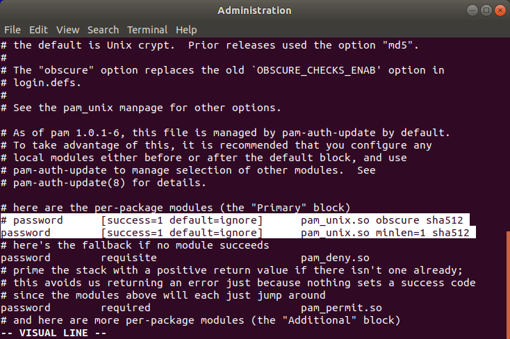

# INR Lab 3 - VLANs and Fault Tolerance

#### Artem Abramov SNE19

May I suggest viewing this document in your browser at address: 
https://github.com/temach/innopolis_university_reports/blob/master/INR-Lab-3-vlans-and-faults.md
Unfortunately rendering the document to PDF breaks some long lines and crops images.


## Task 1 - VLANs

### 1. Change the topology of your network to as follows, make the necessary configs

Below is a screenshot of my modified configuration:


### 2. Exchange the defualt switches Cumulus VX instances.

After installing the cumulus VX appliance I recorded the default login and password as shown on the screenshot below:


The adjusted network topology is shown below:


### 3. Configure the switches and make sure you have connectivity between the hosts.

Each switch was configured using the same steps. The process for one switch is shown below.

The first step was changing the login password to somthing simpler.
There was a problem with creating a new single-letter password `a`, because of the default pam_unix configuration that does a password complexity check. Below is a screenshot showing the resulting configuration for pam_unix module in `/etc/pam.d/common-password` that allows one letter passwords (the old line is commented out):




(source: https://askubuntu.com/questions/113682/how-to-change-disable-password-complexity-test-when-changing-password)

The next step was configuring the swpX interfaces. The configuration is just making sure that they are up. The config for `/etc/network/interfaces` is shown below:
```
$ cat /etc/network/interfaces
# This file describes the network interfaces available on your system
# and how to activate them. For more information, see interfaces(5).

source /etc/network/interfaces.d/*.intf

# The loopback network interface
auto lo
iface lo inet loopback

# The primary network interface
auto eth0
iface eth0 inet dhcp

auto swp1
iface swp1

auto swp2
iface swp2

auto swp3
iface swp3
```

