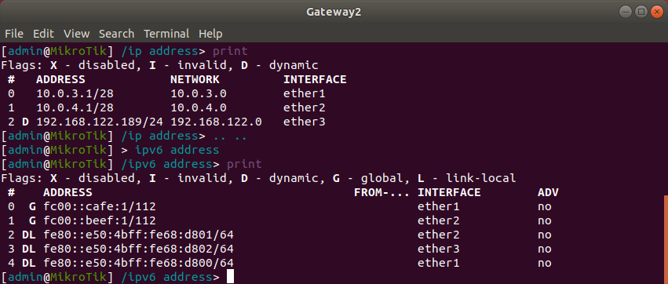
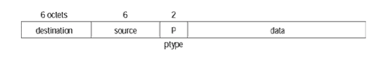
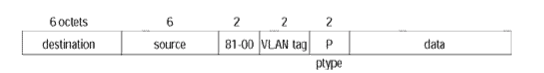
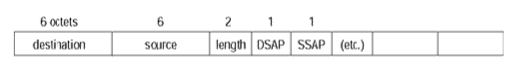
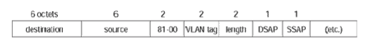
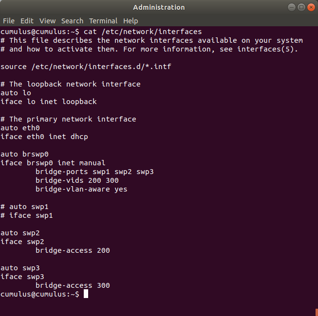
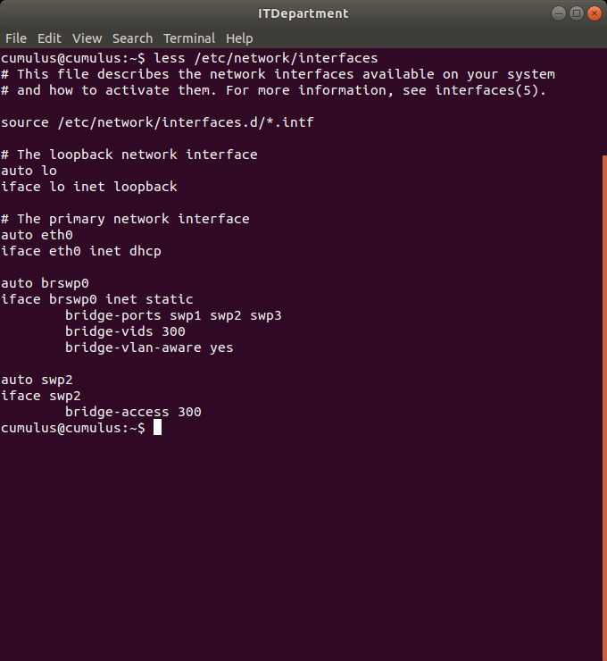
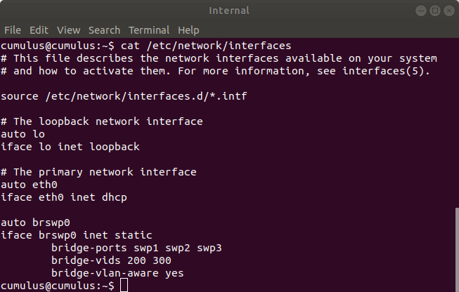
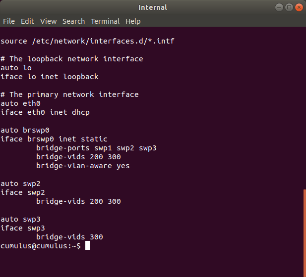

# INR Lab 3 - VLANs and Fault Tolerance

#### Artem Abramov SNE19

May I suggest viewing this document in your browser at address: 
https://github.com/temach/innopolis_university_reports/blob/master/INR-Lab-3-vlans-and-faults.md
Unfortunately rendering the document to PDF breaks some long lines and crops images.


## Task 1 - VLANs

### 1. Change the topology of your network to as follows, make the necessary configs

Below is a screenshot of my modified configuration:


Added two new machines: `HR` and `Management`. The `Worker` machine from the previous lab became the `ITManager` machine. 

A reminder of how the subnets (IPv4 and IPv6) are configured on the MicroTik router is shown below (login `admin` password is empty):



The `External` network is on `ether1`, the `Internal` network is on `ether2` and connection to the cloud is on the `ether3`.

Configuration for HR machine is shown below:

%20-%20TigerVNC_186.png)


Configuration for Management machine is shown below:

%20-%20TigerVNC_187.png)


After each configuration to apply the rules from `/etc/network/interfaces` I used `systemctl restart networking.service`.


### 2. Exchange the default switches Cumulus VX instances.

After installing the cumulus VX appliance I recorded the default login and password as shown on the screenshot below:


The adjusted network topology is shown below:


### 3. Configure the switches and make sure you have connectivity between the hosts.

Each switch was configured using the same steps. The process for one switch is shown below.

The first step was changing the login password to somthing simpler.
There was a problem with creating a new single-letter password `a`, because of the default pam_unix configuration that does a password complexity check. Below is a screenshot showing the resulting configuration for pam_unix module in `/etc/pam.d/common-password` that allows one letter passwords (the old line is commented out):


(source: https://askubuntu.com/questions/113682/how-to-change-disable-password-complexity-test-when-changing-password)

The next step was configuring the swpX interfaces. The interfaces need to be brought up (created), then they need to be added to a bridge. This is just normal setup for making a linux machine act as a switch.

The config for `/etc/network/interfaces` is shown below:
```
$ cat /etc/network/interfaces
# This file describes the network interfaces available on your system
# and how to activate them. For more information, see interfaces(5).

source /etc/network/interfaces.d/*.intf

# The loopback network interface
auto lo
iface lo inet loopback

# The primary network interface
auto eth0
iface eth0 inet dhcp

auto brswp0
iface brswp0 inet static
    bridge_ports swp1 swp2 swp3
```

Important information in the man page for `bridge-utils-interfaces` concerning the arguments to `bridge_ports`:
```
These ports  are  the  interfaces  that are part of the bridge, and they shouldn't have any stanzas defining them on the interfaces file.
```

To activate the configuration restart `networking.service`, then check that the configuration was applied as shown below:

```
$ ip a
1: lo: <LOOPBACK,UP,LOWER_UP> mtu 65536 qdisc noqueue state UNKNOWN group default 
    link/loopback 00:00:00:00:00:00 brd 00:00:00:00:00:00
    inet 127.0.0.1/8 scope host lo
       valid_lft forever preferred_lft forever
    inet6 ::1/128 scope host 
       valid_lft forever preferred_lft forever
2: eth0: <BROADCAST,MULTICAST,UP,LOWER_UP> mtu 1500 qdisc pfifo_fast state UP group default qlen 1000
    link/ether 0c:50:4b:09:19:00 brd ff:ff:ff:ff:ff:ff
    inet6 fe80::e50:4bff:fe09:1900/64 scope link 
       valid_lft forever preferred_lft forever
3: swp1: <BROADCAST,MULTICAST,UP,LOWER_UP> mtu 1500 qdisc pfifo_fast master brswp0 state UP group default qlen 1000
    link/ether 0c:50:4b:09:19:01 brd ff:ff:ff:ff:ff:ff
4: swp2: <BROADCAST,MULTICAST,UP,LOWER_UP> mtu 1500 qdisc pfifo_fast master brswp0 state UP group default qlen 1000
    link/ether 0c:50:4b:09:19:02 brd ff:ff:ff:ff:ff:ff
5: swp3: <BROADCAST,MULTICAST,UP,LOWER_UP> mtu 1500 qdisc pfifo_fast master brswp0 state UP group default qlen 1000
    link/ether 0c:50:4b:09:19:03 brd ff:ff:ff:ff:ff:ff
6: swp4: <BROADCAST,MULTICAST> mtu 1500 qdisc noop state DOWN group default qlen 1000
    link/ether 0c:50:4b:09:19:04 brd ff:ff:ff:ff:ff:ff
7: swp5: <BROADCAST,MULTICAST> mtu 1500 qdisc noop state DOWN group default qlen 1000
    link/ether 0c:50:4b:09:19:05 brd ff:ff:ff:ff:ff:ff
8: swp6: <BROADCAST,MULTICAST> mtu 1500 qdisc noop state DOWN group default qlen 1000
    link/ether 0c:50:4b:09:19:06 brd ff:ff:ff:ff:ff:ff
9: brswp0: <BROADCAST,MULTICAST,UP,LOWER_UP> mtu 1500 qdisc noqueue state UP group default 
    link/ether 0c:50:4b:09:19:01 brd ff:ff:ff:ff:ff:ff
    inet6 fe80::e50:4bff:fe09:1901/64 scope link 
       valid_lft forever preferred_lft forever
```

Note that swp1, swp2, swp3 are all UP and brswp0 bridge was created.

sources: 

1. https://wiki.archlinux.org/index.php/Network_bridge
2. `man interfaces`
3. `man bridge-utils-interfaces`


After applying the same settings to all 4 Cumulus switches, the next step is checking connectivity. 

Below is HR pinging the ITManager:

%20-%20TigerVNC_191.png)


Below is Web pinging Management:

%20-%20TigerVNC_192.png)


Below is ITManager pinging Admin:

%20-%20TigerVNC_190.png)


The other tests results were omitted for brevity.


### 4. How do VLANs work at a packet level ? What are the two major protocols used for this ?

Just to clarify what is a VLAN, quoting from `Interconnections: Bridges, Routers, Switches, and Internetworking Protocols - Addison-Wesley Professional (1999)` by `Radia Perlman` specifically `Chapter 5.3`:

	A VLAN is is the territory over which a broadcast (or multicast) packet is delivered (also known as a broadcast domain ). The difference between a VLAN and a LAN, if there is any, is in packaging. Virtual LANs allow you to have separate LANs among ports on the same switch. For example, a switch might be told that ports 1–32 are in VLAN A and ports 33–64 are in VLAN B.

VLAN operates at the level of Ethernet frames (i.e. which is below what is commonly understood as "packet", so to be pedantic the question appears to be misformulated).

Lets further limit the discussion to wired networks (copper wire) there are two most common types of Ethernet frames:
1. Ethernet II (derived from Ethernet invented at Xerox parc)
2. Ethernet 802.3 (Ethernet II that was standardised with some changes by the IEEE 802.3 comittee)

The Ethernet frames are tagged with a VLAN tag. It is a 2 byte value 3 bits for VLAN priority, 12 bits for VLAN ID and 1 bit for indicating whether the VLAN ID is in a canonical format. The Ethernet frame must also define the presence of a VLAN tag by setting the packet type field (TPID) to 0x8100 (2-bytes).

Ethernet II packet without a VLAN tag is shown below:




The same packet after being tagged with VLAN tag is shown below:



Ethernet 802.3 packet without a VLAN tag is shown below:




Ethernet 802.3 packet after being tagged with VLAN tag is shown below:



sources:
1. `Interconnections: Bridges, Routers, Switches, and Internetworking Protocols`  Addison-Wesley Professional (1999) by Radia Perlman
2. https://study-ccna.com/layer-2-switching/
3. https://networkengineering.stackexchange.com/questions/5300/what-is-the-difference-between-ethernet-ii-and-802-3-ethernet
4. https://community.cisco.com/t5/switching/ethernet-802-3-vs-ethernet-ii-frame/td-p/2718996

### What do we mean by Native VLAN ?

There are two types of switch ports:
1. Access - only one VLAN and the traffic on the VLAN is not tagged
2. Trunk - multiple VLANs (i.e. there are more switches downstream) and the port is ready to receive and send tagged VLAN traffic.

Native vlan on a trunk port is the default vlan to which any untagged traffic on the trunk port is assigned. Default behavior is that vlan with `VLAN ID = 1` is the native vlan.

Thus trunk ports can connect endpoints that support VLAN tagging. Whereas access ports can be used to connect a single VLAN to dumb switches/routers/clients that don't support VLAN tagging (or that should not be aware of it by network design).

To rephrase access port is used to get traffic into the VLAN network by tagging it, inside the network traffic navigates between trunk ports that understand VLAN tags, and the traffic leaves the system through another access port without any VLAN tag. This way VLAN is transparent to end clients. 

sources:
1. https://serverfault.com/questions/385963/access-ports-versus-trunk-ports
2. https://study-ccna.com/configuring-access-trunk-ports/
3. https://networkengineering.stackexchange.com/questions/6483/why-and-how-are-ethernet-vlans-tagged
4. https://www.quora.com/What-is-native-Vlan-2

### 5. Configure the VLANs on the switches to isolate the two virtual networks as shown on the diagram.

The configuration for Administration switch sets up access ports on swp2 and swp3. The swp2 tags/untags the packets with id 200, the swp3 tags/untags packets with id 300.  The configuration is shown below:



The ITDepartment switch only needs to have the bridge become vlan aware and setup the access port on swp2 configured for vlan with id 300. The configuration is shown below:



The configuration for the Internal switch does not need any special settings appart from becoming vlan aware. The configuration for Internal switch is shown below:



### 6. Ping between ITManager and HR , do you have replies ? Ping between ITManager and Management , do you have replies ?

Check that HR can not ping anyone as shown below:

%20-%20TigerVNC_199.png)


Check that ITManager can ping Management:

%20-%20TigerVNC_205.png)


### Capture the traffic of the last ping and show in the packet the VLANs indication.

We can check how the packet is structured and confirm that ping works with Wireshark listening between Internal switch and Administration switch as shown below:

![Capturing from Standard input [Internal swp2 to Administration swp1]_202](INR-Lab-3-vlans-and-faults.assets/Capturing%20from%20Standard%20input%20%5BInternal%20swp2%20to%20Administration%20swp1%5D_202.png)

The VLAN id is 300 as shown in the `bytes` window in wireshark. 

Interestingly however if we listen between Internal switch and the MicroTik router we can see that broadcast traffic escapes the VLANs as shown with wireshark capture below (during a ping from ITManager to the MicroTik router):

![Capturing from Standard input [Gateway2 ether2 to Internal swp1]_203](INR-Lab-3-vlans-and-faults.assets/Capturing%20from%20Standard%20input%20%5BGateway2%20ether2%20to%20Internal%20swp1%5D_203.png)


So we must fix the configuration for Internal switch as shown below:

