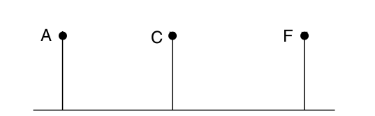
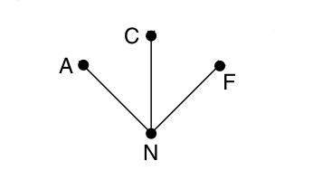

# INR Lab 4 - OSPF

#### Artem Abramov SNE19

## Preparation

#### a. Select a virtual routing solution that you would like to try. For example (Mikrotik, vyos, Pfsense).

#### b. GNS3 already have a template for these routers (Mikrotik, vyos, Pfsense), try to use these templates as it will save you a lot of time and troubleshooting.

I decided to select MikroTik.

#### c. Try to draw a network scheme before you start the lab. This will help you in the deployment phase. 

#### d. The network scheme should include at least 3 routers, each one of them has a different subnet, and they should be able to reach each other (for example by a switch/router in the middle or a bus topology)

This lab will make use of the bus topology as shown below (A, C and F are the 3 routers):

However, modeling the network bus as many point-to-point links increases the size 
of the topology, because for `n` nodes it implies `n^2` links. To simplify the model consider the bus to be a node in itself as shown below:

The routers A, B and C are connected to a new artificial node N. To implement this scheme some router is chosen to be the DR (Designated Router) to play the role of N in the routing protocol. The selection normally is a simple process such as choosing the router with the highest or lowest ID (the address of the loopback interface). The DR names the LAN and constructs an LSP on behalf of the LAN.

Below is an example of an internet consisting of smaller networks (regions) 1 to 5:

Since each network is operated independently of all the others, it is often referred to as an AS (Autonomous System). The mental model for an AS is an ISP network (or alternatively as the range within which an LSP
propagates). The Internet can be viewed as a collection of Autonomous Systems that are interconnected.

**Interior gateway protocols**

Within each network, an interior gateway protocol is used for routing. It might be:
1.	`link state` based protocol:
	a. IS-IS (IP, CLNP)
	b. NLSP (a version of IS-IS for IPX)
	c. PNNI (ATM)
	d. OSPF (IP) Version 2 defined in RFC 2328 (https://tools.ietf.org/html/rfc2328).
2.	`distance vector` based protocol:
	a. RIP (IP)
    b. RTMP (AppleTalk)
    c. RIP (IPX)
    d. DECnet Phases 3 and 4.

The trickiest part of the link state protocol is distributing the link state packets. If different routers are using different versions of the topology, the routes they compute can have inconsistencies such as loops, unreachable machines, and other problems. Neither the link state, nor the distance vector based protocols that are most commonly used can be considered robust, because a single broken/malicious router can corrupt the network.

OSPF is a strict two-level hierarchy. There is a backbone area, and packets traveling
from one area to another area must go via the backbone area.

**Exterior gateway protocols**

Across the networks that make up an internet, an exterior gateway protocol is used. This can be static routing, EGP (old exterior gateway protocol) or BGP (currently used in the Internet).

BGP significantly extends the distance vector approach. It is also refered to as a `path vector` protocol, because each entry in the distance vector table also contains the sequence of routing domains in the path to the destination. Distributing the sequence of routing domains has two purposes.
1. It solves the counting-to-infinity problem.
2. It allows policy decisions to be made based on the routing domains in the path (i.e. allows policy-based routing).

For info on how to take a look inside a BGP server (open looking glass server) see: https://gns3vault.com/blog/bgp-for-beginners

The networks may all use different interior gateway protocols, but they must use the same  exterior gateway protocol to form an internet.

Below is the screenshot of my resulting topology in GNS3:

sources:
1. Computer Networks - A Tanenbaum - 5th edition
2. Radia Perlman - Interconnections: Bridges, Routers, Switches, and Internetworking Protocols -Addison-Wesley Professional (1999)

## 2. Deployment:

### a. Which interface you will select as the OSPF router ID and why?

When a router is booted, its first task is to learn who its neighbors are. It
accomplishes this goal by sending a special HELLO packet on each point-to-point
line. The router on the other end is expected to send back a reply giving its name.
These names must be globally unique because when a distant router later hears
that three routers are all connected to F, it is essential that it can determine wheth-
er all three mean the same F.
