# LS Lab 3 Monitoring

Artem Abramov

### Task 1 - Preparation

I choose Zabbix . 

##### Install a new guest system

Installed guest on Xen. I wanted to get over monitoring first to I quickly setup a test server with python built-in httpd.

```
python3 -m http.server 8000 &> /dev/null
```


##### Install and setup web-server + DBMS (e.g. NGINX + MariaDB)

##### Install and setup a CMS. Create a page with some heavy content

##### Install another guest system and deploy the monitoring facility (and agents, if required)

I setup another Xen guest. And configured MariaDB + PHP + NGinx + Zabbix

sources: 

- https://www.dmosk.ru/miniinstruktions.php?mini=zabbix-server-ubuntu#zabbix
- https://serveradmin.ru/ustanovka-i-nastroyka-zabbix-4-0/#_Zabbix_40_Ubuntu_Debian

DB install and set root password:

```
apt-get install mariadb-server
systemctl enable mariadb
systemctl start mariadb
mysqladmin -u root password
```

Web server:

```
apt-get install nginx
systemctl enable nginx
systemctl start nginx
```

Check that nginx works by going to the ip address in browser.

PHP:

```
apt-get install php php-fpm php-mysql php-pear php-cgi php-common php-ldap php-mbstring php-snmp php-gd php-xml php-gettext php-bcmath
```

Configure php (get version with `php -v`):

```
# cat /etc/php/7.2/fpm/php.ini
date.timezone = "Europe/Moscow"
max_execution_time = 300
post_max_size = 16M
max_input_time = 300
max_input_vars = 10000
```

Enable:

```
systemctl enable php7.2-fpm
systemctl restart php7.2-fpm
```

Configure php in nginx:

```
# cat /etc/nginx/sites-enabled/default
    ...
    location / {
        index  index.php;
        ...
    }
    ...
    location ~ \.php$ {
        set $root_path /var/www/html;
        fastcgi_buffer_size 32k;
        fastcgi_buffers 4 32k;
        fastcgi_pass unix:/run/php/php7.2-fpm.sock;
        fastcgi_index index.php;
        fastcgi_param SCRIPT_FILENAME $root_path$fastcgi_script_name;
        include fastcgi_params;
        fastcgi_param DOCUMENT_ROOT $root_path;
    }
    ...
```

Check nginx config and start:

```
nginx -t
systemctl restart nginx
```

Check PHP works, create index.php:

```
# cat /var/www/html/index.php
<?php phpinfo(); ?>
```

Check by going to the IP of the server (should display PHP version info).

Zabbix add repo (note use 4.0, not 4.2, not 4.4):

```
wget https://repo.zabbix.com/zabbix/4.0/ubuntu/pool/main/z/zabbix-release/zabbix-release_4.0-3+bionic_all.deb
```

Install and add packages:

```
dpkg -i zabbix-release_4.0-3+bionic_all.deb
apt update && apt upgrade
apt install zabbix-server-mysql zabbix-frontend-php
```

At this point make sure to disable apache2:

```
systemctl stop apache2
systemctl disable apache2
```

Configure mysql for zabbix:

source:  https://www.zabbix.com/documentation/4.0/manual/appendix/install/db_scripts#mysql

Login:

```
mysql -uroot -p
> create database zabbix character set utf8 collate utf8_bin;
> grant all privileges on zabbix.* to zabbix@localhost identified by 'zabpassword';
> \q
```

Its important to create db as utf-8 else faced with error about string too long.

Now apply zabbix schema to db, better take it step by step:

```
cd /usr/share/doc/zabbix-server-mysql/
gunzip create.sql.gz
mysql -v -u root -p zabbix < create.sql
```

Enter the password from sql above `identified by 'zabpassword';` i.e. `zabpassword`.

Edit zabbix config, first critical options:

```
# cat /etc/zabbix/zabbix_server.conf
DBName=zabbix
DBUser=zabbix
DBPassword=zabpassword
...
```

Then semi-critical options:

```
DBHost=localhost
ListenIP=0.0.0.0
Timeout=10
```

Make sure log and config dirs are created:

```
mkdir -p /etc/zabbix/zabbix_server.conf.d
mkdir -p /var/log/zabbix-server
chown zabbix:zabbix /var/log/zabbix-server
```

Start and enable:

```
systemctl enable zabbix-server
systemctl start zabbix-server
```

Next is merging zabbix with nginx because zabbix web frontend gets installed into ` /usr/share/zabbix`

```
# cat /etc/nginx/sites-enabled/default
...
root /usr/share/zabbix;
...
set $root_path /usr/share/zabbix;
...
```

Check nginx config and restart:

```
nginx -t
systemctl restart nginx
```

Check the ip address for web interface:


After configuration was successful (requires the password for db zabbix user: `zabpassword`) a config file si created in `/usr/share/zabbix/conf/zabbix.conf.php`.

To login into the web interface the default user name is **Admin**, password **zabbix**. 

Sidenote: docker container with zabbix works, but takes 15 minutes to startup (db population with schema is extremely slow).

#####  Installing an agent on a slave machine that will report to the server

Install package:

```
apt-get install zabbix-agent
```

Fix config:

```
root@guest1:~# cat /etc/zabbix/zabbix_agentd.conf
...
Server=10.1.1.184
ServerActive=10.1.1.184
Hostname=guest1
...
```

Start and enable at boot:

```
systemctl start zabbix-agent
systemctl enable zabbix-agent
```


Then you must add the agent to the zabbix server, in the web interfce:

```
Configuration -> Hosts -> Create host (tiny button) 
```

Enter `Host name` in this case `guest1` (same as in the zabbix_agentd.conf)

Go to `Templates` tab, select one or multiple templates (remember to click the small hyperlinked text  `Add` before clicking one of the big  `Add` / `Update` buttons) 

Then the slave machine should be visible:

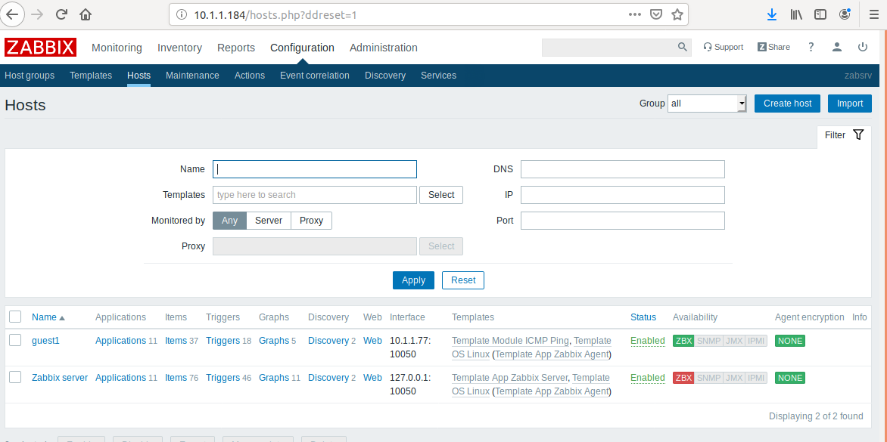


To check what network Zabbix server can see, go to 

```
Monitoring -> Discovery
```

You can configure discovery in 

```
Configuration -> Discovery
```

For example configure to scan LAN network `10.1.1.0/24` once an hour with ICMP ping:

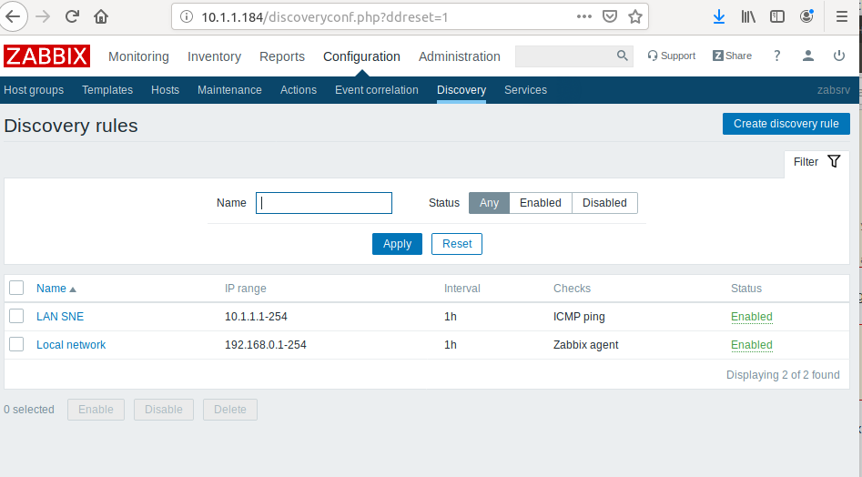


View status:


Problems overview, the report is pretty detailed:

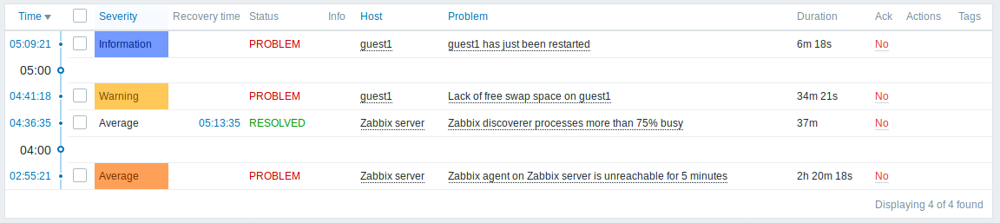


## Task 2 - Status alerts

### - against the guest system itself (ping)

### - against available RAM or disk space (with threshold about 90%)

To quickly configure many of the default parameters I applied two templates to a slave machine:
```
Configuration -> Hosts -> [hostname] -> Templates
```
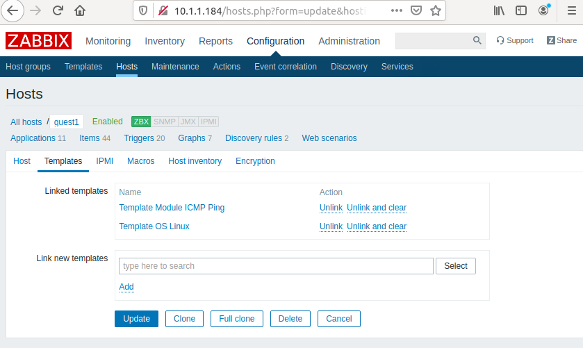


Looking at the Module ICMP Ping template we can see that it sets up ping triggers (i.e. alerts):

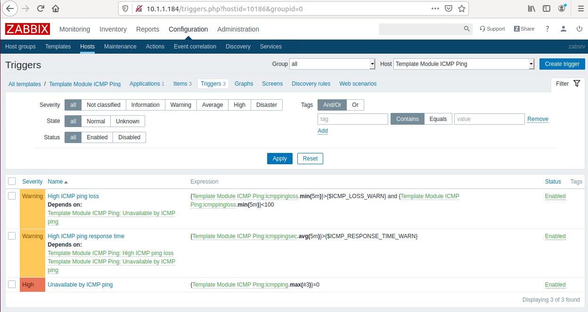


The alerts for RAM and storage are already configured. Below is an example graph for disk io performace:

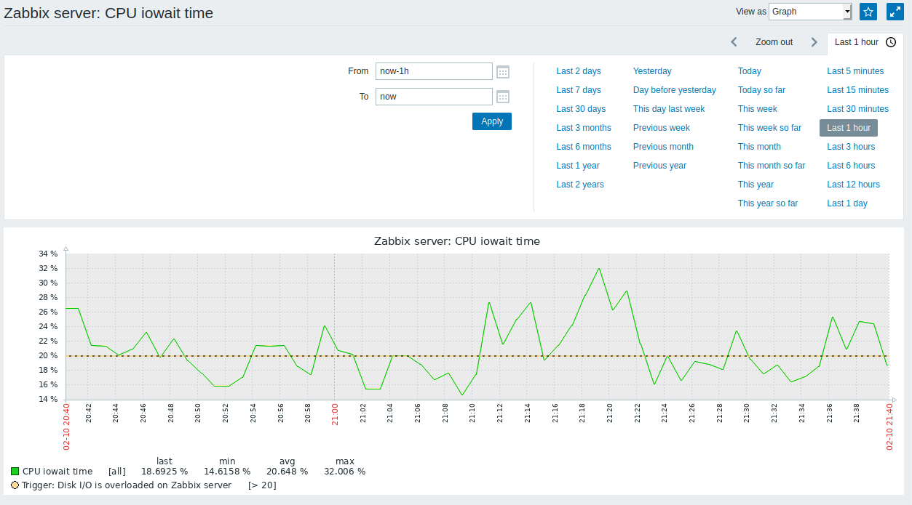


When that time overcomes the threshold `[> 20]`  notification will appear on main dashboard `Disk I/O is overloaded on Zabbix server`:

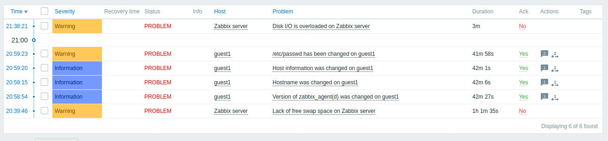

The multiple problems related to guest (change of hostname and /etc/passwd) are because I moved the zabbix-agent from a normal install into a docker container. 


When the problem is resolved (due to whatever reason) a new notification will pop-up as below:

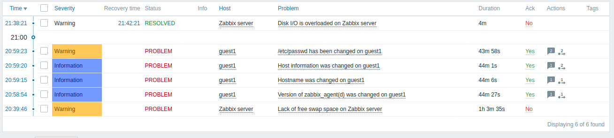


### - against the web service

### - and against two web pages, a simple one and the heavy-duty one

source: https://www.zabbix.com/documentation/4.0/manual/web_monitoring

Final config for the web check (see link above for details) 
```
Configuration -> Hosts -> [hostname] -> Web scenarios -> Create web scenario
```

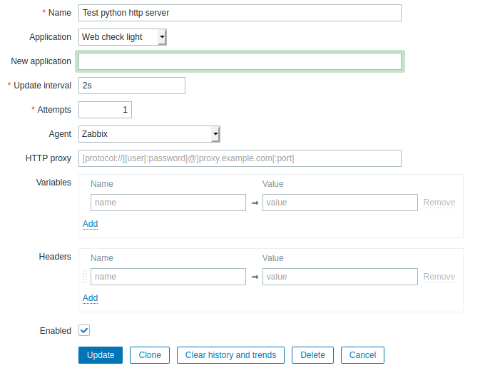

And query URL's are below, visible in the `Steps` tab:

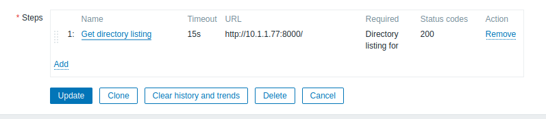


Then I created a graph 

```
Configuration -> Hosts -> [hostname] -> Graphs -> Create Graph
```

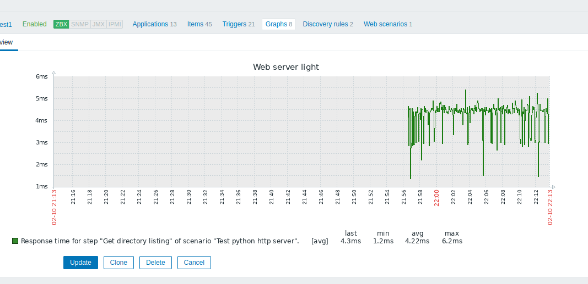


Setup trigger to fire when web service goes down. 

```
Configuration -> Hosts -> [hostname] ->Triggers -> Create trigger
```

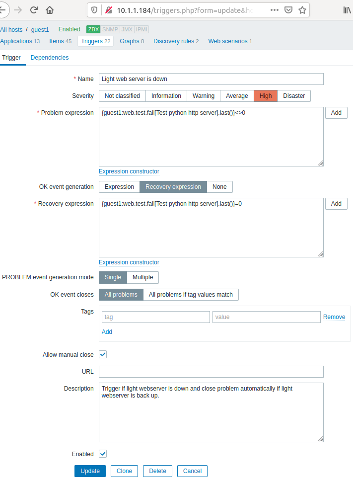


Once I stopped the server the error appeared response was almost immediate because I had set 2 seconds check interval when configuring the `Test python http server` Web check:

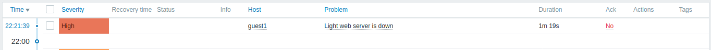


After starting the web server error was resolved:

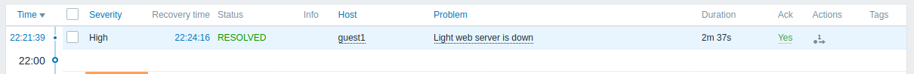


We can see the graph of access time to web server the gap on the right is when it was offline:

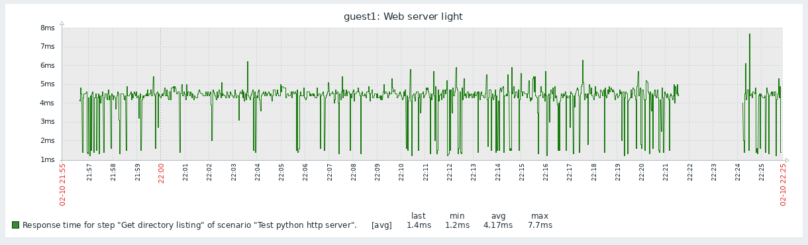


I did the same config for the heavy web server, basically the only thing that changed is the port. For the light web server it was port 8000, for the heavy it was 8080.

