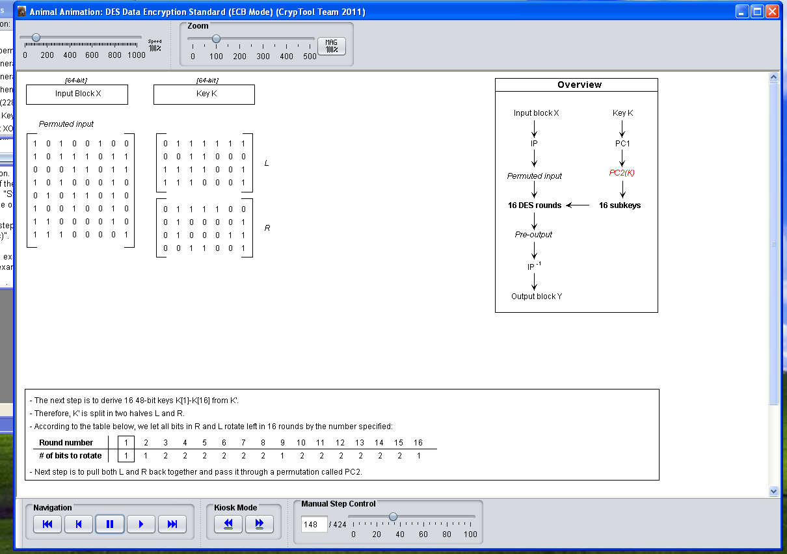
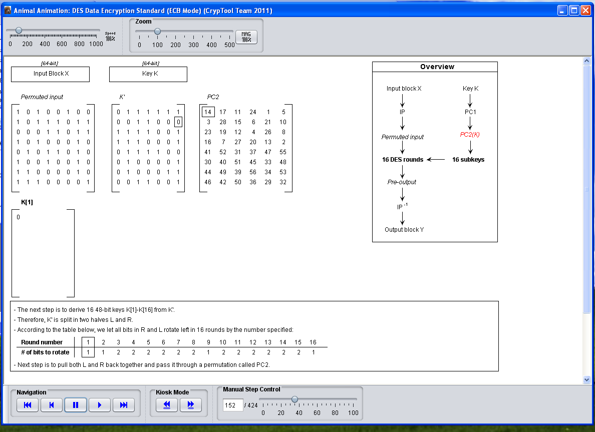
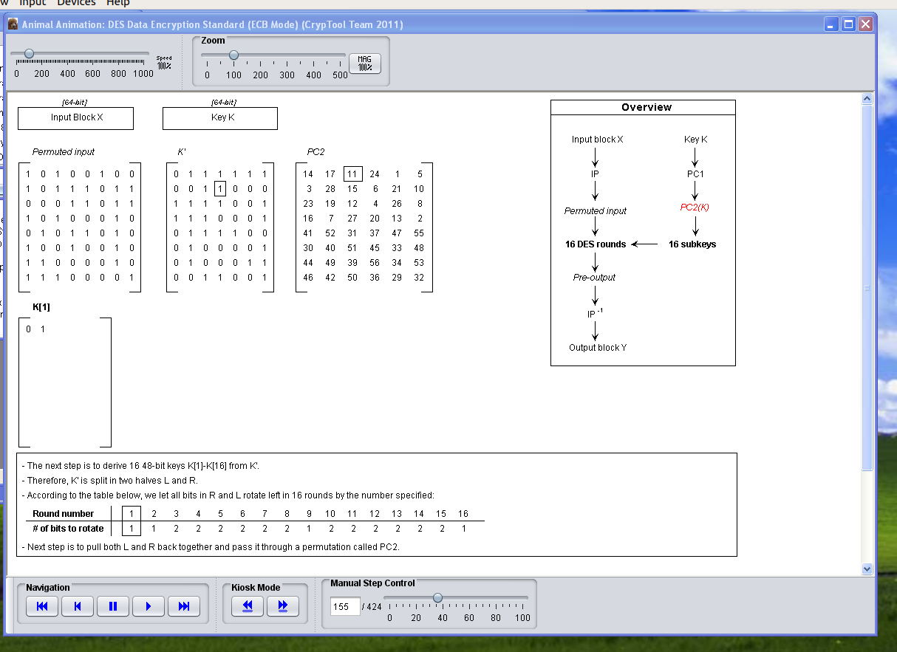
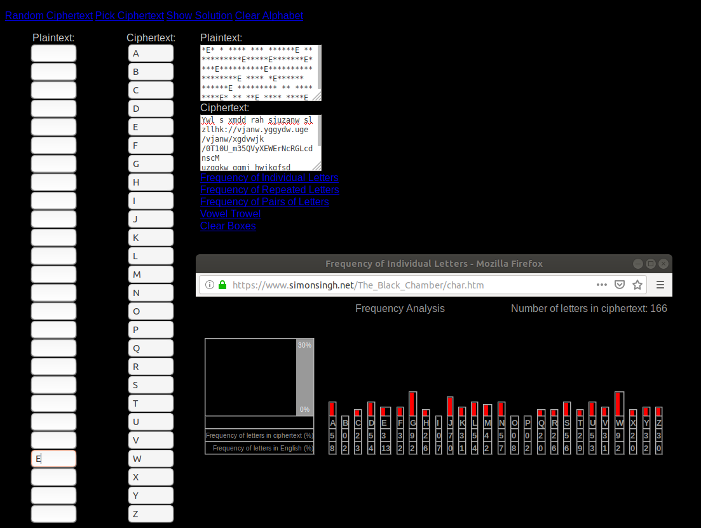
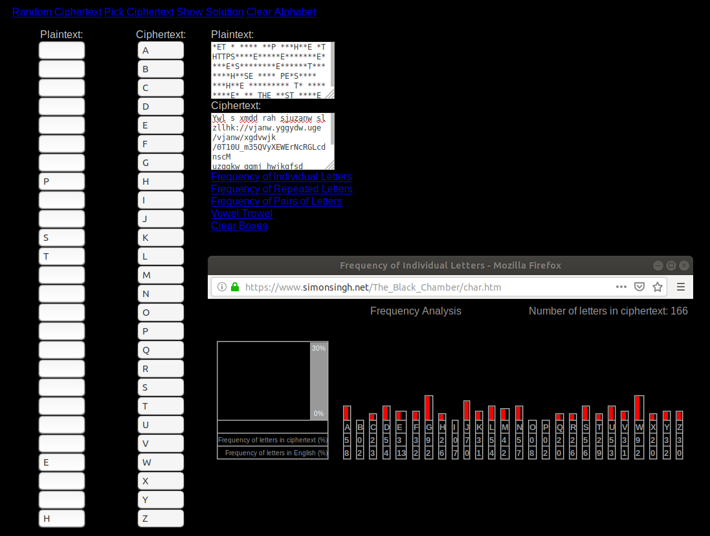
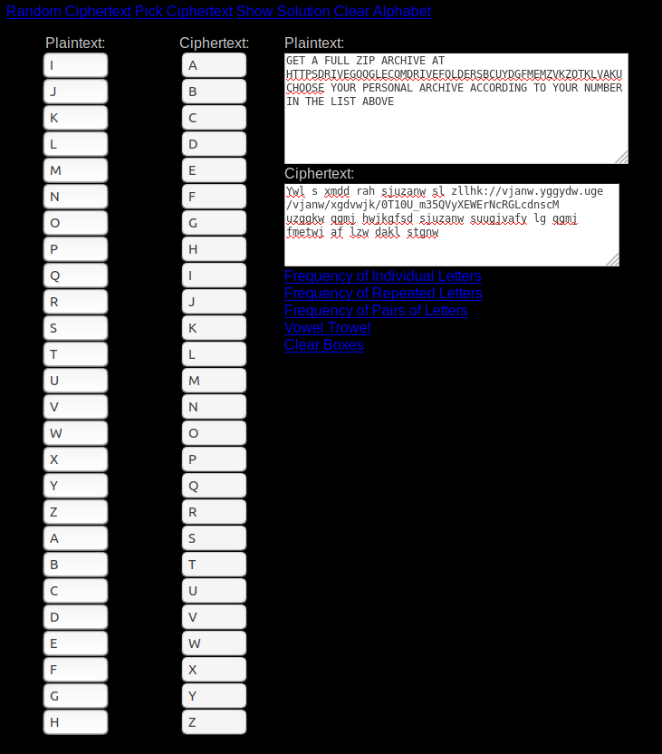
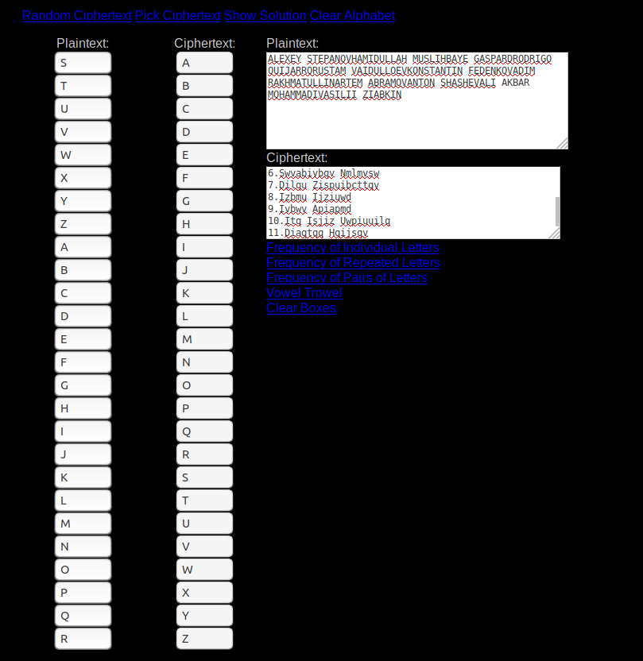

# SSN Lab 2 - Symmetrical Encryption
#### Artem Abramov SNE19

## 1. DES

### The Cryptool 1.x suite contains a simulator for the DES encryption algorithm in the menu “Individual Procedures / Visualization of Algorithms / DES”. Watch this animation.

I downloaded the English version of the CyptTool version 1.4.41 from https://www.cryptool.org/en/ct1-downloads and then configured it in Virtual Box WinXP. 

Then installing an older version of Java from https://www.oracle.com/technetwork/java/javase/downloads/java-archive-downloads-javase7-521261.html was really annoying (I had to register with oracle account, etc). Finally I had to downgrade the version of the CryptTool to 1.4.31, because version 1.4.41 has some sort of a bug and the visualizer does not work.  (To be honest, the tool is good, but the setup has been a tremendous waste of everyone's time, perhaps for next year the SNE students can at least get links to compatible software versions in the task description).

Then I could finally use the tool as shown in the screenshot below:

![winxp-codebook [Running] - Oracle VM VirtualBox_450](SSN-Lab-2-symmetrical.assets/winxp-codebook%20%5BRunning%5D%20-%20Oracle%20VM%20VirtualBox_450.png)


Another round is shown below:

![winxp-codebook [Running] - Oracle VM VirtualBox_452](SSN-Lab-2-symmetrical.assets/winxp-codebook%20%5BRunning%5D%20-%20Oracle%20VM%20VirtualBox_452.png)


### 1.1 Next, use the DES simulator at  http://lpb.canb.auug.org.au/adfa/src/DEScalc/index.html Step through the process of encrypting your name with the key 0x0101010101010101 and write
the internal state of the device at the 8th round.
I downloaded DEScalc.jar from the linked page and run it in WinXP. To encrypt my name I had to write it in hex. Assuming ASCII encoding my name `artem` would be `0x61 0x72 0x74 0x65 0x6d`, this is just from the ASCII table available from `man ascii` .  The tool expects the data to be padded, so I appended zeroes to the end. Below is a screenshot showing the final input to the DES Cypher Calculator:

![winxp-codebook [Running] - Oracle VM VirtualBox_453](SSN-Lab-2-symmetrical.assets/winxp-codebook%20%5BRunning%5D%20-%20Oracle%20VM%20VirtualBox_453.png)


The value on Round 8 is given by the line:

```
  Rnd8	f(R7=4fcef4e7, SK8=00 00 00 00 00 00 00 00 ) = 3550fd54
```


### 1.2 Inspect the key schedule phase for the given key and explain how the sub keys are generated for each of the 16 steps.

The subkeys are generated from the Primary Key. BEfore the subkeys are generated the primary key passes through a permutation called permuted choice 1 (PC1). Just prior to this the rightmost bit of every byte of the key is (i.e. every 8th bit is stripped. These bits are used for parity checking and do not influence encryption). The key then becomes 56-bits. Then we permute the key further with PC2.  This is shown below:




The next step is deriving 16 keys of 48 bits each. The first bit of K[1] comes by taking the bit from K' according to the number in PC2 as shown below:




Taking the the second bit `1` of K[1] from K' according to index `11` is shown below:




K[2] to K[16] use the same approach. The indices depend on the number of the round given in the table.


### 1.3 Comment on the behavior of DES when using the given key.

The subkey comes out to be all zero on each round. This is because ONLY the parity bit is set in the actual key, all the other bits are zero. The parity bit gets thrown out at the very beginning of the DES algorithm. Therefore even after all the permutations: PC1 and PC2 the Primary will still be all zeroes. Therefore any derived keys will also consist only of zero bits, because they are derived by taking bits (indexing bits) from the primary key.


## 2. AES

### The Cryptool 1.x suite contains an animation for the AES encryption algorithm. Watch the whole animation of AES using the Rijndael Animation flash video at http://poincare.matf.bg.ac.rs/~ezivkovm/nastava/rijndael_animacija.swf

I downloaded the Flash file, copied it to WinXP and opened it in Internet Explorer as shown below:

![winxp-codebook [Running] - Oracle VM VirtualBox_454](SSN-Lab-2-symmetrical.assets/winxp-codebook%20%5BRunning%5D%20-%20Oracle%20VM%20VirtualBox_454.png)

Stepping through the material is shown below:

![winxp-codebook [Running] - Oracle VM VirtualBox_456](SSN-Lab-2-symmetrical.assets/winxp-codebook%20%5BRunning%5D%20-%20Oracle%20VM%20VirtualBox_456.png)

### 2.4 Identify the Shannon diffusion element(s).

Diffusion elements ensure that a change of one bit in the input plaintext results in changing multiple different bits (at least more than half) of the resulting ciphertext. The shift-rows and mix-columns operations introduce diffusion, because one bit of difference will spread to multiple rows/columns, which will be amplified over multiple rounds.


### 2.5 Also identify the Shannon confusion element(s).

The confusion elements serve to make the relationship between the key and the cypher text as complex as possible. So it is impossible to make conclusions what the key was, based on the cyphertext. The S-boxes create confusion, because effectively they map every symbol to another making the relationship not a linear function of the input.


## 3 RC4

### Follow the instructions at  http://bit.ly/2gWJvqV, identify the URL and your personal archive accordingly, download it and inspect its contents.  There are two files encrypted with the RC4 cipher. 

The file contents are show below for reference:

```
1.Itmfmg Abmxivwd
2.Piuqlcttip Ucatqp
3.Jigm Oiaxizl
4.Zwlzqow Ycqrizzw
5.Zcabiu Diqlcttwmd
6.Swvabivbqv Nmlmvsw
7.Dilqu Zispuibcttqv
8.Izbmu Ijziuwd
9.Ivbwv Apiapmd
10.Itq Isjiz Uwpiuuilq
11.Diaqtqq Hqijsqv

Ywl s xmdd rah sjuzanw sl zllhk://vjanw.yggydw.uge/vjanw/xgdvwjk/0T10U_m35QVyXEWErNcRGLcdnscM
uzggkw qgmj hwjkgfsd sjuzanw suugjvafy lg qgmj fmetwj af lzw dakl stgnw 
```

It is clear that `Itq Isjiz Uwpiuuilq` is `Ali Akbar Mohammadi`, this will serve to start the analysis, I also noticed that `zllhk` is most likely to be `https`. To complete deciphering i started by trying the frequency analysis. I used the same tool as used in the previous lab https://www.simonsingh.net/The_Black_Chamber/letterfrequencies.html

Then I noticed that the letters were not matching, i.e. if `zllhk` is indeed `https` then we have the mapping:

```
z - h
l - t
h - p
k - s
```

But this did not fit Ali's name. So I decided to start with the bottom text first, as shown below:

```
Ywl s xmdd rah sjuzanw sl zllhk://vjanw.yggydw.uge/vjanw/xgdvwjk/0T10U_m35QVyXEWErNcRGLcdnscM
uzggkw qgmj hwjkgfsd sjuzanw suugjvafy lg qgmj fmetwj af lzw dakl stgnw 
```

The process is shown on the screenshot below:




Quick progress was made as shown below:




Then I realized this was a Caesar cipher and my guess was correct, the whole second text was deciphered as shown below:



The final text was as given below:

```
GET A FULL ZIP ARCHIVE AT HTTPSDRIVEGOOGLECOMDRIVEFOLDERSBCUYDGFMEMZVKZOTKLVAKUCHOOSE YOUR PERSONAL ARCHIVE ACCORDING TO YOUR NUMBER IN THE LIST ABOVE 
```

The link is:

```
HTTPSDRIVEGOOGLECOMDRIVEFOLDERSBCUYDGFMEMZVKZOTKLVAKU
```

We have to insert back the slashes, colons, numbers and unserscores and most importantly keeping the case correct, took me many attempts to get it right:

```
https://drive.google.com/drive/folders/0B10C_u35YDgFMEMzVkZOTklvakU
```


My name was deciphered in a similar manner. I suspected it was a Ceasar cypher and Ali's name gave a lot of the letters, so I just had to fill in the blanks as shown below:




The final text is as shown below:

```
ALEXEY STEPANOVHAMIDULLAH MUSLIHBAYE GASPARDRODRIGO QUIJARRORUSTAM VAIDULLOEVKONSTANTIN FEDENKOVADIM RAKHMATULLINARTEM ABRAMOV ANTONSHASHEVALI AKBAR MOHAMMADIVASILII ZIABKIN
```

Therefore my number is 8.

After I went to google disk and downloaded folder 8. Its contents are shown below:

```
artem@ ssn_8$ tree
.
└── files
    └── 8
        ├── 08471596.in
        ├── 10739426.in
        ├── 23856014.in
        ├── 35247961.in
        ├── 48301965.in
        ├── 49150763.in
        ├── 68157039.in
        ├── 78631025.in
        └── 82960357.in

2 directories, 9 files
```


### One of the files was encrypted using a 40 bit key that when represented in ASCII starts with the character a and contains only lowercase letters while the other uses a 48 bit key that can be written only with digits. Identify the encrypted files and using the brute force tool from https://gist.github.com/4017169 find the keys and decrypt the file. (Most likely you will have to install the pycrypto and numpy libraries first.)


### 3.6 (a) How did you identify the encrypted files?

We can only answer this question after trying to decrypt the files. We are given some information on each key, but not on the file. How can we tell if the file is encrypted or garbage? We have to try searching for possible keys and then match the key to the condition, or perhaps just see that the file was decrypted, before we can identify the files.

I installed the pycrypto dependency with the command below:

```
$ sudo pip3 install pycrypto
```

I  installed the numpy dependency with the command below:

```
$ sudo pip3 install numpy
```

Then I downloaded the script from github (I got the link after opening RAW view in github):

```
$ curl https://gist.githubusercontent.com/cosu/4017169/raw/84674aa4dee9b3432f98aa4b9561d5bc113c848a/rc4brute.py > rc4brute.py
```

By default the program expects a key with `KEY_LENGTH=5` which is 5 bytes and `ALPHABET = string.ascii_lowercase`.  At first I did not realize that ALPHABET was referring to the key, not to the file contents, after clearing this confusion, the next was obvious. Checking for the 40 bit key of lower case letters was done with the following command:

```
$ for f in *.in ; do python3 rc4brute.py $f && echo "done with $f" ; done
done with 08471596.in
done with 10739426.in
Key: afzds, Entropy: 4.514359073222539
done with 23856014.in
```

Therefore the key `afzds` can be applied to decrypt the file `23856014.in`. I terminated the script early when the key was found.

The next step was checking for the 48-bit key that is made up of only digits. To do this I modified the script to set `KEY_LENGTH=6` and set `ALPHABET = string.digits`.  Then I run the same bash command (in retrospect I could have excluded searching the `23856014.in` file):

```
artem@ 8$ for f in *.in ; do python3 rc4brute.py $f && echo "done with $f" ; done
done with 08471596.in
done with 10739426.in
done with 23856014.in
done with 35247961.in
done with 48301965.in
done with 49150763.in
Key: 027138, Entropy: 4.514359073222539
done with 68157039.in
```

Therefore the key `027138` can be applied to decrypt the file `68157039.in`. I terminated the script early when the key was found.

### 3.6 (b) What is the effective key strength for each of the keys?

Number of combinations for the first key and second keys:

1. Chose one out of 26 letters [a-z] and make the choice for 5 slots with repetitions: `26**5 =  11881376`

2. Chose one out of 10 numbers [0-9] and make the choice for 6 slots with repetitions: `10**6 = 1000000`

This means that the smaller alphabetic key should be about ten times harder to crack then the numeric key that is 8 bits longer. The fact that for me the script to find the first key worked was faster is because the python script contains the following lines:

```
#We know prior that the key starts with a. Remove the next two lines for generic behavior
if string.ascii_lowercase in ALPHABET:
    base = tuple(['a']) + base
```

This means for the alphabetical key we were actually searching for `26**4 = 456976` combinations.


### 3.6 (c) Instrument the code to find out how many decryption attempts you can perform in one second. Where is the most time spent ?

Because our keys are only 5 or 6 bytes in length key generation should not be a  big deal, the most likely problem is in counting the bits or doing the math.

The question asks how many attempts can be performed in one second. We already know that the exhaustive search for the second key takes `10**6 = 1000000` attempts. We can time the process for key generation and checking and then divide the total time by  `10**6`.

Note that to make the benchmark more accurate we should disable Garbage Collection, make sure not to write to stdout while timing (because this is an expensive operation). Because of this its not of much use to profile Python code.

The modified code is shown below:
```python
__author__ = 'cdumitru'

import sys
from Crypto.Cipher import ARC4
import numpy
import string
import itertools
from multiprocessing import Pool
from time import time
import cProfile


ALPHABET = string.digits
#ALPHABET = string.ascii_lowercase
#ALPHABET = string.ascii_uppercase
#ALPHABET = string.letters + string.digits
#ALPHABET = string.letters + string.digits + string.punctuation
#ALPHABET = string.printable

KEY_LENGTH = 6
FILE_NAME = sys.argv[1]
CPU_COUNT= 1


def gen():
    """
    Iterates through the alphabet one letter at a time
    """
    for i in ALPHABET:
        yield tuple([i])


def check(key, data):
    """
    Decrypts the data with the given key and checks the entropy
    """

    decr = ARC4.new(key).decrypt(data)

    #compute for the decrypted data block

    #interpret decrypted data as an int array
    int_array = numpy.frombuffer(decr, dtype=numpy.uint8)
    count = numpy.bincount(int_array)
    #compute probability for each int value
    prob = count/float(numpy.sum(count))
    #thow away zero values
    prob = prob [numpy.nonzero(prob)]
    #Shannon entropy
    entropy = -sum(prob * numpy.log2(prob))

    #if this doesn't look like a random stream then jackpot
    if entropy < 7.9:
        return 'Key: {0}, Entropy: {1}'.format(key, entropy)


def worker(base):
    #read 64KB from the file
    data = open(FILE_NAME, 'rb').read(2**16)

    #generate all the strings of KEY_LENGTH length and check them

    #We know prior that the key starts with a. Remove the next two lines for generic behavior
    if string.ascii_lowercase in ALPHABET:
        base = tuple(['a']) + base

    res = None
    t_start = time()
    for i in itertools.product(ALPHABET, repeat=KEY_LENGTH-len(base)):
        tmp = check(''.join(base + i), data)
        if tmp:
            res = tmp
    t_end = time()
    t_diff = t_end - t_start
    print("Start time={}, End time={}, Time for execution={}".format(t_start, t_end, t_diff))
    print(res)


def parallel():
    """
    Starts a number of threads that search through the key space
    """
    p = Pool(CPU_COUNT)
    p.map(worker, gen(), chunksize=2)
    p.close()
    p.join()

def serial():
    worker(tuple())


if __name__ == "__main__":
    serial()
```

The result of running the modified script was as below:

```
$ python3 rc4brute.py 08471596.in 
Start time=1572463795.5652683, End time=1572464162.9835927, Time for execution=367.41832447052
None
```

Therefore we can estimate how many keys were tried per second with  `10**6 / 367.41832447052 = 5973.061808870784` which means 5973 keys per second. Basically 6000 keys/sec.


### 3.6 (d) Modify the code to support parallel execution and calculate the speedup.

To make the code parallel I changed the last line in the script from `serial()` to `parallel()` and changed the constant `CPU_COUNT=1` into `CPU_COUNT=4` (according to the output of `/proc/cpuinfo` on my system, which showed 4 cores).

According to http://effbot.org/zone/thread-synchronization.htm Python provides atomic append to a list data structure out of the box (due to GIL). Therefore  I modified the code as shown below to time the parallel execution:

```python
__author__ = 'cdumitru'

import sys
from Crypto.Cipher import ARC4
import numpy
import string
import itertools
from multiprocessing import Pool
from time import time
import cProfile


ALPHABET = string.digits
#ALPHABET = string.ascii_lowercase
#ALPHABET = string.ascii_uppercase
#ALPHABET = string.letters + string.digits
#ALPHABET = string.letters + string.digits + string.punctuation
#ALPHABET = string.printable

KEY_LENGTH = 6
FILE_NAME = sys.argv[1]
CPU_COUNT= 4

t_results = []

def gen():
    """
    Iterates through the alphabet one letter at a time
    """
    for i in ALPHABET:
        yield tuple([i])


def check(key, data):
    """
    Decrypts the data with the given key and checks the entropy
    """

    decr = ARC4.new(key).decrypt(data)

    #compute for the decrypted data block

    #interpret decrypted data as an int array
    int_array = numpy.frombuffer(decr, dtype=numpy.uint8)
    count = numpy.bincount(int_array)
    #compute probability for each int value
    prob = count/float(numpy.sum(count))
    #thow away zero values
    prob = prob [numpy.nonzero(prob)]
    #Shannon entropy
    entropy = -sum(prob * numpy.log2(prob))

    #if this doesn't look like a random stream then jackpot
    if entropy < 7.9:
        return 'Key: {0}, Entropy: {1}'.format(key, entropy)


def worker(base):
    global t_results
    #read 64KB from the file
    data = open(FILE_NAME, 'rb').read(2**16)

    #generate all the strings of KEY_LENGTH length and check them

    #We know prior that the key starts with a. Remove the next two lines for generic behavior
    if string.ascii_lowercase in ALPHABET:
        base = tuple(['a']) + base

    res = None
    t_start=time()
    for i in itertools.product(ALPHABET, repeat=KEY_LENGTH-len(base)):
        tmp = check(''.join(base + i), data)
        if tmp:
            res = tmp
    t_end=time()
    t_diff = t_end - t_start
    t_results.append(t_diff)


def parallel():
    """
    Starts a number of threads that search through the key space
    """
    total_t_start = time()
    p = Pool(CPU_COUNT)
    p.map(worker, gen(), chunksize=2)
    p.close()
    p.join()
    total_t_end = time()
    total_t_diff = total_t_end - total_t_start
    print(t_results)
    print(total_t_diff)

def serial():
    worker(tuple())


if __name__ == "__main__":
    parallel()
```


### 3.6 (e) If the same message would be encrypted with a key with of length 48 bits but which uses all the printable characters how much time would it take to explore the full key space ?

According to python3 there are 100 printable characters as shown below:
```
$ python3
Python 3.6.8 (default, Aug 20 2019, 13:12:48) 
[GCC 8.3.0] on linux
Type "help", "copyright", "credits" or "license" for more information.
>>> import string
>>> string.printable
'0123456789abcdefghijklmnopqrstuvwxyzABCDEFGHIJKLMNOPQRSTUVWXYZ!"#$%&\'()*+,-./:;<=>?@[\\]^_`{|}~ \t\n\r\x0b\x0c'
>>> len(string.printable)
100
```

The strength of the key is then `100**6 = 1000000000000`. Assuming we can check N keys per second this will take: ` seconds`


## 4 AES - 2

### 4.7 Modify the code to support AES brute-force in CBC mode. How many keys can you test per second? 


### Julian Assange has released an insurance file encrypted with AES256. Assuming that no disruptive technological breakthrough will take place in the future and the performance of CPUs will double every 18 months, when will it be possible to brute-force the file in reasonable time, i.e. less than 1year, using a single computer?


